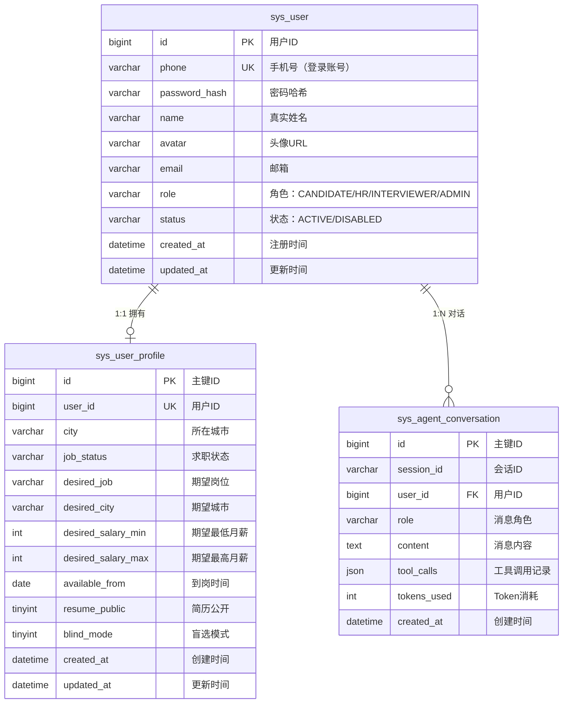

```plain
# 灵犀互聘 — 后端总体系统分析文档

---

> **文档版本：** V1.1
> **创建日期：** 2026-07-30
> **最后更新：** 2026-07-31
> **文档类型：** 后端系统分析设计文档（总体）
> **技术栈：** Spring Cloud Alibaba + Spring Boot 2.7 + MyBatis + Redis + RocketMQ + MySQL
> **JDK版本：** JDK 8
> **维护人：** 后端团队

---

## 文档更改记录表

| 日期 | 版本 | 修订标志 | 修订说明 | 作者 |
| --- | --- | :---: | --- | --- |
| 2026-07-30 | 1.0 | A | 初稿，整合五个成员后端系统分析文档 | 后端团队 |
| 2026-07-31 | 1.1 | M | 技术栈调整：JDK 8 + MyBatis（移除MyBatis-Plus），Spring Boot 降级至2.7 | 后端团队 |

**修订标志：A** – 新增 | **M** – 修改 | **D** – 删除

---

## 目录

1. [系统架构概述](#1-系统架构概述)
2. [模块一：用户服务与微服务基座（成员A）](#2-模块一用户服务与微服务基座成员a)
3. [模块二：岗位服务与Interview Agent（成员B）](#3-模块二岗位服务与interview-agent成员b)
4. [模块三：简历服务与Resume Agent（成员C）](#4-模块三简历服务与resume-agent成员c)
5. [模块四：HR服务与Mock Interview Agent（成员D）](#5-模块四hr服务与mock-interview-agent成员d)
6. [模块五：管理服务（成员E）](#6-模块五管理服务成员e)
7. [跨服务交互设计](#7-跨服务交互设计)
8. [数据库总体设计](#8-数据库总体设计)

---

# 1. 系统架构概述

## 1.1 整体架构

```plain
                    Nginx (反向代理 + 静态资源)
                            │
           ┌────────────────┼────────────────┐
           ▼                ▼                 ▼
    ┌──────────┐    ┌──────────────┐   ┌──────────────┐
    │ B 端前端  │    │  C 端前端    │   │ API Gateway  │
    │ (Umi 4)  │    │  (Umi 4)    │   │ (Spring      │
    │          │    │              │   │  Cloud       │
    │          │    │              │   │  Gateway)    │
    └──────────┘    └──────────────┘   └──────┬───────┘
                                              │
                         ┌────────────────────┼────────────────────┐
                         ▼                    ▼                    ▼
              ┌──────────────────┐ ┌──────────────────┐ ┌──────────────────┐
              │  Nacos 注册中心   │ │  Nacos 配置中心   │ │  Sentinel 流控    │
              └──────────────────┘ └──────────────────┘ └──────────────────┘
                                              │
         ┌────────────┬────────────┬──────────┼──────────┬────────────┐
         ▼            ▼            ▼          ▼          ▼            ▼
   ┌──────────┐ ┌──────────┐ ┌──────────┐ ┌──────────┐ ┌──────────┐
   │ lingxi-  │ │ lingxi-  │ │ lingxi-  │ │ lingxi-  │ │ lingxi-  │
   │ user     │ │ job      │ │ resume   │ │ hr       │ │ admin    │
   │ Port:    │ │ Port:    │ │ Port:    │ │ Port:    │ │ Port:    │
   │ 8081     │ │ 8082     │ │ 8083     │ │ 8084     │ │ 8085     │
   └──────────┘ └──────────┘ └──────────┘ └──────────┘ └──────────┘
```

## 1.2 服务拆分

| 服务 | 端口 | 独立数据库 | 核心职责 | 负责人 |
| --- | :---: | :---: | --- | :---: |
| `lingxi-gateway` | 8080 | 无 | 统一入口、路由、鉴权 | 成员A |
| `lingxi-user` | 8081 | `lingxi` | 注册/登录、用户CRUD、RBAC、Job Agent | 成员A |
| `lingxi-job` | 8082 | `lingxi` | 岗位CRUD、搜索、Headcount、Interview Agent | 成员B |
| `lingxi-resume` | 8083 | `lingxi` | 简历解析、投递管理、Resume Agent | 成员C |
| `lingxi-hr` | 8084 | `lingxi` | HR候选人管理、面试协同、Offer、Mock Interview Agent | 成员D |
| `lingxi-admin` | 8085 | `lingxi` | 管理后台、统计、权限 | 成员E |

## 1.3 技术选型

| 层级 | 技术选型 | 版本 | 说明 |
| --- | --- | --- | --- |
| **JDK** | Oracle JDK / OpenJDK | 1.8 (8u301+) | 运行环境 |
| **前端** | Umi 4 + Ant Design 5 + AntV | - | B端+C端统一技术栈 |
| **核心框架** | Spring Boot | 2.7.18 | 基础框架（JDK8最高支持版本） |
| **微服务** | Spring Cloud Alibaba | 2021.0.6.0 | 微服务解决方案 |
| **微服务** | Spring Cloud | 2021.0.8 | 微服务基础 |
| **网关** | Spring Cloud Gateway + Nacos + Sentinel | - | 统一入口、服务发现、流控 |
| **ORM** | MyBatis | 3.5.13 | 数据访问层（原生MyBatis） |
| **分页** | PageHelper | 1.4.7 | MyBatis分页插件 |
| **AI服务** | DeepSeek + 百宝箱 + Tool-Calling Agent | - | 4个自主决策Agent |
| **数据层** | MySQL + Redis | 5.7/8.x + 6.x/7.x | 业务数据 + 缓存/Token |
| **消息队列** | RocketMQ | 4.9.x / 5.x | 异步通知 |
| **文件存储** | MinIO / 阿里云OSS | - | 简历文件存储 |
| **工具库** | Hutool | 5.8.x | 常用工具集 |
| **API文档** | Knife4j (Swagger) | 4.3.0 | 接口文档 |

## 1.4 统一接口规范

### 统一响应格式

```json
{
  "code": 0,
  "message": "success",
  "data": {}
}
```

**错误响应：**

```json
{
  "code": 1001,
  "message": "验证码错误",
  "data": null
}
```

**分页响应：**

```json
{
  "code": 0,
  "message": "success",
  "data": {
    "list": [],
    "total": 100,
    "page": 1,
    "pageSize": 20
  }
}
```

### 业务错误码范围分配

| 模块 | 错误码范围 | 负责人 |
| --- | --- | --- |
| 用户服务（lingxi-user） | 1001-1999 | 成员A |
| 岗位服务（lingxi-job） | 2001-2999 | 成员B |
| 简历服务（lingxi-resume） | 3001-3999 | 成员C |
| HR服务（lingxi-hr） | 4001-4999 | 成员D |
| 管理服务（lingxi-admin） | 5001-5999 | 成员E |

## 1.5 跨服务调用关系

```plain
┌─────────────────────────────────────────────────────────────────────────────┐
│                              跨服务调用关系图                                  │
├─────────────────────────────────────────────────────────────────────────────┤
│                                                                             │
│  lingxi-user (A)                                                            │
│      │                                                                      │
│      ├──Feign──→ lingxi-job (B)     获取岗位详情、搜索岗位                    │
│      ├──Feign──→ lingxi-resume (C)  获取简历信息、能力模型                    │
│      └──Feign──→ lingxi-hr (D)      获取面试信息                            │
│                                                                             │
│  lingxi-job (B)                                                             │
│      ├──Feign──→ lingxi-user (A)    获取用户信息                            │
│      └──Feign──→ lingxi-hr (D)      获取面试评估结果                        │
│                                                                             │
│  lingxi-resume (C)                                                          │
│      ├──Feign──→ lingxi-user (A)    获取用户信息（含blind_mode）             │
│      ├──Feign──→ lingxi-job (B)     投递时校验岗位状态                       │
│      └──MQ────→ lingxi-hr (D)       投递/诊断消息通知                        │
│                                                                             │
│  lingxi-hr (D)                                                              │
│      ├──Feign──→ lingxi-job (B)     HC预冻结/确认/释放                       │
│      ├──Feign──→ lingxi-resume (C)  获取候选人简历                           │
│      └──MQ────→ lingxi-resume (C)   面试评估结果通知                         │
│                                                                             │
│  lingxi-admin (E)                                                           │
│      ├──Feign──→ lingxi-user (A)    获取用户统计、用户管理                    │
│      ├──Feign──→ lingxi-job (B)     获取岗位统计、岗位管理                    │
│      ├──Feign──→ lingxi-resume (C)  获取投递统计                            │
│      └──Feign──→ lingxi-hr (D)      获取面试/Offer统计                       │
│                                                                             │
└─────────────────────────────────────────────────────────────────────────────┘
```

---

# 2. 模块一：用户服务与微服务基座（成员A）

**接口数量：** 25个 | **API前缀：** `/api/v1/auth/*`, `/api/v1/user/*`, `/api/v1/agent/*`, `/api/v1/conversations/*`
**数据库表：** 4张（sys_user, sys_user_profile, sys_agent_conversation, sys_agent_audit_log）
**错误码范围：** 1001-1999

---

## 2.1 功能模块

### 功能模块树

```
成员A后端模块
├── 微服务基座（lingxi-gateway，端口8080）
│   ├── Spring Cloud Gateway
│   │   ├── 路由配置（按服务名转发）
│   │   ├── 全局过滤器（请求日志、请求ID注入）
│   │   └── 鉴权过滤器（Token校验、白名单放行）
│   ├── Nacos注册中心
│   └── Sentinel流控
│
├── 用户服务（lingxi-user，端口8081）
│   ├── 认证模块
│   │   ├── 发送验证码（SMS）
│   │   ├── 用户注册（手机号+验证码+密码+姓名+角色）
│   │   ├── 手机号+验证码登录（仅已注册用户）
│   │   ├── 手机号+密码登录（仅已注册用户）
│   │   ├── 修改密码
│   │   ├── JWT Token生成与刷新
│   │   ├── 登录安全防护（IP限流、账号锁定、图形验证码）
│   │   └── 管理员账号+密码登录（含首次登录强制改密）
│   ├── 用户模块
│   │   ├── 用户信息CRUD
│   │   ├── 用户详情（求职者/HR）
│   │   └── 隐私设置
│   └── 企业认证模块
│       ├── 认证申请
│       ├── 邀请码加入企业
│       └── 管理员审核
│
├── Job Agent（岗位智能管家）—— 基于百宝箱
│   ├── 百宝箱集成
│   ├── 工具注册（search_jobs/get_job_detail/parse_jd/get_company_jobs）
│   └── SSE流式输出
│
└── 消息服务（WebSocket实时通信）
    ├── WebSocket服务（连接管理、消息推送）
    ├── 会话管理（创建、列表、标记已读）
    └── 消息管理（发送、持久化、未读数）
```

## 2.2 核心流程图

### 2.2.1 用户登录流程

```plain
用户输入手机号
     │
     ▼
点击"获取验证码"
     │
     ├── 校验手机号格式
     │    ├── 格式错误 → 返回错误提示
     │    └── 格式正确 → 继续
     │
     ▼
检查发送频率（60秒内是否已发送）
     │
     ├── 已发送 → 返回"发送过于频繁"
     └── 未发送 → 继续
         │
         ▼
    生成6位随机验证码
         │
         ▼
    存储到Redis（5分钟过期）
         │
         ▼
    调用SMS服务发送验证码
         │
         ├── 发送成功 → 返回成功
         └── 发送失败 → 返回错误

用户输入验证码，点击"登录"
     │
     ▼
校验验证码（从Redis获取）
     │
     ├── 验证码错误 → 返回"验证码错误"
     ├── 验证码过期 → 返回"验证码已过期"
     └── 验证码正确 → 继续
         │
         ▼
    查询用户是否存在
         │
         ├── 不存在 → 返回"用户不存在，请先注册"（错误码1018）
         └── 存在 → 继续
             │
             ▼
        检查用户状态
             │
             ├── 已禁用 → 返回"账号已被禁用"
             └── 正常 → 继续
                 │
                 ▼
            生成JWT Token
                 │
                 ▼
            存储到Redis（7天过期）
                 │
                 ▼
            返回Token + 用户信息
```

### 2.2.2 Token刷新流程

```plain
请求到达Gateway
     │
     ▼
鉴权过滤器校验Token
     │
     ├── Token不存在 → 返回401
     ├── Token已过期 → 返回401
     └── Token有效 → 继续
         │
         ▼
    检查Token是否即将过期（5分钟内）
         │
         ├── 未过期 → 放行请求
         └── 即将过期 → 异步刷新Token
             │
             ▼
        使用refreshToken获取新Token
             │
             ├── 刷新成功 → 更新Redis中的Token
             └── 刷新失败 → 返回401
```

### 2.2.3 Job Agent对话流程（百宝箱版）

```plain
用户输入消息
     │
     ▼
前端建立SSE连接：GET /api/v1/agent/chat?message=xxx
     │
     ▼
后端服务接收请求，解析用户身份
     │
     ▼
加载对话历史（Redis，按用户隔离）
     │
     ▼
调用百宝箱Agent API
     │
     ▼
┌─────────────────────────────────────────────────────────┐
│  百宝箱平台处理                                           │
│  1. LLM意图识别                                          │
│  2. 参数提取                                             │
│  3. 决定是否调用工具                                      │
└─────────────────────────────────────────────────────────┘
     │
     ├── thinking事件 → "正在理解您的需求..."
     │
     ├── 工具调用请求 → 回调后端工具接口
     │    │
     │    ▼
     │   后端执行工具（Feign调用业务服务）
     │    │
     │    ▼
     │   返回工具结果给百宝箱
     │    │
     │    ▼
     │   百宝箱继续生成回复
     │
     └── final事件 → 最终结果
     │
     ▼
SSE推送事件给前端
     │
     ▼
保存对话历史（Redis）
     │
     ▼
用户可继续追问（上下文关联）
```

### 2.2.4 企业认证申请流程

```plain
HR提交认证申请
     │
     ▼
填写企业信息
     │
     ├── 企业名称（认证后不可修改）
     ├── 所属行业
     ├── 企业规模
     ├── 企业地址
     └── 企业官网
     │
     ▼
上传营业执照（必填）
     │
     ▼
上传其他证明材料（选填）
     │
     ▼
创建企业记录（hr_company）
     │
     ├── cert_status = PENDING
     └── 生成邀请码（6位）
     │
     ▼
创建认证申请记录（hr_company_certification）
     │
     ▼
等待管理员审核
     │
     ├── 审核通过（成员E操作）
     │    │
     │    ▼
     │   更新 hr_company.cert_status = APPROVED
     │    │
     │    ▼
     │   HR可正常使用B端功能
     │
     └── 审核拒绝（成员E操作）
          │
          ▼
         返回拒绝原因，HR可修改后重新提交
```

### 2.2.5 用户注册流程

```plain
用户点击"立即注册"
     │
     ▼
填写注册信息
     │
     ├── 手机号 → 获取验证码
     ├── 验证码（6位）
     ├── 设置密码（8-20位，大小写+数字+特殊字符）
     ├── 确认密码
     ├── 真实姓名（1-32字符）
     └── 角色选择（求职者 / HR）
     │
     ▼
调用 POST /api/v1/auth/register
     │
     ▼
校验验证码（从Redis获取）
     │
     ├── 验证码错误 → 返回"验证码错误"
     ├── 验证码过期 → 返回"验证码已过期"
     └── 验证码正确 → 继续
         │
         ▼
    检查手机号是否已注册
         │
         ├── 已注册 → 返回"该手机号已注册，请直接登录"
         └── 未注册 → 继续
             │
             ▼
        校验密码强度
             │
             ├── 不满足 → 返回"密码须包含大小写字母、数字和特殊字符"
             └── 满足 → 继续
                 │
                 ▼
            创建用户账号
                 │
                 ├── phone, name, role, status=ACTIVE
                 ├── password_hash = BCrypt(password)
                 └── 保存到 sys_user
                 │
                 ▼
            生成JWT Token + 存储到Redis
                 │
                 ▼
            返回Token + 用户信息（注册成功后自动登录）
                 │
                 ▼
        根据角色跳转
             │
             ├── 求职者（CANDIDATE）→ 跳转C端首页
             └── HR → 进入企业认证流程
                  │
                  ├── 创建新企业 → 提交认证申请
                  └── 有邀请码 → 输入邀请码加入企业
```

### 2.2.6 邀请码加入企业流程

```plain
HR输入邀请码
     │
     ▼
调用接口：POST /api/v1/company/join-by-invite
     │
     ▼
校验邀请码
     │
     ├── 邀请码不存在 → 返回错误"邀请码不存在"
     │
     ├── 邀请码已过期 → 返回错误"邀请码已过期"
     │
     └── 邀请码有效 → 继续
          │
          ▼
     查询企业信息（hr_company）
          │
          ▼
     检查是否已是该企业成员
          │
          ├── 是 → 返回错误"已是该企业成员"
          │
          └── 否 → 创建企业成员记录
                    │
                    ▼
               hr_company_member
                    │
                    ├── company_id = 企业ID
                    ├── user_id = 当前用户ID
                    ├── role = INTERVIEWER（默认面试官）
                    └── status = ACTIVE
                    │
                    ▼
               返回企业信息
                    │
                    ▼
               加入成功，可访问B端功能
```

### 2.2.7 消息沟通流程（WebSocket实时通信）

```plain
用户打开消息页面
     │
     ▼
前端建立WebSocket连接
     │
     ├── 连接地址：ws://host/ws/message?token=xxx
     └── 携带JWT Token
     │
     ▼
后端校验Token
     │
     ├── 无效 → 拒绝连接
     └── 有效 → 继续
          │
          ▼
     建立用户Session映射
          │
          ▼
     推送未读数给前端
          │
          ▼
     等待用户操作
          │
          ├── 发送消息
          │    │
          │    ▼
          │   校验会话权限 → 保存消息 → 更新会话 → 推送对方
          │
          ├── 接收消息
          │    │
          │    ▼
          │   后端推送：{ type: "NEW_MESSAGE", data: MessageVO }
          │
          └── 标记已读
               │
               ▼
              更新消息已读状态 → 清零未读数
```

## 2.3 时序图

### 2.3.1 用户登录时序

```plain
用户          前端           Gateway        用户服务        Redis         SMS服务
 │             │              │              │              │              │
 │──输入手机号──▶│              │              │              │              │
 │             │──获取验证码──▶│              │              │              │
 │             │              │──转发请求───▶│              │              │
 │             │              │              │──检查频率───▶│              │
 │             │              │              │◀─频率正常────│              │
 │             │              │              │──生成验证码──▶│              │
 │             │              │              │──存储验证码──▶│              │
 │             │              │              │──发送SMS────────────────────▶│
 │             │              │              │◀─发送成功────────────────────│
 │             │              │◀─成功────────│              │              │
 │             │◀─成功────────│              │              │              │
 │◀─提示已发送──│              │              │              │              │
 │             │              │              │              │              │
 │──输入验证码──▶│              │              │              │              │
 │             │──登录请求───▶│              │              │              │
 │             │              │──转发请求───▶│              │              │
 │             │              │              │──校验验证码──▶│              │
 │             │              │              │◀─验证码正确──│              │
 │             │              │              │──查询用户────│              │
 │             │              │              │──生成Token──▶│              │
 │             │              │              │──存储Token──▶│              │
 │             │              │◀─Token+用户──│              │              │
 │             │◀─登录成功────│              │              │              │
 │◀─跳转首页───│              │              │              │              │
```

### 2.3.2 Job Agent SSE对话时序

```plain
用户          前端           Gateway        后端服务       百宝箱平台      岗位服务
 │             │              │              │              │              │
 │──输入消息───▶│              │              │              │              │
 │             │──SSE连接───▶│              │              │              │
 │             │              │──转发SSE───▶│              │              │
 │             │              │              │──调用百宝箱Agent───────────▶│
 │             │              │              │              │              │
 │             │              │              │              │──LLM意图识别─│
 │             │              │              │              │◀─识别结果────│
 │             │              │              │              │              │
 │             │◀─thinking────│◀─thinking────│◀─thinking────│              │
 │◀─正在理解───│              │              │              │              │
 │             │              │              │              │              │
 │             │              │              │◀─工具调用请求─│              │
 │             │              │              │──执行工具──────────────────▶│
 │             │◀─tool_call───│◀─tool_call───│◀─tool_call───│              │
 │◀─正在搜索───│              │              │              │              │
 │             │              │              │◀─工具结果──────────────────│
 │             │              │              │──返回工具结果──────────────▶│
 │             │◀─tool_result─│◀─tool_result─│◀─tool_result─│              │
 │◀─找到12个───│              │              │              │              │
 │             │              │              │              │              │
 │             │              │              │              │──LLM生成回复─│
 │             │              │              │◀─final───────│◀─回复内容────│
 │             │◀─final───────│◀─final───────│              │              │
 │◀─展示结果───│              │              │              │              │
```

## 2.4 数据库设计

### 2.4.1 sys_user — 用户表

```sql
CREATE TABLE IF NOT EXISTS `sys_user` (
    `id`                  BIGINT UNSIGNED NOT NULL AUTO_INCREMENT COMMENT '用户ID',
    `phone`               VARCHAR(20)     NOT NULL COMMENT '手机号（登录账号）',
    `password_hash`       VARCHAR(128)    COMMENT '密码哈希（BCrypt加密，注册时必填）',
    `name`                VARCHAR(32)     NOT NULL COMMENT '真实姓名',
    `avatar`              VARCHAR(512)    COMMENT '头像URL',
    `email`               VARCHAR(64)     COMMENT '邮箱',
    `role`                VARCHAR(16)     NOT NULL COMMENT '角色：CANDIDATE/HR/INTERVIEWER/ADMIN',
    `status`              VARCHAR(16)     NOT NULL DEFAULT 'ACTIVE' COMMENT '状态：ACTIVE/DISABLED',
    `first_login`         TINYINT         NOT NULL DEFAULT 0 COMMENT '首次登录标记：0=否 1=是（默认密码未修改）',
    `created_at`          DATETIME        NOT NULL DEFAULT CURRENT_TIMESTAMP COMMENT '注册时间',
    `updated_at`          DATETIME        NOT NULL DEFAULT CURRENT_TIMESTAMP ON UPDATE CURRENT_TIMESTAMP COMMENT '更新时间',
    PRIMARY KEY (`id`),
    UNIQUE KEY `uk_phone` (`phone`),
    KEY `idx_role` (`role`),
    KEY `idx_status` (`status`)
) ENGINE=InnoDB DEFAULT CHARACTER SET utf8mb4 COMMENT='用户表';
```

### 2.4.2 sys_user_profile — 用户画像表

```sql
CREATE TABLE IF NOT EXISTS `sys_user_profile` (
    `id`                  BIGINT UNSIGNED NOT NULL AUTO_INCREMENT COMMENT '主键ID',
    `user_id`             BIGINT UNSIGNED NOT NULL COMMENT '用户ID',
    `city`                VARCHAR(32)     COMMENT '所在城市',
    `job_status`          VARCHAR(20)     COMMENT '求职状态：JOB_SEEKING/EMPLOYED_LOOKING/NOT_LOOKING',
    `desired_job`         VARCHAR(64)     COMMENT '期望岗位',
    `desired_city`        VARCHAR(64)     COMMENT '期望城市',
    `desired_salary_min`  INT             COMMENT '期望最低月薪（元）',
    `desired_salary_max`  INT             COMMENT '期望最高月薪（元）',
    `available_from`      DATE            COMMENT '到岗时间',
    `resume_public`       TINYINT         NOT NULL DEFAULT 1 COMMENT '简历公开：0=关闭 1=开启',
    `blind_mode`          TINYINT         NOT NULL DEFAULT 0 COMMENT '盲选模式：0=关闭 1=开启',
    `created_at`          DATETIME        NOT NULL DEFAULT CURRENT_TIMESTAMP COMMENT '创建时间',
    `updated_at`          DATETIME        NOT NULL DEFAULT CURRENT_TIMESTAMP ON UPDATE CURRENT_TIMESTAMP COMMENT '更新时间',
    PRIMARY KEY (`id`),
    UNIQUE KEY `uk_user_id` (`user_id`),
    KEY `idx_city` (`city`),
    KEY `idx_job_status` (`job_status`)
) ENGINE=InnoDB DEFAULT CHARACTER SET utf8mb4 COMMENT='用户画像表（求职者）';
```

### 2.4.3 sys_agent_conversation — Agent对话历史表

```sql
CREATE TABLE IF NOT EXISTS `sys_agent_conversation` (
    `id`                    BIGINT UNSIGNED NOT NULL AUTO_INCREMENT COMMENT '主键ID',
    `session_id`            VARCHAR(64)     NOT NULL COMMENT '会话ID（UUID格式）',
    `user_id`               BIGINT UNSIGNED NOT NULL COMMENT '用户ID',
    `role`                  VARCHAR(16)     NOT NULL COMMENT '消息角色：user/assistant/system',
    `content`               TEXT            NOT NULL COMMENT '消息内容',
    `tool_calls`            JSON            COMMENT '工具调用记录',
    `tokens_used`           INT UNSIGNED    COMMENT '本次消耗的Token数',
    `created_at`            DATETIME        NOT NULL DEFAULT CURRENT_TIMESTAMP COMMENT '创建时间',
    PRIMARY KEY (`id`),
    KEY `idx_session_id` (`session_id`, `created_at`),
    KEY `idx_user_id` (`user_id`, `created_at`)
) ENGINE=InnoDB DEFAULT CHARACTER SET utf8mb4 COMMENT='Agent对话历史表';
```

### 2.4.4 模块A ER图



**表关系说明：**

| 关系 | 说明 |
|------|------|
| `sys_user` → `sys_user_profile` | 1:1关系，一个用户对应一个画像（求职者） |
| `sys_user` → `sys_agent_conversation` | 1:N关系，一个用户可有多次Agent对话 |

**索引说明：**

| 表 | 索引 | 用途 |
|----|------|------|
| sys_user | uk_phone | 手机号唯一索引，登录查询 |
| sys_user | idx_role | 角色索引，按角色筛选用户 |
| sys_user_profile | uk_user_id | 用户ID唯一索引 |
| sys_user_profile | idx_city | 城市索引，按城市筛选 |
| sys_user_profile | idx_job_status | 求职状态索引 |
| sys_agent_conversation | idx_session_id | 会话ID+时间组合索引 |
| sys_agent_conversation | idx_user_id | 用户ID+时间组合索引 |

## 2.5 API设计

### 2.5.1 认证服务接口

#### 1. 发送验证码

**POST** `/api/v1/auth/send-code`

**请求参数：**

| 参数 | 类型 | 必填 | 说明 |
| --- | --- | --- | --- |
| phone | String | Y | 手机号，11位 |

**业务逻辑：**
- 校验手机号格式
- 检查发送频率（60秒内不能重复发送）
- 检查每日上限（10次/天）
- 生成6位随机验证码
- 存储到Redis（5分钟过期）
- 调用SMS服务发送

**响应：**

```json
{
  "code": 0,
  "message": "success",
  "data": null
}
```

**错误码：** 1001(格式错误), 1007(发送过于频繁), 1008(每日上限)

---

#### 2. 用户登录

**POST** `/api/v1/auth/login`

**请求参数：**

| 参数 | 类型 | 必填 | 说明 |
| --- | --- | --- | --- |
| phone | String | Y | 手机号 |
| code | String | Y | 验证码，6位 |

**业务逻辑：**
- 校验IP限流（单IP每分钟最多20次）
- 检查登录失败锁定（连续失败>5次锁定30分钟）
- 校验验证码（从Redis获取）
- 查询用户是否存在
- 不存在则返回错误码1018（"用户不存在，请先注册"）
- 检查用户状态（是否禁用）
- 清除登录失败计数
- 生成JWT Token（accessToken + refreshToken）
- 存储Token到Redis（user:token:{userId}、user:refresh:{userId}）

**响应：**

```json
{
  "code": 0,
  "message": "success",
  "data": {
    "accessToken": "eyJhbGciOiJIUzI1NiIsInR5cCI6IkpXVCJ9...",
    "refreshToken": "eyJhbGciOiJIUzI1NiIsInR5cCI6IkpXVCJ9...",
    "expiresIn": 7200,
    "user": {
      "id": 1001,
      "phone": "13812345678",
      "name": "张三",
      "role": "CANDIDATE",
      "avatar": null,
      "company": null
    }
  }
}
```

**错误码：** 1001(手机号格式错误), 1002(验证码过期), 1003(账号锁定), 1004(账号禁用), 1009(IP限流), 1010(验证码错误), 1018(用户不存在)

---

#### 2.1 用户注册

**POST** `/api/v1/auth/register`

**请求参数：**

| 参数 | 类型 | 必填 | 说明 |
| --- | --- | --- | --- |
| phone | String | Y | 手机号，11位 |
| code | String | Y | 验证码，6位 |
| password | String | Y | 密码，8-20位，须包含大小写字母+数字+特殊字符 |
| name | String | Y | 真实姓名，1-32字符 |
| role | String | Y | 角色：CANDIDATE（求职者）/ HR |

**业务逻辑：**
- 校验IP限流
- 校验验证码
- 检查手机号是否已注册（已注册返回1017）
- 校验密码强度（DTO层 @Pattern 校验）
- 校验角色（仅允许 CANDIDATE 或 HR）
- 创建用户（password_hash = BCrypt(password)）
- 生成JWT Token + 存储到Redis
- 返回Token（注册成功后自动登录）

**响应：** 同登录接口

**错误码：** 1001(手机号格式错误), 1002(验证码过期), 1009(IP限流), 1010(验证码错误), 1014(密码强度不足), 1016(参数不完整), 1017(手机号已注册)

---

#### 2.2 密码登录

**POST** `/api/v1/auth/login-by-password`

**请求参数：**

| 参数 | 类型 | 必填 | 说明 |
| --- | --- | --- | --- |
| phone | String | Y | 手机号 |
| password | String | Y | 密码 |

**业务逻辑：**
- 校验IP限流
- 检查登录失败锁定
- 查询用户是否存在（不存在返回1018）
- 检查用户是否已设置密码（password_hash为空返回1012）
- 校验密码（BCrypt比对，不匹配记录失败次数）
- 检查用户状态
- 清除登录失败计数
- 生成JWT Token + 存储到Redis

**响应：** 同验证码登录接口

**错误码：** 1001(手机号格式错误), 1003(账号锁定), 1004(账号禁用), 1009(IP限流), 1012(未设置密码), 1013(密码错误), 1018(用户不存在)

---

#### 2.3 修改密码

**POST** `/api/v1/auth/change-password`

**请求参数：**

| 参数 | 类型 | 必填 | 说明 |
| --- | --- | --- | --- |
| oldPassword | String | Y | 旧密码 |
| newPassword | String | Y | 新密码，8-20位，须包含大小写字母+数字+特殊字符 |

**业务逻辑：**
- 校验IP限流
- 查询当前登录用户
- 校验旧密码（BCrypt比对）
- 校验新密码不能与旧密码相同
- 更新 password_hash
- 清除旧Token，要求重新登录

**响应：** `{"code": 0, "message": "success", "data": null}`

**错误码：** 1003(账号锁定), 1009(IP限流), 1012(未设置密码), 1014(密码强度不足), 1015(新旧密码相同)

---

#### 3. 管理员登录

**POST** `/api/v1/admin/login`

**请求参数：**

| 参数 | 类型 | 必填 | 说明 |
| --- | --- | --- | --- |
| username | String | Y | 管理员账号 |
| password | String | Y | 密码 |

**业务逻辑：**
- 校验账号密码（密码哈希比对）
- 检查管理员状态
- 生成JWT Token

**响应：**

```json
{
  "code": 0,
  "message": "success",
  "data": {
    "accessToken": "eyJhbGciOiJIUzI1NiIsInR5cCI6IkpXVCJ9...",
    "refreshToken": "eyJhbGciOiJIUzI1NiIsInR5cCI6IkpXVCJ9...",
    "expiresIn": 7200,
    "user": {
      "id": 1,
      "username": "admin",
      "name": "系统管理员",
      "role": "ADMIN"
    }
  }
}
```

**错误码：** 5001(账号或密码错误), 5002(账号已禁用)

---

#### 4. 刷新Token

**POST** `/api/v1/auth/refresh-token`

**请求参数：**

| 参数 | 类型 | 必填 | 说明 |
| --- | --- | --- | --- |
| refreshToken | String | Y | 刷新Token |

**响应：**

```json
{
  "code": 0,
  "message": "success",
  "data": {
    "accessToken": "new_access_token...",
    "refreshToken": "new_refresh_token...",
    "expiresIn": 7200
  }
}
```

---

### 2.5.2 用户服务接口

#### 5. 获取用户信息

**GET** `/api/v1/user/info`

**响应：**

```json
{
  "code": 0,
  "message": "success",
  "data": {
    "id": 1001,
    "phone": "13812345678",
    "name": "张三",
    "role": "CANDIDATE",
    "avatar": "https://xxx.com/avatar.jpg",
    "company": null,
    "profile": {
      "city": "杭州",
      "jobStatus": "JOB_SEEKING",
      "desiredJob": "高级前端工程师",
      "resumePublic": true,
      "blindMode": false
    }
  }
}
```

---

#### 6. 更新用户信息

**PUT** `/api/v1/user/info`

**请求参数：**

| 参数 | 类型 | 必填 | 说明 |
| --- | --- | --- | --- |
| name | String | N | 姓名 |
| city | String | N | 所在城市 |
| jobStatus | String | N | 求职状态 |
| expectedPosition | String | N | 期望职位 |

**响应：**

```json
{
  "code": 0,
  "message": "success",
  "data": null
}
```

---

#### 7. 获取隐私设置

**GET** `/api/v1/user/privacy`

**响应：**

```json
{
  "code": 0,
  "message": "success",
  "data": {
    "resumePublic": true,
    "matchNotify": true,
    "jobStatus": "JOB_SEEKING",
    "blindMode": false
  }
}
```

---

#### 8. 更新隐私设置

**PUT** `/api/v1/user/privacy`

**请求参数：**

| 参数 | 类型 | 必填 | 说明 |
| --- | --- | --- | --- |
| resumePublic | Boolean | N | 简历是否公开 |
| matchNotify | Boolean | N | 匹配通知开关 |
| jobStatus | String | N | 求职状态 |
| blindMode | Boolean | N | 盲选模式开关 |

**响应：**

```json
{
  "code": 0,
  "message": "success",
  "data": null
}
```

---

### 2.5.3 企业认证接口

#### 9. 提交认证申请

**POST** `/api/v1/company/certification/apply`

**请求参数：**

| 参数 | 类型 | 必填 | 说明 |
| --- | --- | --- | --- |
| companyName | String | Y | 企业全称 |
| industry | String | Y | 所属行业 |
| scale | String | Y | 企业规模 |
| address | String | N | 企业地址 |
| website | String | N | 企业官网 |
| businessLicense | File | Y | 营业执照图片 |

**响应：**

```json
{
  "code": 0,
  "message": "success",
  "data": {
    "certificationId": 1001,
    "companyId": 201,
    "inviteCode": "A3K9M2",
    "status": "PENDING"
  }
}
```

**错误码：** 2001(企业名称已存在), 2002(营业执照格式不支持)

---

#### 10. 邀请码加入企业

**POST** `/api/v1/company/join-by-invite`

**请求参数：**

| 参数 | 类型 | 必填 | 说明 |
| --- | --- | --- | --- |
| inviteCode | String | Y | 6位邀请码 |

**响应：**

```json
{
  "code": 0,
  "message": "success",
  "data": {
    "companyId": 201,
    "companyName": "灵犀科技",
    "role": "INTERVIEWER",
    "status": "ACTIVE"
  }
}
```

**错误码：** 2010(邀请码不存在), 2011(邀请码已过期), 2012(已是该企业成员)

---

### 2.5.4 Agent接口

#### 11. Agent对话（SSE）

**GET** `/api/v1/agent/chat?message={message}`

**SSE事件格式：**

```
event: thinking
data: {"type":"thinking","content":"正在理解您的需求..."}

event: tool_call
data: {"type":"tool_call","tool":"search_jobs","args":{"keyword":"前端"}}

event: tool_result
data: {"type":"tool_result","tool":"search_jobs","summary":"找到12个岗位"}

event: final
data: {"type":"final","content":{"jobs":[...],"summary":"为您推荐..."}}
```

---

### 2.5.5 消息服务接口

#### 12. 获取会话列表

**GET** `/api/v1/conversations`

**响应：**

```json
{
  "code": 0,
  "message": "success",
  "data": [
    {
      "id": 1001,
      "targetUser": {
        "id": 201,
        "name": "李明",
        "avatar": "https://xxx.com/avatar.jpg",
        "company": "灵犀科技"
      },
      "lastMessage": "好的，那我们面试时间定在...",
      "lastMessageTime": "2026-07-30T14:45:00",
      "unreadCount": 1
    }
  ]
}
```

---

#### 13. 获取聊天记录

**GET** `/api/v1/conversations/{id}/messages?page=1&pageSize=20`

**响应：**

```json
{
  "code": 0,
  "message": "success",
  "data": {
    "list": [
      {
        "id": 5001,
        "senderId": 201,
        "senderRole": "HR",
        "contentType": "TEXT",
        "content": "您好，我对这个岗位很感兴趣",
        "isRead": true,
        "createdAt": "2026-07-30T14:30:00"
      }
    ],
    "total": 50,
    "page": 1,
    "pageSize": 20
  }
}
```

---

#### 14. 发送消息

**POST** `/api/v1/conversations/{id}/messages`

**请求参数：**

| 参数 | 类型 | 必填 | 说明 |
| --- | --- | --- | --- |
| contentType | String | Y | 消息类型：TEXT/CARD_RESUME/CARD_INTERVIEW |
| content | String | Y | 消息内容 |

**响应：**

```json
{
  "code": 0,
  "message": "success",
  "data": {
    "messageId": 5002,
    "createdAt": "2026-07-30T14:50:00"
  }
}
```

---

### 2.5.6 通知接口

#### 15. 获取通知列表

**GET** `/api/v1/notifications`

**请求参数：**

| 参数 | 类型 | 必填 | 说明 |
|------|------|:---:|------|
| type | String | N | 通知类型：APPLICATION/INTERVIEW/OFFER/SYSTEM/JOB_RECOMMEND |
| page | Integer | N | 页码，默认1 |
| size | Integer | N | 每页条数，默认20 |

**响应：**

```json
{
  "code": 0,
  "data": {
    "total": 25,
    "unreadCount": 3,
    "records": [
      {
        "id": 9001,
        "type": "APPLICATION",
        "typeDesc": "投递通知",
        "title": "简历已被查看",
        "content": "XX公司的HR已查看您的简历",
        "targetType": "application",
        "targetId": 5001,
        "isRead": false,
        "createdAt": "2026-07-28T10:00:00"
      }
    ]
  }
}
```

---

#### 16. 获取未读通知数

**GET** `/api/v1/notifications/unread-count`

**响应：**

```json
{
  "code": 0,
  "data": {
    "totalCount": 15,
    "applicationCount": 5,
    "interviewCount": 3,
    "offerCount": 2,
    "systemCount": 5
  }
}
```

---

#### 17. 标记通知已读

**PUT** `/api/v1/notifications/{id}/read`

**响应：** `{"code": 0, "data": null}`

---

#### 18. 全部标记已读

**PUT** `/api/v1/notifications/read-all`

**响应：** `{"code": 0, "data": null}`

---

### 2.5.7 内部接口（供其他服务调用）

#### 15. 获取用户总数

**GET** `/internal/users/count`

**响应：**

```json
{
  "code": 0,
  "message": "success",
  "data": 1234
}
```

#### 16. 获取用户详情

**GET** `/internal/users/{id}`

**响应：**

```json
{
  "code": 0,
  "message": "success",
  "data": {
    "id": 1001,
    "phone": "138****5678",
    "name": "张三",
    "role": "CANDIDATE",
    "status": "ACTIVE",
    "profile": {
      "city": "杭州",
      "jobStatus": "JOB_SEEKING",
      "blindMode": false
    }
  }
}
```

#### 17. 禁用用户

**PUT** `/internal/users/{id}/disable`

**响应：**

```json
{
  "code": 0,
  "message": "success",
  "data": null
}
```

## 2.6 关键技术设计

### 2.6.1 JWT Token管理

| Token类型 | 有效期 | 存储位置 |
|-----------|--------|----------|
| AccessToken | 2小时 | Redis `user:token:{userId}` |
| RefreshToken | 7天 | Redis `user:refresh:{userId}` |

**AccessToken Payload：** `{userId, username, roles, type:"access", iat, exp}`
**RefreshToken Payload：** `{userId, type:"refresh", jti:UUID, iat, exp}`

### 2.6.2 登录安全防护机制

| 防护措施 | 实现方式 | 触发条件 |
| --- | --- | --- |
| 登录失败限制 | Redis计数，30分钟过期 | 连续失败5次锁定账号 |
| 验证码防护 | 图形验证码，5分钟有效 | 失败3次后触发 |
| IP限流 | Redis滑动窗口 | 每分钟最多10次 |
| 首次登录强制改密 | first_login标记 | 默认密码登录时 |
| 密码强度校验 | 8-20位，大小写+数字 | 注册/修改密码时 |

### 2.6.3 Feign降级策略

- 连接超时：5秒
- 读取超时：10秒
- 降级：返回默认值，不影响页面展示

### 2.6.4 权限管理设计

#### 角色定义

| 角色 | 编码 | 数据范围 | 说明 |
|------|------|----------|------|
| 求职者 | CANDIDATE | 仅本人 | 只能查看自己的数据 |
| HR | HR | 本企业 | 可查看本企业所有数据 |
| 面试官 | INTERVIEWER | 被分配 | 只能查看被分配面试的数据 |
| 管理员 | ADMIN | 全平台 | 可查看所有数据 |

#### Token Payload设计

| 字段 | 说明 |
|------|------|
| userId | 用户ID |
| phone | 手机号 |
| role | 角色编码（CANDIDATE/HR/INTERVIEWER/ADMIN） |
| companyId | 企业ID（HR/面试官有值） |
| certStatus | 认证状态（HR有值） |

#### 接口权限控制

**实现方式：** 注解 + 拦截器

**权限注解：**
- `@RequireLogin`：需要登录才能访问
- `@RequireRole({"HR", "ADMIN"})`：需要特定角色才能访问
- `@RequireCertification`：需要企业认证通过才能访问

**拦截器逻辑：**
1. 白名单放行（/api/v1/auth/*, /api/v1/admin/login, /internal/*）
2. 从请求头提取Token
3. 解析Token获取用户信息
4. 存储到ThreadLocal（UserContext）
5. 检查方法级权限注解
6. 校验角色是否匹配
7. 校验企业认证状态（如需要）
8. 请求完成后清理ThreadLocal

#### 数据权限控制

**实现方式：** MyBatis拦截器自动追加SQL条件

| 角色 | 表 | 过滤条件 | 说明 |
|------|------|----------|------|
| CANDIDATE | job_post | status='PUBLISHED' AND deleted_at IS NULL | 只看已发布岗位 |
| CANDIDATE | resume | candidate_id={当前用户ID} | 只看自己的简历 |
| CANDIDATE | job_application | candidate_id={当前用户ID} | 只看自己的投递 |
| HR | job_post | company_id={当前企业ID} | 只看本企业岗位 |
| HR | job_application | job_id IN (本企业岗位) | 只看本企业投递 |
| HR | hr_interview | company_id={当前企业ID} | 只看本企业面试 |
| INTERVIEWER | hr_interview | interviewer_id={当前用户ID} | 只看自己的面试 |
| ADMIN | 所有表 | 无过滤 | 查看所有数据 |

### 2.6.5 验证码防刷机制

**SMS服务选型：** 阿里云SMS

**防刷策略：**
- 60秒内不能重复发送（Redis Key: `sms:freq:{phone}`）
- 每天上限10次（Redis Key: `sms:daily:{phone}`）
- 验证码5分钟过期（Redis Key: `sms:code:{phone}`）

### 2.6.6 百宝箱Agent集成设计

**集成方式：**
- 使用百宝箱SDK调用Agent API
- 百宝箱控制台配置Agent和工具
- 后端提供工具回调接口

**工具注册（百宝箱控制台）：**
- search_jobs: 回调 `/api/v1/agent/tools/search_jobs`
- get_job_detail: 回调 `/api/v1/agent/tools/get_job_detail`
- parse_jd: 回调 `/api/v1/agent/tools/parse_jd`
- get_company_jobs: 回调 `/api/v1/agent/tools/get_company_jobs`

**会话管理：**
- 对话历史存储在Redis（Key: `agent:session:{userId}:{sessionId}`）
- 按用户+会话隔离
- 支持上下文关联（追问）

### 2.6.7 WebSocket实时消息实现

**连接管理：**
- 用户ID → WebSocketSession映射（ConcurrentHashMap）
- 连接建立时推送未读数
- 连接关闭时移除映射

**消息发送流程：**
1. 前端发送SEND_MESSAGE事件
2. 后端校验会话权限
3. 保存消息到msg_message
4. 更新会话最后消息和未读数
5. 推送NEW_MESSAGE给对方（如果在线）
6. 推送SEND_SUCCESS给发送者

**心跳机制：**
- 前端每30秒发送PING
- 后端响应PONG
- 超时断开连接

### 2.6.8 数据隐私保护方案

**敏感数据分类：**

| 数据类型 | 敏感级别 | 能否经过百宝箱 | 处理策略 |
|----------|----------|----------------|----------|
| 用户输入 | 低 | ✅ 可以 | 直接发送 |
| 岗位公开信息 | 低 | ✅ 可以 | 直接发送 |
| 用户手机号 | 高 | ❌ 不可以 | 脱敏后发送 |
| 用户简历内容 | 高 | ❌ 不可以 | 不发送，本地处理 |
| 身份证号 | 极高 | ❌ 不可以 | 永不发送 |

**脱敏规则：**
- 手机号：138****1234
- 身份证：3301**********1234
- 邮箱：z***@example.com

**输入过滤（防Prompt注入）：**
- 移除手机号、身份证号、银行卡号
- 检测危险关键词（"忽略之前的指令"等）
- 限制输入长度（2000字符）

### 2.6.9 缓存设计

#### 缓存架构

```
┌─────────────────────────────────────────────────────────────────┐
│                          缓存架构                                │
├─────────────────────────────────────────────────────────────────┤
│  L1：本地缓存（Caffeine）                                        │
│  ├── 用户信息（TTL 10分钟，最大1000条）                          │
│  ├── 热点岗位（TTL 5分钟，最大500条）                            │
│  └── 企业信息（TTL 10分钟，最大200条）                           │
├─────────────────────────────────────────────────────────────────┤
│  L2：分布式缓存（Redis Cluster）                                 │
│  ├── Token存储（TTL 2小时）                                      │
│  ├── 验证码（TTL 5分钟）                                         │
│  ├── 会话数据（TTL 30分钟）                                      │
│  ├── Agent对话历史（TTL 2小时）                                  │
│  ├── 未读数计数（持久化）                                        │
│  └── 限流计数器（TTL 按策略）                                    │
└─────────────────────────────────────────────────────────────────┘
```

#### 缓存Key规范

| Key格式 | 说明 | TTL | 示例 |
|---------|------|-----|------|
| `user:{userId}` | 用户信息 | 30分钟 | user:1001 |
| `user:token:{userId}` | AccessToken | 2小时 | user:token:1001 |
| `user:refresh:{userId}` | RefreshToken | 7天 | user:refresh:1001 |
| `sms:code:{phone}` | 验证码 | 5分钟 | sms:code:13812345678 |
| `sms:freq:{phone}` | 发送频率 | 60秒 | sms:freq:13812345678 |
| `sms:daily:{phone}` | 每日计数 | 24小时 | sms:daily:13812345678 |
| `login:fail:{phone}` | 登录失败计数 | 30分钟 | login:fail:13812345678 |
| `ip:rate:sms:{ip}` | IP限流（验证码） | 60秒 | ip:rate:sms:192.168.1.1 |
| `ip:rate:login:{ip}` | IP限流（登录） | 60秒 | ip:rate:login:192.168.1.1 |
| `conversation:{id}` | 会话数据 | 30分钟 | conversation:101 |
| `unread:{userId}` | 未读数 | 持久化 | unread:1001 |
| `agent:session:{userId}:{sessionId}` | Agent对话 | 2小时 | agent:session:1001:abc |

## 2.7 边界条件与输入校验

### 2.7.1 认证模块边界条件

#### 发送验证码（POST /api/v1/auth/send-code）

| 校验项 | 规则 | 边界值 | 错误码 | 错误信息 |
|--------|------|--------|--------|----------|
| 手机号格式 | 正则 `^1[3-9]\d{9}$` | 严格11位数字 | 1001 | 手机号格式不正确 |
| 手机号为空 | 非空校验 | — | 1001 | 手机号不能为空 |
| 发送频率 | Redis计数，60秒窗口 | 60秒内已有发送记录 | 1007 | 发送过于频繁，请60秒后重试 |
| 每日上限 | Redis计数，24小时窗口 | 单日累计≥10次 | 1008 | 今日发送次数已达上限 |
| IP限流 | Redis滑动窗口 | 单IP每分钟≥10次 | 1009 | 请求过于频繁，请稍后重试 |

#### 用户登录（POST /api/v1/auth/login）

| 校验项 | 规则 | 边界值 | 错误码 | 错误信息 |
|--------|------|--------|--------|----------|
| 手机号格式 | 同上 | 同上 | 1001 | 手机号格式不正确 |
| 验证码格式 | 6位纯数字 | 非6位或含非数字字符 | 1001 | 验证码格式不正确 |
| 验证码正确性 | Redis比对 | 不匹配 | 1001 | 验证码错误 |
| 验证码有效期 | Redis TTL | 已过期（>5分钟） | 1002 | 验证码已过期，请重新获取 |
| 登录失败次数 | Redis计数，30分钟窗口 | 连续失败≥5次 | 1003 | 账号已锁定，请30分钟后重试 |
| 用户状态 | DB查询 | status=DISABLED | 1004 | 账号已被禁用，请联系管理员 |

#### 管理员登录（POST /api/v1/admin/login）

| 校验项 | 规则 | 边界值 | 错误码 | 错误信息 |
|--------|------|--------|--------|----------|
| 用户名 | 非空，4-32字符 | 空或超长 | 5001 | 账号或密码错误 |
| 密码 | 非空，8-20位 | 空或超长 | 5001 | 账号或密码错误 |
| 密码强度 | 大小写字母+数字+特殊字符 | 不满足组合要求 | 5003 | 密码强度不足 |
| 账号状态 | DB查询 | status=DISABLED | 5002 | 账号已被禁用 |
| 首次登录 | first_login标记 | 默认密码未修改 | 5004 | 请先修改初始密码 |

#### Token刷新（POST /api/v1/auth/refresh-token）

| 校验项 | 规则 | 边界值 | 错误码 | 错误信息 |
|--------|------|--------|--------|----------|
| refreshToken存在 | 非空校验 | 空值 | 1005 | refreshToken不能为空 |
| refreshToken有效性 | JWT解析+Redis校验 | 格式非法 | 1005 | refreshToken无效 |
| refreshToken过期 | Redis TTL | 已过期（>7天） | 1006 | refreshToken已过期，请重新登录 |
| Token类型 | payload.type=="refresh" | 误传accessToken | 1005 | refreshToken无效 |

### 2.7.2 用户模块边界条件

#### 更新用户信息（PUT /api/v1/user/info）

| 校验项 | 规则 | 边界值 | 错误码 | 错误信息 |
|--------|------|--------|--------|----------|
| 姓名长度 | 1-32字符 | 空字符串或>32字符 | 1010 | 姓名长度须在1-32字符之间 |
| 姓名内容 | 不含特殊字符 `< > { } \` | 含非法字符 | 1011 | 姓名包含非法字符 |
| 城市 | ≤32字符 | 超长 | 1012 | 城市名称过长 |
| 求职状态 | 枚举：JOB_SEEKING / EMPLOYED_LOOKING / NOT_LOOKING | 非枚举值 | 1013 | 求职状态值不合法 |
| 期望职位 | ≤64字符 | 超长 | 1014 | 期望职位名称过长 |
| 邮箱格式 | 正则校验 | 格式错误 | 1015 | 邮箱格式不正确 |

#### 更新隐私设置（PUT /api/v1/user/privacy）

| 校验项 | 规则 | 边界值 | 错误码 | 错误信息 |
|--------|------|--------|--------|----------|
| resumePublic | Boolean类型 | 非布尔值 | 1016 | 参数类型错误 |
| matchNotify | Boolean类型 | 非布尔值 | 1016 | 参数类型错误 |
| blindMode | Boolean类型 | 非布尔值 | 1016 | 参数类型错误 |
| jobStatus | 枚举值同上 | 非枚举值 | 1013 | 求职状态值不合法 |

#### 用户画像（sys_user_profile）字段边界

| 字段 | 类型 | 边界约束 | 说明 |
|------|------|----------|------|
| city | VARCHAR(32) | 最大32字符，允许NULL | 空值表示未填写 |
| job_status | VARCHAR(20) | 枚举值约束 | 仅允许预定义枚举 |
| desired_job | VARCHAR(64) | 最大64字符 | — |
| desired_city | VARCHAR(64) | 最大64字符 | — |
| desired_salary_min | INT | ≥0，≤desired_salary_max | 最低薪资不可为负 |
| desired_salary_max | INT | ≥desired_salary_min，≤9999999 | 合理薪资上限 |
| available_from | DATE | 不早于当前日期-1年 | 允许过去日期（已到岗） |
| resume_public | TINYINT | 0 或 1 | 仅允许布尔语义 |
| blind_mode | TINYINT | 0 或 1 | 仅允许布尔语义 |

### 2.7.3 企业认证模块边界条件

#### 提交认证申请（POST /api/v1/company/certification/apply）

| 校验项 | 规则 | 边界值 | 错误码 | 错误信息 |
|--------|------|--------|--------|----------|
| 企业名称 | 非空，2-100字符 | 空或超长 | 2001 | 企业名称长度须在2-100字符之间 |
| 企业名称唯一性 | DB唯一索引 | 已存在同名企业 | 2001 | 该企业名称已被注册 |
| 所属行业 | 非空，枚举校验 | 空或非枚举值 | 2003 | 请选择所属行业 |
| 企业规模 | 非空，枚举校验 | 空或非枚举值 | 2004 | 请选择企业规模 |
| 企业地址 | ≤200字符 | 超长 | 2005 | 企业地址过长 |
| 企业官网 | URL格式校验 | 格式错误 | 2006 | 企业官网格式不正确 |
| 营业执照 | 必填，文件格式+大小 | 未上传 | 2002 | 请上传营业执照 |
| 营业执照格式 | jpg/png/pdf | 非允许格式 | 2002 | 营业执照仅支持jpg/png/pdf格式 |
| 营业执照大小 | ≤5MB | 超过5MB | 2007 | 营业执照文件大小不可超过5MB |
| 重复申请 | 校验已有PENDING状态 | 已有待审核申请 | 2008 | 您已有待审核的认证申请，请勿重复提交 |
| 用户角色 | role=HR | 非HR角色 | 403 | 无权限提交企业认证 |

#### 邀请码加入企业（POST /api/v1/company/join-by-invite）

| 校验项 | 规则 | 边界值 | 错误码 | 错误信息 |
|--------|------|--------|--------|----------|
| 邀请码格式 | 6位字母数字组合 | 格式不符 | 2010 | 邀请码格式不正确 |
| 邀请码存在性 | DB查询 | 不存在 | 2010 | 邀请码不存在 |
| 邀请码有效期 | 企业设置的过期时间 | 已过期 | 2011 | 邀请码已过期，请联系管理员重新生成 |
| 重复加入 | 查询hr_company_member | 已是该企业成员 | 2012 | 您已是该企业成员，无需重复加入 |
| 用户角色 | role=HR | 非HR角色 | 403 | 无权限加入企业 |
| 企业认证状态 | hr_company.cert_status | 企业未通过认证 | 2013 | 该企业尚未通过认证 |

### 2.7.4 Agent模块边界条件

#### Agent对话（GET /api/v1/agent/chat）

| 校验项 | 规则 | 边界值 | 错误码 | 错误信息 |
|--------|------|--------|--------|----------|
| message非空 | 必填参数 | 空字符串 | 1020 | 消息内容不能为空 |
| message长度 | ≤2000字符 | 超过2000字符 | 1021 | 消息内容过长，请精简后重试 |
| Prompt注入检测 | 关键词+模式匹配 | 检测到注入意图 | 1022 | 消息内容包含不安全信息 |
| 敏感信息过滤 | 正则检测手机号/身份证/银行卡 | 包含敏感信息 | 1023 | 消息中包含敏感个人信息，请勿直接输入 |
| 并发限制 | 单用户同时仅1个SSE连接 | 已有活跃连接 | 1024 | 您有正在进行的对话，请等待完成 |
| 用户角色 | role=CANDIDATE | 非求职者 | 403 | 该功能仅对求职者开放 |
| 会话数限制 | 单用户每日≤50个会话 | 超过限制 | 1025 | 今日对话次数已达上限 |

#### 百宝箱工具回调接口

| 校验项 | 规则 | 边界值 | 错误码 | 错误信息 |
|--------|------|--------|--------|----------|
| 回调来源校验 | IP白名单 + 签名校验 | 非百宝箱来源 | 403 | 非法请求来源 |
| 工具参数校验 | JSON Schema校验 | 参数缺失或类型错误 | 1030 | 工具参数校验失败 |
| search_jobs关键词 | ≤200字符 | 超长 | 1031 | 搜索关键词过长 |
| get_job_detail ID | 正整数 | 非法ID | 1032 | 岗位ID不合法 |

### 2.7.5 消息服务边界条件

#### WebSocket连接

| 校验项 | 规则 | 边界值 | 错误码 | 错误信息 |
|--------|------|--------|--------|----------|
| Token校验 | JWT有效性 | 无效或过期 | 1040 | Token无效，连接被拒绝 |
| 连接数限制 | 单用户≤3个连接 | 超过限制 | 1041 | 连接数已达上限 |
| 心跳超时 | 60秒无PING | 超时 | — | 自动断开连接 |
| 消息体大小 | ≤64KB | 超过限制 | 1042 | 消息内容过大 |

#### 发送消息（POST /api/v1/conversations/{id}/messages）

| 校验项 | 规则 | 边界值 | 错误码 | 错误信息 |
|--------|------|--------|--------|----------|
| contentType | 枚举：TEXT / CARD_RESUME / CARD_INTERVIEW | 非枚举值 | 1043 | 消息类型不支持 |
| content非空 | 必填 | 空字符串 | 1044 | 消息内容不能为空 |
| content长度 | ≤10000字符（TEXT） | 超长 | 1045 | 消息内容过长 |
| 会话权限 | 当前用户必须是会话参与者 | 非参与者 | 1046 | 无权在该会话中发送消息 |
| 会话状态 | 会话未关闭 | 已关闭 | 1047 | 该会话已关闭 |

#### 获取聊天记录（GET /api/v1/conversations/{id}/messages）

| 校验项 | 规则 | 边界值 | 错误码 | 错误信息 |
|--------|------|--------|--------|----------|
| page | ≥1 | <1时置为1 | — | 自动修正 |
| pageSize | 1-100 | <1置为20，>100置为100 | — | 自动修正 |
| 会话权限 | 当前用户必须是会话参与者 | 非参与者 | 1046 | 无权查看该会话 |

### 2.7.6 通知模块边界条件

#### 获取通知列表（GET /api/v1/notifications）

| 校验项 | 规则 | 边界值 | 错误码 | 错误信息 |
|--------|------|--------|--------|----------|
| type | 枚举：APPLICATION / INTERVIEW / OFFER / SYSTEM / JOB_RECOMMEND | 非枚举值 | 1050 | 通知类型不合法 |
| page | ≥1 | <1时置为1 | — | 自动修正 |
| size | 1-100 | <1置为20，>100置为100 | — | 自动修正 |

#### 标记通知已读（PUT /api/v1/notifications/{id}/read）

| 校验项 | 规则 | 边界值 | 错误码 | 错误信息 |
|--------|------|--------|--------|----------|
| 通知归属 | 通知必须属于当前用户 | 非本人通知 | 1051 | 无权操作该通知 |
| 通知存在性 | DB查询 | 不存在 | 1052 | 通知不存在 |
| 重复标记 | 幂等处理 | 已标记为已读 | — | 直接返回成功（幂等） |

### 2.7.7 数据库字段边界约束汇总

#### sys_user 表

| 字段 | 约束 | 边界说明 |
|------|------|----------|
| id | BIGINT UNSIGNED AUTO_INCREMENT | 范围 1 ~ 2^64-1，不支持手动指定 |
| phone | VARCHAR(20) NOT NULL + UNIQUE | 全局唯一，最大20字符 |
| password_hash | VARCHAR(128) | BCrypt固定60字符，预留空间 |
| name | VARCHAR(32) NOT NULL | 最大32字符，不允许为空 |
| avatar | VARCHAR(512) | URL最大512字符，允许NULL |
| email | VARCHAR(64) | 最大64字符，允许NULL |
| role | VARCHAR(16) NOT NULL | 仅允许 CANDIDATE / HR / INTERVIEWER / ADMIN |
| status | VARCHAR(16) NOT NULL DEFAULT 'ACTIVE' | 仅允许 ACTIVE / DISABLED |

#### sys_agent_conversation 表

| 字段 | 约束 | 边界说明 |
|------|------|----------|
| session_id | VARCHAR(64) NOT NULL | UUID格式，36字符（含连字符） |
| role | VARCHAR(16) NOT NULL | 仅允许 user / assistant / system |
| content | TEXT NOT NULL | 最大65,535字符 |
| tool_calls | JSON | 可为NULL，结构由百宝箱定义 |
| tokens_used | INT UNSIGNED | 范围 0 ~ 4,294,967,295 |

### 2.7.8 分页与排序通用边界

| 参数 | 默认值 | 最小值 | 最大值 | 超界处理 |
|------|--------|--------|--------|----------|
| page | 1 | 1 | 10000 | <1修正为1，>10000修正为10000 |
| pageSize/size | 20 | 1 | 100 | <1修正为20，>100修正为100 |
| sortBy | created_at | — | — | 非法字段忽略，使用默认 |
| sortOrder | DESC | — | — | 仅允许 ASC / DESC，非法值使用默认 |

### 2.7.9 文件上传通用边界

| 约束项 | 规则 | 超界处理 |
|--------|------|----------|
| 文件大小 | ≤10MB（简历）/ ≤5MB（营业执照） | 返回错误码，提示最大文件大小 |
| 文件格式 | 白名单校验（PDF/DOCX/DOC/JPG/PNG） | 返回错误码，提示支持的格式 |
| 文件数量 | 单用户简历≤5份 | 返回错误码 3201 |
| 文件名长度 | ≤128字符 | 截断处理 |
| 文件内容 | Tika解析验证非空文件 | 返回错误码，提示文件内容为空 |
| 并发上传 | 单用户同时仅1个上传任务 | 排队或拒绝，返回提示 |

---

## 2.8 异常处理与容错设计

### 2.8.1 全局异常处理架构

#### 统一异常处理器

使用 `@RestControllerAdvice` 全局捕获异常，统一返回 `Result<?>` 格式。各异常类型与处理器映射如下：

| 异常类型 | 处理器方法 | 日志级别 | 返回码 |
|----------|------------|----------|--------|
| BusinessException | handleBusiness | WARN | e.getCode() |
| MethodArgumentNotValidException | handleValidation | DEBUG | 1001 |
| MethodArgumentTypeMismatchException | handleTypeMismatch | DEBUG | 1001 |
| MissingServletRequestParameterException | handleMissingParam | DEBUG | 1001 |
| HttpRequestMethodNotSupportedException | handleMethodNotSupported | DEBUG | 405 |
| MaxUploadSizeExceededException | handleMaxUploadSize | WARN | 3002 |
| FeignException | handleFeign | ERROR | 1060 |
| Exception（兜底） | handleException | ERROR | 500 |

#### 异常分类处理策略

| 异常类型 | 处理策略 | 是否记录日志 | 用户感知 |
|----------|----------|:------------:|----------|
| BusinessException | 直接返回错误码+消息 | WARN级别 | 明确的业务错误提示 |
| 参数校验异常 | 返回第一个校验失败的字段 | DEBUG级别 | 具体的参数错误提示 |
| Feign调用异常 | 降级返回默认值或错误 | ERROR级别 | "服务暂时不可用" |
| 数据库异常 | 重试/降级/报错 | ERROR级别 | "系统繁忙" |
| Redis异常 | 降级到DB查询 | ERROR级别 | 功能可用但响应稍慢 |
| 未知异常 | 返回通用错误 | ERROR级别 | "系统繁忙，请稍后重试" |

### 2.8.2 认证模块异常处理

#### 验证码发送异常

```plain
调用SMS服务发送验证码
     │
     ├── SMS服务超时（>5秒）
     │    │
     │    ▼
     │   记录ERROR日志
     │    │
     │    ▼
     │   返回错误码 1061 "短信发送失败，请稍后重试"
     │
     ├── SMS服务返回错误（余额不足/签名异常）
     │    │
     │    ▼
     │   记录ERROR日志，触发告警
     │    │
     │    ▼
     │   返回错误码 1061 "短信发送失败，请稍后重试"
     │
     ├── Redis写入失败
     │    │
     │    ▼
     │   降级：不存储验证码，直接返回失败
     │    │
     │    ▼
     │   返回错误码 1062 "系统繁忙，请稍后重试"
     │
     └── 正常发送
          │
          ▼
         返回成功
```

#### 登录异常处理

| 异常场景 | 触发条件 | 处理策略 | 返回 |
|----------|----------|----------|------|
| 验证码Redis不可用 | Redis连接失败 | 拒绝登录，要求重新获取验证码 | 1062 |
| 用户表查询超时 | DB慢查询 | 重试1次，仍失败则报错 | 500 |
| Token生成失败 | JWT签名异常 | 记录ERROR日志，返回系统错误 | 500 |
| Token写入Redis失败 | Redis写入异常 | Token仍返回客户端，降级无状态验证 | WARN日志 |
| 自动注册失败 | DB写入冲突 | 重试1次（幂等），仍失败则报错 | 500 |

#### Token刷新异常处理

| 异常场景 | 触发条件 | 处理策略 | 返回 |
|----------|----------|----------|------|
| Redis不可用 | 连接失败 | 返回401，要求重新登录 | 401 |
| Token被篡改 | JWT签名验证失败 | 返回401，清除Redis中的Token | 401 |
| 并发刷新 | 多个请求同时刷新 | 使用Redis分布式锁（SETNX），仅1个成功 | 其他请求等待或重试 |

### 2.8.3 短信服务异常处理

#### SMS服务降级策略

```plain
SMS发送请求
     │
     ▼
尝试主通道（阿里云SMS）
     │
     ├── 成功 → 返回
     │
     ├── 超时（>5秒）
     │    │
     │    ▼
     │   切换备用通道（腾讯云SMS）
     │    │
     │    ├── 成功 → 返回
     │    └── 失败 → 返回错误
     │
     └── 业务错误（余额不足等）
          │
          ▼
         触发告警（钉钉/邮件）
          │
          ▼
         返回错误
```

#### SMS发送频率控制异常

| 场景 | 处理 |
|------|------|
| Redis计数器异常 | 降级放行（允许发送），记录WARN日志 |
| Redis与DB数据不一致 | 以Redis为准，定时任务同步校验 |
| 时钟偏移导致频率判断错误 | 使用Redis服务器时间，不依赖应用服务器时钟 |

### 2.8.4 Redis异常处理

#### Redis不可用降级矩阵

| 业务场景 | Redis用途 | 降级策略 | 影响范围 |
|----------|-----------|----------|----------|
| 验证码存储 | 存储验证码+频率计数 | **拒绝服务**，无法降级到DB | 登录功能不可用 |
| Token存储 | 存储JWT Token | 降级为无状态Token验证 | Token刷新功能不可用，单点登出失效 |
| 登录频率限制 | 滑动窗口计数 | **降级放行**，失去限流保护 | 可能遭受暴力破解 |
| Agent对话历史 | 存储会话上下文 | 降级到DB查询 | 对话上下文丢失，Agent无法追问 |
| 未读消息数 | 计数器 | 降级到DB COUNT查询 | 响应变慢，功能可用 |
| 会话数据 | 缓存会话信息 | 降级到DB查询 | 响应变慢，功能可用 |

#### Redis连接池异常处理

使用 Lettuce 客户端，命令超时3秒，关闭超时100ms，优先从库读取（`ReadFrom.REPLICA_PREFERRED`）。

**连接池配置：**

| 参数 | 值 | 说明 |
|------|-----|------|
| maxTotal | 50 | 最大连接数 |
| maxIdle | 20 | 最大空闲连接 |
| minIdle | 5 | 最小空闲连接 |
| maxWait | 3000ms | 获取连接最大等待时间 |
| testOnBorrow | true | 借用时检测连接有效性 |

### 2.8.5 Feign调用异常处理

#### 超时配置

| 服务 | 连接超时 | 读取超时 | 说明 |
|------|----------|----------|------|
| 默认（所有服务） | 5秒 | 10秒 | 通用配置 |
| lingxi-job | 5秒 | 15秒 | JD解析可能较慢 |
| lingxi-resume | 5秒 | 15秒 | 简历解析可能较慢 |

#### 降级策略（Fallback）

| 调用目标 | 接口 | 降级策略 | 用户感知 |
|----------|------|----------|----------|
| lingxi-job | 获取岗位详情 | 返回缓存数据或空对象 | 岗位信息暂无 |
| lingxi-resume | 获取简历信息 | 返回缓存数据或空对象 | 简历信息暂无 |
| lingxi-hr | 获取面试信息 | 返回空对象 | 面试信息暂无 |
| SMS服务 | 发送验证码 | 返回失败 | 请稍后重试 |

#### Feign重试策略

使用 `Retryer.Default`：初始间隔100ms，最大间隔1秒，最多重试2次。

**重试规则：**
- ✅ 仅GET请求和5xx服务端错误触发重试
- ❌ POST/PUT/DELETE请求（非幂等操作）不重试
- ❌ 4xx客户端错误不重试

#### Feign异常分类处理

```plain
Feign调用异常
     │
     ├── FeignException.NotFound (404)
     │    └── 返回业务错误码（资源不存在）
     │
     ├── FeignException.ServiceUnavailable (503)
     │    └── 触发降级，返回默认值
     │
     ├── RetryableException（网络超时/连接拒绝）
     │    └── 按重试策略重试
     │    └── 重试耗尽 → 触发降级
     │
     ├── CircuitBreakerOpenException（熔断器打开）
     │    └── 直接降级，不调用远程服务
     │
     └── 其他异常
          └── 记录ERROR日志，返回通用错误
```

### 2.8.6 百宝箱Agent异常处理

#### SSE连接异常处理

| 异常场景 | 触发条件 | 处理策略 | SSE事件 |
|----------|----------|----------|---------|
| 百宝箱API超时 | 连接超时>10秒 | 关闭SSE，返回错误 | `event: error` |
| 百宝箱API超时 | 读取超时>120秒 | 关闭SSE，返回错误 | `event: error` |
| LLM生成超时 | 单轮生成>60秒 | 终止当前轮次，返回已生成内容 | `event: error` |
| LLM输出格式错误 | JSON Schema校验失败 | 重试1次，仍失败则降级 | `event: error` |
| 工具调用失败 | Feign调用业务服务失败 | 返回工具错误给百宝箱，继续对话 | `event: tool_result`（含错误） |
| 客户端断开连接 | 前端关闭SSE | 清理资源，终止百宝箱调用 | — |
| 并发超限 | Semaphore获取失败 | 拒绝请求 | `event: error` |
| Token消耗超限 | 单次对话>4000 tokens | 终止对话，返回已生成内容 | `event: error` |

#### Agent对话降级策略

```plain
用户发起Agent对话
     │
     ▼
检查百宝箱服务健康状态
     │
     ├── 健康 → 正常调用百宝箱Agent
     │
     └── 不健康（连续3次调用失败）
          │
          ▼
         进入降级模式
          │
          ├── 岗位搜索 → 直接调用lingxi-job搜索接口
          │    └── 返回岗位列表（无AI总结）
          │
          ├── 岗位详情 → 直接调用lingxi-job详情接口
          │    └── 返回岗位详情（无AI解读）
          │
          └── 其他意图 → 返回固定话术
               └── "智能助手暂时不可用，请直接使用搜索功能"
```

#### SSE线程池异常

| 异常 | 处理 |
|------|------|
| 线程池满（RejectedExecutionException） | 返回错误码 2304 "系统繁忙，请稍后重试" |
| 线程中断（InterruptedException） | 清理资源，关闭SSE |
| 未捕获异常 | 全局UncaughtExceptionHandler记录日志，关闭SSE |

### 2.8.7 WebSocket异常处理

#### 连接异常处理

```plain
WebSocket连接异常
     │
     ├── Token校验失败
     │    └── 拒绝握手，返回4001 CloseCode
     │
     ├── 连接建立后Token过期
     │    └── 推送REAUTH事件，要求前端刷新Token
     │    └── 30秒内未刷新 → 主动断开
     │
     ├── 心跳超时（60秒无PING）
     │    └── 主动断开连接
     │    └── 移除Session映射
     │
     ├── 网络异常断开
     │    └── 触发close回调
     │    └── 移除Session映射
     │    └── 前端自动重连（指数退避：1s/2s/4s/8s/16s/30s）
     │
     ├── 消息发送失败（对方离线）
     │    └── 消息已持久化到DB
     │    └── 对方上线后通过拉取未读数获取
     │
     └── 消息推送异常（Session已失效）
          └── 清理无效Session
          └── 不影响消息持久化
```

#### WebSocket重连机制

| 参数 | 值 | 说明 |
|------|-----|------|
| 最大重连次数 | 10 | 超过后提示用户刷新页面 |
| 初始重连间隔 | 1秒 | 指数退避 |
| 最大重连间隔 | 30秒 | 退避上限 |
| 退避因子 | 2 | 每次间隔翻倍 |
| 随机抖动 | ±500ms | 避免重连风暴 |

### 2.8.8 文件上传异常处理

#### 上传流程异常处理

```plain
文件上传请求
     │
     ├── 文件为空
     │    └── 返回错误码 "请选择文件"
     │
     ├── 文件格式不支持
     │    └── 返回错误码 3001（简历）/ 2002（营业执照）
     │
     ├── 文件大小超限
     │    └── 返回错误码 3002（简历>10MB）/ 2007（营业执照>5MB）
     │
     ├── 文件数量超限（简历>5份）
     │    └── 返回错误码 3201
     │
     ├── MinIO存储失败
     │    │
     │    ├── 连接超时 → 重试1次
     │    ├── 存储空间不足 → 触发告警，返回系统错误
     │    └── 其他异常 → 返回系统错误
     │
     ├── Tika解析失败
     │    │
     │    ├── 文件加密/损坏 → parse_status='FAILED'
     │    ├── 文件内容为空 → parse_status='FAILED'
     │    └── Tika服务不可用 → parse_status='PENDING'，稍后重试
     │
     └── 并发上传冲突
          └── 使用分布式锁（Redis SETNX）保证单用户串行上传
```

#### 文件存储异常恢复

| 异常场景 | 恢复策略 |
|----------|----------|
| MinIO写入成功但DB写入失败 | 定时任务清理MinIO孤儿文件 |
| DB写入成功但MinIO写入失败 | 标记resume状态为FAILED，允许用户重新上传 |
| MinIO文件被意外删除 | 从DB记录中检测，标记为FAILED，通知用户重新上传 |

### 2.8.9 数据库异常处理

#### 常见数据库异常处理

| 异常类型 | 错误码 | 处理策略 |
|----------|--------|----------|
| DuplicateKeyException | 唯一键冲突 | 返回业务错误码（如"手机号已注册"） |
| OptimisticLockException | 乐观锁冲突 | 返回错误码，提示用户刷新重试 |
| DataIntegrityViolationException | 数据完整性违反 | 返回业务错误码，提示具体字段问题 |
| CannotAcquireLockException | 锁等待超时 | 重试1次，仍失败返回"系统繁忙" |
| TransactionSystemException | 事务异常 | 回滚事务，记录ERROR日志 |
| BadSqlGrammarException | SQL语法错误 | 记录ERROR日志（开发阶段暴露） |
| QueryTimeoutException | 查询超时 | 记录慢查询日志，返回"系统繁忙" |

#### 乐观锁重试机制

使用 `@Retryable` 注解：捕获 `OptimisticLockException`，最多重试3次，初始间隔100ms，倍数因子2（即100ms → 200ms → 400ms）。重试逻辑为 SELECT → 比较version → UPDATE WHERE version=?。

#### 数据库连接池异常

| 参数 | 值 | 说明 |
|------|-----|------|
| maximumPoolSize | 20 | 最大连接数 |
| minimumIdle | 5 | 最小空闲连接 |
| connectionTimeout | 3000ms | 获取连接超时 |
| idleTimeout | 600000ms | 空闲连接超时（10分钟） |
| maxLifetime | 1800000ms | 连接最大存活时间（30分钟） |
| leakDetectionThreshold | 60000ms | 连接泄漏检测阈值（1分钟） |

### 2.8.10 幂等性保障

#### 幂等性设计原则

| 操作类型 | 幂等方案 | 实现方式 |
|----------|----------|----------|
| 发送验证码 | Redis频率控制 | `SET sms:freq:{phone} EX 60 NX` |
| 用户登录 | 验证码消费标记 | `DEL sms:code:{phone}`（取后删除） |
| 投递简历 | DB唯一约束 | `UNIQUE KEY uk_job_candidate (job_id, candidate_id)` |
| Agent对话 | 会话ID幂等 | 相同sessionId+相同消息不重复处理 |
| 标记已读 | 状态幂等 | 已读状态重复设置无副作用 |
| Token刷新 | Redis分布式锁 | `SET token:refresh:lock:{userId} EX 5 NX` |

#### 幂等键设计

| 接口 | 幂等键 | 存储位置 | TTL |
|------|--------|----------|-----|
| 发送验证码 | `sms:freq:{phone}` | Redis | 60秒 |
| 用户登录 | `sms:code:{phone}` | Redis | 5分钟 |
| 一键投递 | `(job_id, candidate_id)` | DB唯一约束 | 永久 |
| Token刷新 | `token:refresh:lock:{userId}` | Redis | 5秒 |
| WebSocket发送 | 消息ID（前端生成） | 内存去重 | 会话周期 |

### 2.8.11 限流与熔断策略

#### Sentinel限流规则

| 资源 | 阈值类型 | 阈值 | 统计窗口 | 流控效果 |
|------|----------|------|----------|----------|
| 发送验证码API | QPS | 10/秒/IP | 1秒 | 快速失败 |
| 登录API | QPS | 20/秒/IP | 1秒 | 快速失败 |
| Agent对话API | 并发数 | 10/用户 | — | 快速失败 |
| Agent对话API | QPS | 100/秒（全局） | 1秒 | 排队等待 |
| 文件上传API | QPS | 5/秒/用户 | 1秒 | 快速失败 |
| 内部接口 | QPS | 500/秒（全局） | 1秒 | 快速失败 |

#### 熔断降级规则

| 资源 | 熔断策略 | 阈值 | 熔断时长 | 恢复策略 |
|------|----------|------|----------|----------|
| 百宝箱Agent API | 慢调用比例 | RT>5秒 比例>50% | 30秒 | 半开后探测5次 |
| SMS服务 | 异常比例 | 异常比例>30% | 60秒 | 半开后探测3次 |
| Redis | 异常数 | 1分钟内异常>10次 | 10秒 | 半开后探测5次 |
| Feign调用 | 异常比例 | 异常比例>50% | 30秒 | 半开后探测3次 |

#### 降级返回值

以 Agent 对话为例，使用 `@SentinelResource` 注解配置降级：

| 场景 | 触发条件 | SSE返回 |
|------|----------|---------|
| 正常降级（fallback） | 业务异常 | `event: error`，code=AGENT_UNAVAILABLE，"智能助手暂时不可用，请直接使用搜索功能" |
| 限流降级（blockHandler） | Sentinel拦截 | `event: error`，code=RATE_LIMITED，"系统繁忙，请稍后重试" |

### 2.8.12 异常监控与告警

#### 日志规范

| 日志级别 | 使用场景 | 示例 |
|----------|----------|------|
| ERROR | 需要人工介入的异常 | DB连接失败、第三方服务不可用 |
| WARN | 可自动恢复的异常 | Feign超时重试成功、Redis降级 |
| INFO | 关键业务节点 | 用户登录成功、Token刷新 |
| DEBUG | 调试信息 | 参数校验详情、SQL执行详情 |

#### 告警规则

| 告警项 | 触发条件 | 告警通道 | 告警级别 |
|--------|----------|----------|----------|
| 登录失败率 | 5分钟内>30% | 钉钉/邮件 | P1 |
| SMS发送失败率 | 5分钟内>50% | 钉钉 | P1 |
| Agent对话超时率 | 5分钟内>20% | 钉钉 | P2 |
| Feign调用失败率 | 5分钟内>30% | 钉钉 | P2 |
| Redis连接异常 | 连续3次连接失败 | 钉钉/短信 | P0 |
| DB连接池耗尽 | 使用率>90% | 钉钉/短信 | P0 |
| 线程池满 | 拒绝执行>0 | 钉钉 | P1 |
| 慢查询 | RT>3秒 | 日志+钉钉 | P3 |

---

# 3. 模块二：岗位服务与Interview Agent（成员B）

**接口数量：** 31个 | **API前缀：** `/api/v1/hr/jobs/*`, `/api/v1/jobs/*`, `/api/v1/hr/questions/*`, `/internal/jobs/*`
**数据库表：** 6张（job_post, job_profile, job_hc_reservation, job_question, job_favorite, job_status_log）
**错误码范围：** 2001-2999

---

## 3.1 功能模块

### 功能模块树

```
lingxi-job 服务
├── 岗位管理
│   ├── 创建岗位草稿
│   ├── 编辑岗位
│   ├── 删除草稿（逻辑删除）
│   ├── 发布/关闭/重新开放
│   ├── HR管理列表
│   └── HR岗位详情
├── 岗位搜索
│   ├── C端关键词+城市+技能搜索
│   └── C端岗位详情
├── 岗位画像
│   ├── JD AI解析
│   └── 画像确认与降级
├── HC管控
│   ├── 预冻结
│   ├── 确认占用
│   ├── 释放回退
│   └── 自动暂停/恢复/满额关闭
├── 企业题库
│   ├── 题目CRUD（P1）
│   ├── 审核状态管理（P1）
│   └── 相似度去重
└── Interview Agent（百宝箱编排）
    ├── 获取岗位画像
    ├── 获取候选人简历
    ├── 题库检索
    ├── MCP联网搜索
    └── 生成四类题型
```

## 3.2 核心流程图

### 3.2.1 岗位全生命周期状态机

```plain
                    ┌─────────┐
                    │  DRAFT  │  HR创建
                    └────┬────┘
                         │ publish (校验:7字段+画像确认+薪资)
                         ▼
       ┌─────────────────────────────────┐
       │          PUBLISHED              │
       │  (C端可搜索/查看)              │
       └────┬────────────┬──────────────┘
            │            │
  avail=0   │            │ close(MANUAL)
  (自动)    │            │ HR可从PUBLISHED/PAUSED手动关闭
            ▼            ▼
       ┌─────────┐  ┌──────────┐
       │ PAUSED  │  │  CLOSED   │ 终态
       │HCRESERVE│  └────┬─────┘
       └────┬────┘       │
            │            │ reopen(仅HC_CONFIRMED_FULL+avail>0)
            │            │
            ├─ avail>0 && pause_reason=HC_RESERVED_FULL
            │  (自动恢复,清空pause_reason)
            │
            ├─ close(MANUAL) ────────────────→ CLOSED
            │
            ▼
       ┌─────────┐
       │PUBLISHED│ ←── reopen 回到此状态
       └─────────┘
```

### 3.2.2 HC 预冻结 → 确认 → 释放 全流程

```plain
D生成offerId(Snowflake)
      │
      ▼
POST /internal/jobs/{jobId}/hc/reserve
      │
      ▼
B: SELECT job_post FOR UPDATE (排他锁)
      │
      ▼
  锁内查询流水: WHERE company_id=? AND offer_id=? FOR UPDATE
      │
      ├── 存在且参数(jobId,candidateId)一致 → 幂等返回(PAUSED也成功)
      ├── 存在但参数不同 → 409(2203)
      │
      ▼
  不存在: 校验 status=PUBLISHED → 否则 409(2204)
      │
      ├── available_hc≤0 → 409(2201)
      │
      ▼
  INSERT RESERVED (reserved_at=NOW())
  UPDATE reserved_hc+1, version+1
      │
      ├── available_hc=0 → PAUSED(HCRESERVEDFULL)
      │
      ▼
  返回 { reservationStatus:RESERVED, ... }
```

### 3.2.3 Interview Agent SSE流程（百宝箱编排）

```plain
HR前端 → POST /api/v1/hr/jobs/{jobId}/interview-questions/generate
      │
      ▼
lingxi-job Controller:
  ① 校验HR角色 + 岗位归属(company_id) + 投递状态
  ② 调C获取InterviewContext并缓存
  ③ 组装百宝箱请求（jobId, applicationId, difficulty, companyId）
  ④ 调百宝箱 Agent API, 建立SSE连接
      │
      ▼
百宝箱平台（Agent编排 + Prompt管理 + 大模型调用）:
  → 读取Prompt模板（四类题型 + 出题策略 + JSON Schema）
  → 按序调用Tool:
       get_job_requirements    → B提供岗位画像
       get_resume_highlights   → B返回缓存的脱敏简历亮点
       search_question_bank    → B返回本地题库投影
       search_web_references   → 百宝箱自带MCP联网搜索
  → 合并结果 → 调LLM生成四题 → JSON Schema校验(失败重试1次)
  → SSE流式返回
      │
      ▼
lingxi-job 透传SSE给前端
```

### 3.2.4 题库检索内部流程

```plain
Interview Agent (百宝箱) → search_question_bank Tool
      │
      ▼
QuestionService.search(companyId, jobType, skillTags, questionType, difficulty)
      │
      ▼
WHERE company_id=? AND status='ACTIVE' AND deleted_at IS NULL
  AND job_type=?                          ← 精确匹配
      │
      ▼
ORDER BY:
  ① 技能标签重合度 DESC
  ② difficulty=? 精确匹配优先
  ③ question_type 每种取一题
  ④ id ASC（保证稳定）
      │
      ▼
映射为 QuestionPromptProjection:
  { questionType, difficulty, content, keyPoints, contentHash,
    normalizedSkillTags, sanitizedAbilityPoints }
  不含: id, companyId, referenceAnswer, 完整 evaluationPoints
  content 经脱敏后返回（过滤企业特定名称）
      │
      ▼
返回给百宝箱（≤4条, 每种题型最多1条）

降级说明:
  若 LLM 不可用(2303), B 直接从本地题库按相同检索逻辑取题,
  组装完整的 referenceAnswer + evaluationPoints 作为兜底结果返回,
  generationMode 标记为 LOCAL_FALLBACK
```

### 3.2.5 题库审核流（P1）

```plain
HR手动新增 → status=ACTIVE（直接启用）
AI选入     → status=PENDING_REVIEW
      │
      ▼
HR在题库列表看到待审核标记
      │
      ├── 通过(APPROVE) → status=ACTIVE, reviewed_by/at写入
      └── 拒绝(REJECT)  → status=REJECTED, review_reason写入
                            │
                            └── HR编辑后自动回PENDING_REVIEW
```

### 3.2.6 定时到期关闭（P1）

```plain
@Scheduled(cron: 0 0 * * * ?) 每小时整点
      │
      ▼
UPDATE job_post
SET status = 'CLOSED',
    close_reason = 'EXPIRED',
    closed_at = UTC_TIMESTAMP(3),
    version = version + 1
WHERE status IN ('PUBLISHED', 'PAUSED')
  AND expires_at < UTC_TIMESTAMP(3)
  AND deleted_at IS NULL
      │
      ▼
FOR EACH 影响行数 = 1 的记录: @Transactional
  INSERT job_status_log(operator_id=0, role=SYSTEM, reason=EXPIRED)
  单条失败不影响其他记录
```

> **并发安全**：条件 UPDATE 原子完成查询+更新，杜绝 SELECT-then-UPDATE 的并发覆盖。若 HR 在扫描期间手动关闭岗位（status 变为 CLOSED+MANUAL），WHERE 条件不命中，影响行数 = 0，不会覆盖 closeReason。

## 3.3 时序图

### 3.3.1 HC 预冻结 → 确认 → 释放 完整时序

```plain
成员D (lingxi-hr)                        成员B (lingxi-job)
     │                                         │
     │  ═══ 场景1: 首次预冻结 ═══                 │
     │── POST /internal/.../hc/reserve ────────→│
     │   {companyId:"100",offerId:"40001",      │
     │    candidateId:"30001"}                  │── 检查已有流水
     │                                         │── SELECT job_post FOR UPDATE
     │                                         │── 校验 status=PUBLISHED, avail=2>0
     │                                         │── INSERT RESERVED
     │                                         │── UPDATE reserved_hc:0→1
     │←── {status:RESERVED,reservedHc:1,       │
     │     availHc:1,jobStatus:PUBLISHED} ─────│
     │                                         │
     │  ═══ 场景2: 占满PAUSED ═══                │
     │── reserve(offerId="40002") ────────────→│── avail=0→PAUSED(HCRESERVEDFULL)
     │←── {status:RESERVED,jobStatus:PAUSED} ──│
     │                                         │
     │  ═══ 场景3: 释放→自动恢复PUBLISHED ═══     │
     │── release(offerId="40002",REJECTED) ────→│── RESERVED→RELEASED
     │                                         │── avail=1>0 && PAUSED+HCRFULL
     │←── {status:RELEASED,jobStatus:PUBLISHED}│── →PUBLISHED(清空pause_reason)
     │                                         │
     │  ═══ 场景4: confirm→满额CLOSED ═══         │
     │── confirm(offerId="40001") ─────────────→│── RESERVED→CONFIRMED
     │←── {status:CONFIRMED,confirmedHc:1} ────│── reserved:1→0, confirmed:0→1
```

### 3.3.2 Interview Agent SSE 时序

```plain
HR前端              lingxi-job               百宝箱平台              成员C
  │                     │                        │                    │
  │─POST /.../generate──→│                        │                    │
  │                     │─校验HR+岗位+投递───────│                    │
  │                     │─GET interview-context──────────────────────→│
  │                     │←{applicationId,candidateId,...}─────────────│
  │                     │─调百宝箱Agent API─────→│                    │
  │                     │                        │─get_job_requirements─→│
  │                     │←─返回岗位画像──────────│                       │
  │                     │                        │─get_resume_highlights→│
  │                     │←─返回脱敏简历──────────│                       │
  │                     │                        │─search_question_bank─→│
  │                     │←─返回题库投影──────────│                       │
  │                     │                        │─调LLM生成            │
  │←SSE:PROGRESS────────│←─透传─────────────────│                       │
  │←SSE:RESULT──────────│←─透传+校验────────────│                       │
  │←SSE:DONE────────────│←─透传─────────────────│                       │
```

## 3.4 数据库设计

### 3.4.1 job_post — 岗位表

```sql
CREATE TABLE IF NOT EXISTS `job_post` (
    `id`                       BIGINT UNSIGNED NOT NULL AUTO_INCREMENT COMMENT '岗位ID',
    `company_id`               BIGINT UNSIGNED NOT NULL COMMENT '企业ID',
    `title`                    VARCHAR(100)    NOT NULL COMMENT '岗位名称',
    `city_code`                VARCHAR(32)     NOT NULL COMMENT '城市编码',
    `city_name`                VARCHAR(64)     NOT NULL COMMENT '城市展示名称',
    `min_experience_years`     TINYINT UNSIGNED NOT NULL DEFAULT 0 COMMENT '最低工作年限',
    `education_requirement`    VARCHAR(16)     NOT NULL DEFAULT 'NONE' COMMENT '学历要求编码',
    `salary_min_amount`        BIGINT UNSIGNED COMMENT '最低薪资（分）',
    `salary_max_amount`        BIGINT UNSIGNED COMMENT '最高薪资（分）',
    `salary_currency`          VARCHAR(8)      NOT NULL DEFAULT 'CNY' COMMENT '币种',
    `salary_period`            VARCHAR(16)     COMMENT '薪资周期',
    `salary_months`            TINYINT UNSIGNED COMMENT '年薪月数',
    `is_salary_negotiable`     TINYINT UNSIGNED NOT NULL DEFAULT 0 COMMENT '是否面议',
    `salary_raw_text`          VARCHAR(128)    COMMENT '原始薪资文本',
    `total_hc`                 SMALLINT UNSIGNED NOT NULL DEFAULT 1 COMMENT '岗位总HC',
    `reserved_hc`              SMALLINT UNSIGNED NOT NULL DEFAULT 0 COMMENT '预冻结HC',
    `confirmed_hc`             SMALLINT UNSIGNED NOT NULL DEFAULT 0 COMMENT '已确认HC',
    `jd_text`                  MEDIUMTEXT      COMMENT 'JD原文',
    `jd_summary`               VARCHAR(1000)   COMMENT 'JD摘要',
    `status`                   VARCHAR(20)     NOT NULL DEFAULT 'DRAFT' COMMENT '状态：DRAFT/PUBLISHED/PAUSED/CLOSED',
    `pause_reason`             VARCHAR(32)     COMMENT '暂停原因',
    `close_reason`             VARCHAR(32)     COMMENT '关闭原因',
    `published_at`             DATETIME        COMMENT '首次发布时间',
    `closed_at`                DATETIME        COMMENT '关闭时间',
    `expires_at`               DATETIME        COMMENT '岗位到期时间',
    `version`                  INT UNSIGNED    NOT NULL DEFAULT 0 COMMENT '乐观锁版本号',
    `created_by`               BIGINT UNSIGNED NOT NULL COMMENT '创建人用户ID',
    `updated_by`               BIGINT UNSIGNED COMMENT '最后更新人用户ID',
    `created_at`               DATETIME        NOT NULL DEFAULT CURRENT_TIMESTAMP COMMENT '创建时间',
    `updated_at`               DATETIME        NOT NULL DEFAULT CURRENT_TIMESTAMP ON UPDATE CURRENT_TIMESTAMP COMMENT '更新时间',
    `deleted_at`               DATETIME        COMMENT '逻辑删除时间',
    PRIMARY KEY (`id`),
    KEY `idx_job_hr_list` (`company_id`, `deleted_at`, `status`, `updated_at`, `id`),
    KEY `idx_job_public_list` (`status`, `deleted_at`, `city_code`, `published_at`, `id`),
    KEY `idx_job_title` (`title`)
) ENGINE=InnoDB DEFAULT CHARACTER SET utf8mb4 COMMENT='岗位表';
```

### 3.4.2 job_profile — 岗位画像表

```sql
CREATE TABLE IF NOT EXISTS `job_profile` (
    `id`                    BIGINT UNSIGNED NOT NULL AUTO_INCREMENT COMMENT '岗位画像ID',
    `company_id`            BIGINT UNSIGNED NOT NULL COMMENT '企业ID',
    `job_id`                BIGINT UNSIGNED NOT NULL COMMENT '岗位ID',
    `job_type`              VARCHAR(64)     COMMENT '标准化岗位类型',
    `core_skills`           JSON            COMMENT '核心技能',
    `soft_skills`           JSON            COMMENT '软能力',
    `industry_experience`   TEXT            COMMENT '行业经验要求',
    `hidden_requirements`   JSON            COMMENT '隐性要求',
    `interview_focus`       JSON            COMMENT '面试考察重点',
    `profile_source`        VARCHAR(16)     NOT NULL DEFAULT 'MANUAL' COMMENT '画像来源：AI/MANUAL/MIXED',
    `version`               INT UNSIGNED    NOT NULL DEFAULT 1 COMMENT '版本号',
    `confirmed_by`          BIGINT UNSIGNED COMMENT '确认人',
    `confirmed_at`          DATETIME        COMMENT '确认时间',
    `created_at`            DATETIME        NOT NULL DEFAULT CURRENT_TIMESTAMP COMMENT '创建时间',
    `updated_at`            DATETIME        NOT NULL DEFAULT CURRENT_TIMESTAMP ON UPDATE CURRENT_TIMESTAMP COMMENT '更新时间',
    PRIMARY KEY (`id`),
    UNIQUE KEY `uk_job_profile` (`company_id`, `job_id`),
    KEY `idx_job_id` (`job_id`)
) ENGINE=InnoDB DEFAULT CHARACTER SET utf8mb4 COMMENT='岗位画像表';
```

### 3.4.3 job_hc_reservation — HC预冻结流水表

```sql
CREATE TABLE IF NOT EXISTS `job_hc_reservation` (
    `id`                    BIGINT UNSIGNED NOT NULL AUTO_INCREMENT COMMENT 'HC流水ID',
    `company_id`            BIGINT UNSIGNED NOT NULL COMMENT '企业ID',
    `job_id`                BIGINT UNSIGNED NOT NULL COMMENT '岗位ID',
    `offer_id`              BIGINT UNSIGNED NOT NULL COMMENT 'Offer业务ID',
    `candidate_id`          BIGINT UNSIGNED NOT NULL COMMENT '候选人用户ID',
    `status`                VARCHAR(20)     NOT NULL DEFAULT 'RESERVED' COMMENT '状态：RESERVED/CONFIRMED/RELEASED',
    `reserved_at`           DATETIME        NOT NULL COMMENT '预冻结时间',
    `confirmed_at`          DATETIME        COMMENT '确认占用时间',
    `released_at`           DATETIME        COMMENT '释放时间',
    `release_reason`        VARCHAR(32)     COMMENT '释放原因编码',
    `version`               INT UNSIGNED    NOT NULL DEFAULT 0 COMMENT '乐观锁版本号',
    `created_at`            DATETIME        NOT NULL DEFAULT CURRENT_TIMESTAMP COMMENT '创建时间',
    `updated_at`            DATETIME        NOT NULL DEFAULT CURRENT_TIMESTAMP ON UPDATE CURRENT_TIMESTAMP COMMENT '更新时间',
    PRIMARY KEY (`id`),
    UNIQUE KEY `uk_hc_offer` (`company_id`, `offer_id`),
    KEY `idx_hc_job_status` (`company_id`, `job_id`, `status`),
    KEY `idx_hc_candidate` (`company_id`, `candidate_id`, `created_at`)
) ENGINE=InnoDB DEFAULT CHARACTER SET utf8mb4 COMMENT='HC预冻结流水表';
```

### 3.4.4 job_question — 企业私有题库表

```sql
CREATE TABLE IF NOT EXISTS `job_question` (
    `id`                    BIGINT UNSIGNED NOT NULL AUTO_INCREMENT COMMENT '企业题目ID',
    `company_id`            BIGINT UNSIGNED NOT NULL COMMENT '企业ID',
    `job_type`              VARCHAR(64)     NOT NULL COMMENT '通用岗位类型',
    `skill_tags`            JSON            COMMENT '标准化技能标签数组',
    `question_type`         VARCHAR(24)     NOT NULL COMMENT '题目类型：BASIC/PROJECT/BOUNDARY/COMPREHENSIVE',
    `difficulty`            VARCHAR(16)     NOT NULL DEFAULT 'MEDIUM' COMMENT '难度：EASY/MEDIUM/HARD',
    `content`               VARCHAR(2000)   NOT NULL COMMENT '题目内容',
    `content_sha256`        CHAR(64)        NOT NULL COMMENT '标准化题干SHA-256',
    `key_points`            VARCHAR(1000)   COMMENT '考察要点',
    `reference_answer`      VARCHAR(4000)   COMMENT '参考答案',
    `evaluation_points`     JSON            COMMENT '结构化评分要点',
    `source`                VARCHAR(20)     NOT NULL DEFAULT 'DEMO_SEED' COMMENT '来源：DEMO_SEED/HR_CREATED/AI_GENERATED',
    `status`                VARCHAR(20)     NOT NULL DEFAULT 'ACTIVE' COMMENT '状态：PENDING_REVIEW/ACTIVE/INACTIVE/REJECTED',
    `version`               INT UNSIGNED    NOT NULL DEFAULT 0 COMMENT '乐观锁版本号',
    `created_by`            BIGINT UNSIGNED COMMENT '创建人用户ID',
    `created_at`            DATETIME        NOT NULL DEFAULT CURRENT_TIMESTAMP COMMENT '创建时间',
    `updated_at`            DATETIME        NOT NULL DEFAULT CURRENT_TIMESTAMP ON UPDATE CURRENT_TIMESTAMP COMMENT '更新时间',
    `deleted_at`            DATETIME        COMMENT '逻辑删除时间',
    `reviewed_by`           BIGINT UNSIGNED  COMMENT '审核人用户ID',
    `reviewed_at`           DATETIME         COMMENT '审核时间',
    `review_reason`         VARCHAR(255)     COMMENT '审核意见/拒绝原因',
    PRIMARY KEY (`id`),
    UNIQUE KEY `uk_question_content` (`company_id`, `content_sha256`),
    KEY `idx_question_search` (`company_id`, `status`, `job_type`, `question_type`, `difficulty`, `deleted_at`)
) ENGINE=InnoDB DEFAULT CHARACTER SET utf8mb4 COMMENT='企业私有题库表';
```

### 3.4.5 job_favorite — 岗位收藏表

```sql
CREATE TABLE IF NOT EXISTS `job_favorite` (
    `id`              BIGINT UNSIGNED NOT NULL AUTO_INCREMENT COMMENT '收藏ID',
    `candidate_id`    BIGINT UNSIGNED NOT NULL COMMENT '求职者用户ID',
    `job_id`          BIGINT UNSIGNED NOT NULL COMMENT '岗位ID',
    `created_at`      DATETIME        NOT NULL DEFAULT CURRENT_TIMESTAMP COMMENT '收藏时间',
    PRIMARY KEY (`id`),
    UNIQUE KEY `uk_candidate_job` (`candidate_id`, `job_id`),
    KEY `idx_candidate` (`candidate_id`, `created_at`),
    KEY `idx_job` (`job_id`)
) ENGINE=InnoDB DEFAULT CHARACTER SET utf8mb4 COMMENT='岗位收藏表';
```

### 3.4.6 job_status_log — 岗位状态变更日志表

```sql
CREATE TABLE IF NOT EXISTS `job_status_log` (
    `id`              BIGINT UNSIGNED NOT NULL AUTO_INCREMENT COMMENT '日志ID',
    `company_id`      BIGINT UNSIGNED NOT NULL COMMENT '企业ID',
    `job_id`          BIGINT UNSIGNED NOT NULL COMMENT '岗位ID',
    `from_status`     VARCHAR(20)     COMMENT '原状态',
    `to_status`       VARCHAR(20)     NOT NULL COMMENT '目标状态',
    `reason`          VARCHAR(32)     COMMENT '变更原因编码',
    `reason_detail`   VARCHAR(500)    COMMENT '补充说明',
    `operator_id`     BIGINT UNSIGNED NOT NULL COMMENT '操作人（0=SYSTEM）',
    `operator_role`   VARCHAR(16)     NOT NULL COMMENT 'HR/SYSTEM/ADMIN',
    `request_id`      VARCHAR(64)     COMMENT '请求追踪ID',
    `created_at`      DATETIME        NOT NULL DEFAULT CURRENT_TIMESTAMP COMMENT '变更时间',
    `updated_at`      DATETIME        NOT NULL DEFAULT CURRENT_TIMESTAMP ON UPDATE CURRENT_TIMESTAMP COMMENT '更新时间',
    PRIMARY KEY (`id`),
    KEY `idx_job_id` (`company_id`, `job_id`, `created_at`),
    KEY `idx_operator` (`operator_id`, `created_at`)
) ENGINE=InnoDB DEFAULT CHARACTER SET utf8mb4 COMMENT='岗位状态变更日志表';
```

## 3.5 API设计

### 3.5.1 统一错误码

| 错误码 | HTTP | 含义 |
|------|:---:|------|
| 2010 | 200 | 操作成功 |
| 2101 | 404 | 岗位不存在或无权访问 |
| 2102 | 409 | 乐观锁版本冲突 |
| 2103 | 409 | 非法状态迁移 |
| 2104 | 409 | 当前状态不可编辑 |
| 2105 | 409 | 当前状态不可删除 |
| 2201 | 409 | 无可用HC |
| 2202 | 404 | HC流水不存在 |
| 2203 | 409 | 幂等键参数不一致 |
| 2204 | 409 | 非法HC状态迁移 |
| 2301 | 503 | JD解析AI不可用 |
| 2302 | — | Agent输出校验失败（SSE） |
| 2303 | — | Agent无法生成题目（SSE） |
| 2304 | 503 | Agent并发已满 |

### 3.5.2 C端岗位接口

#### 1. 岗位搜索

**GET** `/api/v1/jobs`

**请求参数：**

| 参数 | 类型 | 必填 | 说明 |
|------|------|:---:|------|
| keyword | String | 否 | 搜索关键词，匹配title和jd_summary |
| cityCode | String | 否 | 城市编码 |
| skillTags | String[] | 否 | 技能标签，可多选，OR关系，最多10个 |
| page | Integer | 否 | 页码，默认1 |
| size | Integer | 否 | 每页条数，默认20，最大50 |

**响应：**

```json
{
  "code": 2010,
  "message": "查询成功",
  "data": {
    "page": 1,
    "size": 20,
    "total": 100,
    "list": [
      {
        "jobId": "10001",
        "title": "高级前端工程师",
        "companyName": "某科技有限公司",
        "cityCode": "110000",
        "cityName": "北京",
        "salary": {
          "minAmount": 2500000,
          "maxAmount": 4000000,
          "currency": "CNY",
          "period": "MONTH",
          "months": 13,
          "negotiable": false,
          "rawText": "25k-40k·13薪"
        },
        "skillTags": ["React", "TypeScript"],
        "publishedAt": "2026-07-30T02:30:00.000Z"
      }
    ]
  }
}
```

---

#### 2. 岗位详情

**GET** `/api/v1/jobs/{jobId}`

**响应：**

```json
{
  "code": 2010,
  "message": "查询成功",
  "data": {
    "jobId": "10001",
    "title": "高级前端工程师",
    "companyName": "某科技有限公司",
    "cityCode": "110000",
    "cityName": "北京",
    "minExperienceYears": 3,
    "educationRequirement": "BACHELOR",
    "salary": {
      "minAmount": 2500000,
      "maxAmount": 4000000,
      "currency": "CNY",
      "period": "MONTH",
      "months": 13,
      "negotiable": false,
      "rawText": "25k-40k·13薪"
    },
    "jdText": "负责React与TypeScript项目开发...",
    "jdSummary": "负责React与TypeScript项目开发，要求3年以上经验...",
    "profile": {
      "jobType": "FRONTEND",
      "coreSkills": [{ "name": "React", "level": "EXPERT", "required": true }],
      "softSkills": [{ "name": "沟通能力", "importance": "HIGH" }],
      "industryExperience": "有电商行业经验优先",
      "interviewFocus": ["React原理", "性能优化"]
    },
    "publishedAt": "2026-07-30T02:30:00.000Z"
  }
}
```

**错误码：** 2101(岗位不存在或已关闭)

---

### 3.5.3 岗位收藏接口

#### 3. 收藏岗位

**POST** `/api/v1/jobs/{jobId}/favorite`

**响应：** `{"code": 2010, "message": "收藏成功", "data": null}`

**错误码：** 2101(岗位不存在), 2106(已收藏)

---

#### 4. 取消收藏

**DELETE** `/api/v1/jobs/{jobId}/favorite`

**响应：** `{"code": 2010, "message": "取消收藏成功", "data": null}`

---

#### 5. 获取收藏列表

**GET** `/api/v1/favorites?page=1&size=20`

**响应：**

```json
{
  "code": 2010,
  "message": "查询成功",
  "data": {
    "page": 1,
    "size": 20,
    "total": 5,
    "list": [
      {
        "jobId": "10001",
        "title": "高级前端工程师",
        "companyName": "某科技有限公司",
        "cityName": "北京",
        "salary": {
          "minAmount": 2500000,
          "maxAmount": 4000000,
          "currency": "CNY",
          "period": "MONTH"
        },
        "skillTags": ["React", "TypeScript"],
        "status": "PUBLISHED",
        "favoritedAt": "2026-07-28T10:00:00"
      }
    ]
  }
}
```

---

### 3.5.4 B端HR管理接口

#### 3. JD解析

**POST** `/api/v1/hr/jobs/jd/parse`

**请求体：**

```json
{
  "jdText": "负责React与TypeScript项目开发，要求3年以上前端经验..."
}
```

**响应：**

```json
{
  "code": 2010,
  "message": "解析成功",
  "data": {
    "jobType": "FRONTEND",
    "coreSkills": [
      { "name": "React", "level": "EXPERT", "required": true, "basis": "JD明确要求", "confidence": 0.95 },
      { "name": "TypeScript", "level": "ADVANCED", "required": true, "basis": "JD明确要求", "confidence": 0.95 }
    ],
    "softSkills": [
      { "name": "沟通协作", "importance": "MEDIUM", "inferred": true, "confidence": 0.60 }
    ],
    "minExperienceYears": 3,
    "educationRequirement": "BACHELOR",
    "industryExperience": null,
    "hiddenRequirements": [
      { "requirement": "可能需要加班", "basis": "JD提及'抗压能力'", "inferred": true, "confidence": 0.50, "hrConfirmed": false }
    ],
    "interviewFocus": ["React原理深度", "性能优化经验", "工程化能力"],
    "salary": {
      "minAmount": null,
      "maxAmount": null,
      "currency": "CNY",
      "period": "MONTH",
      "months": null,
      "negotiable": true,
      "rawText": "薪资面议"
    },
    "jdSummary": "负责React与TypeScript项目开发...",
    "warnings": ["未从JD中识别到明确的薪资范围，请手动填写"]
  }
}
```

**错误码：** 400(JD文本为空或超过20000字符), 2301(AI解析服务不可用)

---

#### 4. 创建岗位

**POST** `/api/v1/hr/jobs`

**请求体：**

```json
{
  "title": "高级前端工程师",
  "cityCode": "110000",
  "cityName": "北京",
  "minExperienceYears": 3,
  "educationRequirement": "BACHELOR",
  "salary": {
    "minAmount": 2500000,
    "maxAmount": 4000000,
    "currency": "CNY",
    "period": "MONTH",
    "months": 13,
    "negotiable": false,
    "rawText": "25k-40k·13薪"
  },
  "totalHc": 3,
  "jdText": "负责React与TypeScript项目开发...",
  "expiresAt": "2026-09-30T02:30:00.000Z",
  "profileConfirmed": true,
  "profile": {
    "jobType": "FRONTEND",
    "coreSkills": [
      { "name": "React", "level": "EXPERT", "required": true, "basis": "JD明确要求", "confidence": 0.95 }
    ],
    "softSkills": [],
    "industryExperience": null,
    "hiddenRequirements": [],
    "interviewFocus": ["React原理深度", "性能优化经验"],
    "profileSource": "AI"
  }
}
```

**响应（201 Created）：**

```json
{
  "code": 2010,
  "message": "岗位创建成功",
  "data": {
    "jobId": "10001",
    "status": "DRAFT",
    "version": 0,
    "profileVersion": 1,
    "createdAt": "2026-07-30T02:30:00.000Z"
  }
}
```

---

#### 5. 编辑岗位

**PUT** `/api/v1/hr/jobs/{jobId}`

**权限：** HR角色。company_id校验。仅status=DRAFT可编辑。双表version乐观锁。

**请求体：** 同创建岗位，需传入version和profileVersion。

**响应：**

```json
{
  "code": 2010,
  "message": "岗位更新成功",
  "data": {
    "jobId": "10001",
    "status": "DRAFT",
    "version": 1,
    "profileVersion": 2,
    "updatedAt": "2026-07-30T03:00:00.000Z"
  }
}
```

**错误码：** 2101(岗位不存在), 2102(版本冲突), 2104(非DRAFT状态不可编辑)

---

#### 6. 删除草稿

**DELETE** `/api/v1/hr/jobs/{jobId}?version=0`

**响应：** HTTP 204，无响应体

**错误码：** 2101(岗位不存在), 2102(版本冲突), 2105(非DRAFT状态不可删除)

---

#### 7. 发布/关闭/重新开放岗位

**PATCH** `/api/v1/hr/jobs/{jobId}/status`

**请求体：**

```json
{
  "action": "PUBLISH",
  "version": 1,
  "profileVersion": 2
}
```

**action枚举：** PUBLISH / CLOSE / REOPEN

**响应：**

```json
{
  "code": 2010,
  "message": "发布成功",
  "data": {
    "jobId": "10001",
    "status": "PUBLISHED",
    "version": 2,
    "publishedAt": "2026-07-30T04:00:00.000Z"
  }
}
```

**错误码：** 2101(岗位不存在), 2102(版本冲突), 2103(非法状态迁移), 400(发布校验失败)

---

#### 8. HR岗位管理列表

**GET** `/api/v1/hr/jobs?status=PUBLISHED&page=1&size=20`

**响应：**

```json
{
  "code": 2010,
  "message": "查询成功",
  "data": {
    "page": 1,
    "size": 20,
    "total": 50,
    "list": [
      {
        "jobId": "10001",
        "title": "高级前端工程师",
        "status": "PUBLISHED",
        "cityCode": "110000",
        "cityName": "北京",
        "salary": { "minAmount": 2500000, "maxAmount": 4000000, "currency": "CNY", "period": "MONTH", "months": 13, "negotiable": false, "rawText": "25k-40k·13薪" },
        "totalHc": 3,
        "reservedHc": 1,
        "confirmedHc": 1,
        "availableHc": 1,
        "version": 2,
        "publishedAt": "2026-07-30T04:00:00.000Z",
        "updatedAt": "2026-07-30T05:00:00.000Z"
      }
    ]
  }
}
```

---

#### 9. HR岗位详情

**GET** `/api/v1/hr/jobs/{jobId}`

**响应：** 返回完整字段含HC值、profile完整信息（含confirmedBy/confirmedAt）

---

#### 10. Agent出题（SSE）

**POST** `/api/v1/hr/jobs/{jobId}/interview-questions/generate`

**请求头：** `Accept: text/event-stream`

**请求体：**

```json
{
  "applicationId": "20001",
  "difficulty": "MEDIUM"
}
```

**SSE事件：**

```
event: progress
data: {"requestId":"req-agent-001","sequence":1,"code":"READING_JOB_REQUIREMENTS","message":"正在读取岗位要求"}

event: progress
data: {"requestId":"req-agent-001","sequence":2,"code":"READING_RESUME","message":"正在分析候选人简历"}

event: progress
data: {"requestId":"req-agent-001","sequence":3,"code":"SEARCHING_QUESTION_BANK","message":"正在检索企业题库"}

event: progress
data: {"requestId":"req-agent-001","sequence":4,"code":"GENERATING","message":"正在生成面试题目"}

event: result
data: {"requestId":"req-agent-001","generationMode":"AI_GENERATED","isPersonalized":true,"questions":[{"type":"BASIC","difficulty":"MEDIUM","content":"请描述React中虚拟DOM的工作原理","keyPoints":"虚拟DOM概念;Diff算法","referenceAnswer":"虚拟DOM是真实DOM的轻量JS对象映射...","evaluationDimensions":[{"name":"概念理解","weight":40},{"name":"原理深度","weight":60}],"sourceType":"AI_GENERATED"},...]}

event: done
data: {"requestId":"req-agent-001","timestamp":"2026-07-30T06:00:10.000Z"}
```

---

### 3.5.4 服务内部接口

#### 11. HC预冻结

**POST** `/internal/jobs/{jobId}/hc/reserve`

**请求体：**

```json
{
  "companyId": "100",
  "offerId": "40001",
  "candidateId": "30001"
}
```

**响应：**

```json
{
  "code": 2010,
  "message": "HC预冻结成功",
  "data": {
    "reservationStatus": "RESERVED",
    "totalHc": 3,
    "reservedHc": 1,
    "confirmedHc": 1,
    "availableHc": 1,
    "jobStatus": "PUBLISHED",
    "jobVersion": 3,
    "reservationVersion": 0
  }
}
```

**错误码：** 2201(无可用HC), 2203(幂等键参数不一致), 2204(非法HC状态迁移)

---

#### 12. HC确认占用

**POST** `/internal/jobs/{jobId}/hc/confirm`

**请求体：**

```json
{
  "companyId": "100",
  "offerId": "40001"
}
```

**响应：**

```json
{
  "code": 2010,
  "message": "HC确认占用成功",
  "data": {
    "reservationStatus": "CONFIRMED",
    "totalHc": 3,
    "reservedHc": 0,
    "confirmedHc": 2,
    "availableHc": 1,
    "jobStatus": "PUBLISHED",
    "jobVersion": 4,
    "reservationVersion": 1
  }
}
```

---

#### 13. HC释放回退

**POST** `/internal/jobs/{jobId}/hc/release`

**请求体：**

```json
{
  "companyId": "100",
  "offerId": "40002",
  "reason": "REJECTED"
}
```

**reason枚举：** REJECTED / EXPIRED / WITHDRAWN / NOT_ONBOARDED / D_PERSIST_FAILED

**响应：**

```json
{
  "code": 2010,
  "message": "HC释放成功",
  "data": {
    "reservationStatus": "RELEASED",
    "totalHc": 3,
    "reservedHc": 1,
    "confirmedHc": 1,
    "availableHc": 1,
    "jobStatus": "PUBLISHED",
    "jobVersion": 5,
    "reservationVersion": 2
  }
}
```

---

#### 14. 获取岗位总数

**GET** `/internal/positions/count`

**响应：**

```json
{
  "code": 0,
  "message": "success",
  "data": 189
}
```

#### 15. 获取岗位类型分布

**GET** `/internal/positions/distribution`

**响应：**

```json
{
  "code": 0,
  "message": "success",
  "data": [
    { "type": "技术", "count": 45 },
    { "type": "产品", "count": 32 },
    { "type": "运营", "count": 18 },
    { "type": "设计", "count": 12 }
  ]
}
```

## 3.6 关键技术设计

### 3.6.1 乐观锁并发控制

```sql
UPDATE job_post 
SET version = version + 1, ...
WHERE id = ? AND version = ?
```

### 3.6.2 HC预冻结并发安全

- 使用数据库行级锁：`SELECT ... FOR UPDATE`
- 幂等键：`(company_id, offer_id)` 唯一约束
- 所有HC操作使用MyBatis Mapper/XML

### 3.6.3 Interview Agent runToken机制

| 属性 | 说明 |
|------|------|
| 签发时机 | 建流前，校验HR+岗位归属+投递状态通过后 |
| 算法 | UUID.randomUUID() 生成32位hex |
| 绑定信息 | companyId/jobId/applicationId/candidateId |
| TTL | 300秒（5分钟） |
| 存储 | ConcurrentHashMap（P0单实例） |
| 清理时机 | result+done发送后/error发送后/客户端断开/定时器每60s清理过期条目 |

### 3.6.4 SSE线程池与并发控制

| 配置项 | 值 | 说明 |
|--------|:---:|------|
| SseEmitter超时 | 120s | `new SseEmitter(120_000L)` |
| 网关读超时 | 180s | 大于SseEmitter超时 |
| corePoolSize | 10 | 固定线程池 |
| maxPoolSize | 10 | 与core相等 |
| queueCapacity | 10 | 有界队列 |
| 拒绝策略 | AbortPolicy | 队列满直接抛异常 |
| Semaphore | 10 | 限制同时进行的Agent SSE连接数 |

---

# 4. 模块三：简历服务与Resume Agent（成员C）

**接口数量：** 18个 | **API前缀：** `/api/v1/resumes/*`, `/api/v1/applications/*`, `/internal/resumes/*`
**数据库表：** 5张（resume, resume_ability_model, resume_application, resume_status_log, resume_diagnosis_report）
**错误码范围：** 3001-3999

---

## 4.1 功能模块

### 功能模块树

```
lingxi-resume 服务
├── 简历管理
│   ├── 简历上传（PDF/Word/图片，≤10MB，上限5份）
│   ├── AI简历解析（Tika + LLM）
│   ├── 在线编辑简历
│   └── 能力模型生成（5维度雷达图）
├── 简历诊断
│   ├── AI简历诊断
│   ├── 匹配度计算
│   └── 诊断报告生成
├── 投递管理
│   ├── 一键投递
│   ├── 投递状态机（8状态）
│   ├── 落选反馈生成
│   └── 投递撤回
└── Resume Agent（基于百宝箱）
    ├── 文本提取（Tika）
    ├── 结构化分析（LLM）
    ├── 能力模型生成（5维度）
    └── 诊断报告生成
```

## 4.2 核心流程图

### 4.2.1 简历上传解析流程

```plain
求职者上传简历文件（PDF/Word/图片）
     │
     ▼
【Step 1】文件校验
     检查格式（PDF/Word/图片）、大小（≤10MB）、数量上限（≤5份）
     │
     ▼
【Step 2】MinIO存储
     存储原始文件到MinIO
     │
     ▼
【Step 3】文本提取（Apache Tika）
     从文件中提取纯文本
     SSE推送："正在提取文本..."
     │
     ▼
【Step 4】结构化分析（LLM）
     提取：姓名、手机/邮箱、教育经历、工作经历、项目经历、技能标签
     SSE推送："正在分析技能栈..."
     │
     ▼
【Step 5】能力模型生成（LLM）
     5维度评分：
     - 专业技能（0-100）
     - 项目与工作经验（0-100）
     - 行业认知（0-100）
     - 综合素质（0-100）
     - 学习成长（0-100）
     SSE推送："正在生成能力模型..."
     │
     ▼
【Step 6】产出两个文件
     - resume.md（MinIO）：人类可读的Markdown
     - card_structure JSON（DB）：前端卡片渲染指令
     │
     ▼
【Step 7】返回结果
     结构化简历数据 + 5维度能力模型
```

### 4.2.2 投递状态机

```plain
SUBMITTED ──→ VIEWED ──→ SCREENED ──→ INTERVIEWING ──→ OFFERABLE ──→ OFFERED
    │            │           │              │               │
    │            │           │              │               ├──→ WITHDRAWN（求职者拒绝Offer）
    │            │           │              │               │
    │            │           └──→ REJECTED ──┘               │
    │            │           （HR标记不合适） （面试未通过）     │
    │            │                                            │
    │            └──→ REJECTED                                │
    │            （HR直接淘汰）                                  │
    │                                                         │
    └──→ WITHDRAWN                                            │
    （求职者主动撤回）                                           │
```

**12条关键约束：**

1. 求职者可在OFFERED之前主动撤回投递
2. 面试最终评估通过时，投递状态由INTERVIEWING变为OFFERABLE
3. 面试未通过时，投递状态由INTERVIEWING变为REJECTED
4. 只有OFFERABLE状态可以发起Offer
5. HR发出Offer后，投递状态保持OFFERABLE，Offer状态变为SENT
6. 求职者接受Offer时，投递状态由OFFERABLE变为OFFERED
7. 求职者拒绝Offer时，投递状态由OFFERABLE变为WITHDRAWN
8. HR只能将非终态且尚未发出Offer的投递变更为REJECTED
9. REJECTED、WITHDRAWN、OFFERED均为终态
10. HR查看简历时，自动触发SUBMITTED→VIEWED，重复查看不重复变更
11. 每次状态变更记录from_status/to_status/operator/reason/timestamp
12. 所有状态变更接口必须幂等

### 4.2.3 简历诊断流程

```plain
求职者选择目标职业 → 点击「AI诊断」
     │
     ▼
【Step 1】获取诊断数据
     - 读取求职者已解析的简历能力模型
     - 基于自身知识分析该职业的核心能力要求
     │
     ▼
【Step 2】逐维度对比分析
     LLM对比简历能力 vs 职业要求，逐维度分析Gap
     │
     ▼
【Step 3】生成诊断报告
     按严重程度分类：
     - 🔴 硬伤项（必须修改）
     - 🟠 薄弱项（建议优化）
     - 🟢 优势项（高度匹配）
     - ⚪ 冗余项（可删减）
     │
     ▼
【Step 4】计算综合匹配度
     匹配度 = Σ(维度权重 × 维度匹配度)
     │
     ▼
【Step 5】写入MinIO + DB
     诊断报告Markdown存MinIO，元数据存diagnosis_report表
     │
     ▼
【Step 6】RocketMQ通知D
     发送DIAGNOSIS_COMPLETE事件
```

### 4.2.4 简历解析完整时序

```plain
用户上传文件
  │
  ▼
Controller.upload()
  ├─ 校验(格式/大小/数量)
  ├─ MinIO存储
  ├─ INSERT resume (parse_status='PENDING')
  └─ async → ParseService.parse(resumeId)
       │
       ├─ Step 1: Tika提取文本
       │     ├─ 成功 → raw_text
       │     └─ 失败 → parse_status='FAILED', return
       │
       ├─ Step 2: 文本质量预检
       │     ├─ < 100字 → FAILED
       │     ├─ 乱码(非可打印字符 > 30%) → FAILED
       │     └─ 合格 → 继续
       │
       ├─ Step 3: 调百宝箱 → parse_resume（一次调用产出两个文件）
       │     ├─ resume.md → MinIO（/resumes/{resumeId}/resume.md）→ UPDATE resume.resume_md_url
       │     └─ card_structure JSON → UPDATE resume.card_structure
       │
       ├─ Step 4: 调百宝箱 → build_ability_model
       │     ├─ 输入：从card_structure提取纯文本摘要
       │     ├─ 输出: 5维分数 + sub_dimensions
       │     └─ INSERT ability_model (ON DUPLICATE KEY UPDATE)
       │
       └─ Step 5: UPDATE resume.parse_status='COMPLETED'
```

### 4.2.5 简历诊断完整时序

```plain
用户输入职业名 → 点击「AI诊断」
  │
  ▼
Controller.diagnose(resumeId, career)
  │
  ├─ ① 校验 resume.parse_status == COMPLETED
  │     └─ 否则 400 "请先完成简历解析"
  │
  ├─ ② 查缓存：diagnosis_report WHERE resume_id=? AND career=?
  │     └─ ORDER BY created_at DESC LIMIT 1
  │     ├─ 命中 → MinIO拉Markdown → SSE:final直接返回（秒开）
  │     └─ 未命中 → 启动Agent循环 ↓
  │
  └─ ③ ResumeAgentService.diagnose()
       │
       ├─ [SSE: thinking] "正在分析「高级前端工程师」的职业要求..."
       ├─ [SSE: tool_call] get_resume → [SSE: tool_result] "已获取能力模型"
       ├─ [SSE: tool_call] compare_dimensions → [SSE: tool_result] "对比完成，匹配度72%"
       ├─ [SSE: tool_call] generate_report → [SSE: tool_result] "报告生成完成"
       ├─ [SSE: final] {matchScore, markdown}
       │
       ├─ 写MinIO: /diagnosis/{resumeId}/{career}/{timestamp}.md
       ├─ INSERT diagnosis_report (resume_id, career, file_url, match_score)
       └─ RocketMQ → DIAGNOSIS_COMPLETE → D推送通知
```

## 4.3 数据库设计

### 4.3.1 resume — 简历表

```sql
CREATE TABLE IF NOT EXISTS `resume` (
    `id`                  BIGINT UNSIGNED NOT NULL AUTO_INCREMENT COMMENT '简历ID',
    `candidate_id`        BIGINT UNSIGNED NOT NULL COMMENT '求职者用户ID',
    `file_name`           VARCHAR(128)    NOT NULL COMMENT '原始文件名',
    `file_url`            VARCHAR(512)    NOT NULL COMMENT '原始文件存储URL（MinIO/OSS）',
    `file_format`         VARCHAR(8)      NOT NULL COMMENT '文件格式：pdf/docx/doc/jpg/png',
    `file_size`           INT UNSIGNED    COMMENT '文件大小（字节）',
    `is_default`          TINYINT         NOT NULL DEFAULT 0 COMMENT '是否默认简历：0=否 1=是',
    `parse_status`        VARCHAR(16)     NOT NULL DEFAULT 'PENDING' COMMENT '解析状态：PENDING/PARSING/COMPLETED/FAILED',
    `resume_md_url`       VARCHAR(512)    COMMENT 'Agent解析产出的MD文件MinIO路径',
    `card_structure`      JSON            COMMENT '前端卡片渲染指令',
    `deleted_at`          DATETIME        COMMENT '逻辑删除时间（NULL=未删除）',
    `created_at`          DATETIME        NOT NULL DEFAULT CURRENT_TIMESTAMP COMMENT '上传时间',
    `updated_at`          DATETIME        NOT NULL DEFAULT CURRENT_TIMESTAMP ON UPDATE CURRENT_TIMESTAMP COMMENT '更新时间',
    PRIMARY KEY (`id`),
    KEY `idx_candidate_id` (`candidate_id`),
    KEY `idx_parse_status` (`parse_status`),
    KEY `idx_is_default` (`candidate_id`, `is_default`)
) ENGINE=InnoDB DEFAULT CHARACTER SET utf8mb4 COMMENT='简历表';
```

### 4.3.2 resume_ability_model — 能力模型表

```sql
CREATE TABLE IF NOT EXISTS `resume_ability_model` (
    `id`                           BIGINT UNSIGNED NOT NULL AUTO_INCREMENT COMMENT '主键ID',
    `candidate_id`                 BIGINT UNSIGNED NOT NULL COMMENT '求职者用户ID',
    `resume_id`                    BIGINT UNSIGNED NOT NULL COMMENT '关联简历ID',
    `professional_skill_score`     TINYINT NOT NULL DEFAULT 0 COMMENT '专业技能(0-100)',
    `work_experience_score`        TINYINT NOT NULL DEFAULT 0 COMMENT '项目与工作经验(0-100)',
    `industry_knowledge_score`     TINYINT NOT NULL DEFAULT 0 COMMENT '行业认知(0-100)',
    `comprehensive_quality_score`  TINYINT NOT NULL DEFAULT 0 COMMENT '综合素质(0-100)',
    `learning_growth_score`        TINYINT NOT NULL DEFAULT 0 COMMENT '学习成长(0-100)',
    `sub_dimensions`               JSON    COMMENT 'AI动态生成的各维度子项分析依据',
    `created_at`                   DATETIME NOT NULL DEFAULT CURRENT_TIMESTAMP COMMENT '创建时间',
    `updated_at`                   DATETIME NOT NULL DEFAULT CURRENT_TIMESTAMP ON UPDATE CURRENT_TIMESTAMP COMMENT '更新时间',
    PRIMARY KEY (`id`),
    UNIQUE KEY `uk_resume_id` (`resume_id`),
    KEY `idx_candidate_id` (`candidate_id`)
) ENGINE=InnoDB DEFAULT CHARACTER SET utf8mb4 COMMENT='能力模型表（5通用维度雷达图）';
```

### 4.3.3 resume_application — 投递记录表

```sql
CREATE TABLE IF NOT EXISTS `resume_application` (
    `id`                  BIGINT UNSIGNED NOT NULL AUTO_INCREMENT COMMENT '投递记录ID',
    `job_id`              BIGINT UNSIGNED NOT NULL COMMENT '岗位ID',
    `candidate_id`        BIGINT UNSIGNED NOT NULL COMMENT '求职者用户ID',
    `resume_id`           BIGINT UNSIGNED COMMENT '使用的简历ID',
    `status`              VARCHAR(20)     NOT NULL DEFAULT 'SUBMITTED' COMMENT '投递状态',
    `match_score`         DECIMAL(5,2)    COMMENT '投递匹配度(0-100)',
    `reject_feedback`     JSON            COMMENT 'AI落选反馈',
    `submitted_at`        DATETIME        NOT NULL DEFAULT CURRENT_TIMESTAMP COMMENT '投递时间',
    `viewed_at`           DATETIME        COMMENT 'HR首次查看时间',
    `screened_at`         DATETIME        COMMENT '筛选通过时间',
    `interviewing_at`     DATETIME        COMMENT '进入面试时间',
    `offerable_at`        DATETIME        COMMENT '可录用时间',
    `offered_at`          DATETIME        COMMENT '已录用时间',
    `rejected_at`         DATETIME        COMMENT '淘汰时间',
    `withdrawn_at`        DATETIME        COMMENT '撤回时间',
    `created_at`          DATETIME        NOT NULL DEFAULT CURRENT_TIMESTAMP COMMENT '创建时间',
    `updated_at`          DATETIME        NOT NULL DEFAULT CURRENT_TIMESTAMP ON UPDATE CURRENT_TIMESTAMP COMMENT '更新时间',
    PRIMARY KEY (`id`),
    UNIQUE KEY `uk_job_candidate` (`job_id`, `candidate_id`),
    KEY `idx_candidate_id` (`candidate_id`),
    KEY `idx_job_id_status` (`job_id`, `status`),
    KEY `idx_status` (`status`),
    KEY `idx_submitted_at` (`submitted_at`)
) ENGINE=InnoDB DEFAULT CHARACTER SET utf8mb4 COMMENT='投递记录表';
```

### 4.3.4 resume_status_log — 投递状态变更日志表

```sql
CREATE TABLE IF NOT EXISTS `resume_status_log` (
    `id`                  BIGINT UNSIGNED NOT NULL AUTO_INCREMENT COMMENT '主键ID',
    `application_id`      BIGINT UNSIGNED NOT NULL COMMENT '投递记录ID',
    `from_status`         VARCHAR(20)     COMMENT '原状态',
    `to_status`           VARCHAR(20)     NOT NULL COMMENT '目标状态',
    `operator_id`         BIGINT UNSIGNED COMMENT '操作人用户ID',
    `operator_role`       VARCHAR(16)     COMMENT '操作人角色：CANDIDATE/HR/SYSTEM',
    `reason`              VARCHAR(500)    COMMENT '变更原因',
    `idempotent_key`      VARCHAR(64)     COMMENT '幂等键',
    `created_at`          DATETIME        NOT NULL DEFAULT CURRENT_TIMESTAMP COMMENT '变更时间',
    PRIMARY KEY (`id`),
    UNIQUE KEY `uk_idempotent` (`idempotent_key`),
    KEY `idx_application_id` (`application_id`, `created_at`),
    KEY `idx_operator_id` (`operator_id`)
) ENGINE=InnoDB DEFAULT CHARACTER SET utf8mb4 COMMENT='投递状态变更日志表';
```

### 4.3.5 resume_diagnosis_report — 简历诊断报告表

```sql
CREATE TABLE IF NOT EXISTS `resume_diagnosis_report` (
    `id`              BIGINT UNSIGNED NOT NULL AUTO_INCREMENT COMMENT '诊断报告ID',
    `resume_id`       BIGINT UNSIGNED NOT NULL COMMENT '简历ID',
    `career`          VARCHAR(64)     NOT NULL COMMENT '目标职业名',
    `file_url`        VARCHAR(512)    NOT NULL COMMENT 'MinIO文件路径',
    `match_score`     DECIMAL(5,2)    COMMENT '综合匹配度(0-100)',
    `created_at`      DATETIME        NOT NULL DEFAULT CURRENT_TIMESTAMP COMMENT '诊断时间',
    PRIMARY KEY (`id`),
    KEY `idx_resume_career_time` (`resume_id`, `career`, `created_at` DESC)
) ENGINE=InnoDB DEFAULT CHARACTER SET utf8mb4 COMMENT='简历诊断报告表';
```

## 4.4 API设计

### 4.4.1 错误码表

| code | HTTP | 说明 |
|------|:---:|------|
| 0 | 200 | 成功 |
| 3001 | 400 | 文件格式不支持（仅PDF/Word/图片） |
| 3002 | 400 | 文件大小超过10MB |
| 3003 | 400 | 简历未完成解析 |
| 3004 | 400 | 职业名为空 |
| 3006 | 400 | 当前状态不可操作 |
| 3007 | 400 | 无默认简历 |
| 3008 | 400 | 岗位不在招聘中 |
| 3101 | 404 | 简历不存在或已删除 |
| 3102 | 404 | 诊断报告不存在 |
| 3103 | 404 | 投递记录不存在 |
| 3201 | 409 | 已达简历数量上限（5份） |
| 3202 | 409 | 不可重复投递 |
| 3203 | 409 | 状态已变更，请刷新重试 |
| 3501 | 500 | AI服务暂时不可用 |
| 3502 | 500 | 简历解析失败 |
| 3503 | 503 | Agent调用超时 |

### 4.4.2 简历管理接口

#### 1. 上传简历

**POST** `/api/v1/resumes/upload`

**请求：** `multipart/form-data { file: File }`

**响应：**

```json
{
  "code": 0,
  "data": {
    "resumeId": 1001,
    "fileUrl": "https://minio.xxx/resumes/1001/cv.pdf",
    "parseStatus": "PENDING"
  }
}
```

**错误码：** 3001(格式不支持), 3002(超过10MB), 3201(已达5份上限)

---

#### 2. 解析进度（SSE）

**GET** `/api/v1/resumes/{resumeId}/parse-stream`

**SSE事件：**

```
event: thinking
data: {"type":"thinking","content":"正在提取文本..."}

event: tool_call
data: {"type":"tool_call","tool":"parse_resume","args":{}}

event: tool_result
data: {"type":"tool_result","tool":"parse_resume","summary":"文本提取完成"}

event: final
data: {"type":"final","content":{"resumeId":1001,"parseStatus":"COMPLETED"}}
```

---

#### 3. 获取简历列表

**GET** `/api/v1/resumes`

**响应：**

```json
{
  "code": 0,
  "data": {
    "list": [
      {
        "id": 1001,
        "fileName": "张三_前端.pdf",
        "fileFormat": "pdf",
        "isDefault": true,
        "parseStatus": "COMPLETED",
        "createdAt": "2026-07-29T14:30:00"
      }
    ],
    "total": 3
  }
}
```

---

#### 4. 获取简历详情

**GET** `/api/v1/resumes/{id}`

**响应：**

```json
{
  "code": 0,
  "data": {
    "id": 1001,
    "fileName": "张三_前端.pdf",
    "fileFormat": "pdf",
    "fileSize": 204800,
    "isDefault": true,
    "parseStatus": "COMPLETED",
    "resumeMdUrl": "https://minio.xxx/resumes/1001/resume.md",
    "cardStructure": {
      "cards": [
        {"id":"card_1","title":"工作经历","points":[...]},
        {"id":"card_2","title":"项目经历","points":[...]}
      ]
    },
    "createdAt": "...",
    "updatedAt": "..."
  }
}
```

**错误码：** 3101(简历不存在)

---

#### 5. 更新简历

**PUT** `/api/v1/resumes/{id}`

**请求体：**

```json
{
  "cardStructure": {
    "cards": [
      {"id":"card_1","title":"工作经历","points":[...]},
      {"id":"card_2","title":"项目经历","points":[...]}
    ]
  }
}
```

**响应：** `{"code": 0, "data": null}`

---

#### 6. 删除简历

**DELETE** `/api/v1/resumes/{id}`

**响应：** `{"code": 0, "data": null}`

**业务逻辑：** 逻辑删除 `deleted_at=NOW()`，若删除的是默认简历同时清空 `is_default`

---

#### 7. 设为默认简历

**PUT** `/api/v1/resumes/{id}/default`

**响应：** `{"code": 0, "data": null}`

**业务逻辑：** 原子化SQL，InnoDB行级锁自动串行

---

#### 8. 获取能力模型

**GET** `/api/v1/resumes/{id}/ability-model`

**响应：**

```json
{
  "code": 0,
  "data": {
    "resumeId": 1001,
    "dimensions": {
      "professionalSkill": 85,
      "workExperience": 60,
      "industryKnowledge": 70,
      "comprehensiveQuality": 80,
      "learningGrowth": 75
    },
    "subDimensions": {
      "专业技能": [
        {"name": "React", "score": 85, "evidence": "3年实战经验"}
      ]
    },
    "createdAt": "2026-07-29T14:35:00"
  }
}
```

**错误码：** 3101(简历不存在)

---

#### 9. 简历诊断（SSE）

**POST** `/api/v1/resumes/{id}/diagnosis`

**请求体：** `{"career": "高级前端工程师"}`

**SSE事件：**

```
event: thinking
data: {"type":"thinking","content":"正在分析职业要求..."}

event: tool_call
data: {"type":"tool_call","tool":"get_resume","args":{"resumeId":1001}}

event: tool_result
data: {"type":"tool_result","tool":"get_resume","summary":"已获取能力模型"}

event: tool_call
data: {"type":"tool_call","tool":"compare_dimensions","args":{}}

event: final
data: {"type":"final","content":{"diagnosis":{...},"abilityModel":{...},"matchScore":72.5}}
```

**错误码：** 3003(简历未完成解析), 3004(职业名为空)

---

#### 10. AI智能改写（SSE）

**POST** `/api/v1/resumes/{id}/rewrite`

**请求参数：**

| 参数 | 类型 | 必填 | 说明 |
|------|------|:---:|------|
| id | Long | Y | 简历ID（路径参数） |
| selectedText | String | Y | 选中的文字内容 |

**SSE事件：**

```
event: thinking
data: {"type":"thinking","content":"正在分析选中内容..."}

event: tool_call
data: {"type":"tool_call","tool":"rewrite_text","args":{"text":"..."}}

event: result
data: {"type":"result","content":{"versions":["改写版本1","改写版本2","改写版本3"]}}

event: done
data: {"type":"done"}
```

**业务逻辑：**
- 事实锁定：简历中已有的事实（公司名/时间/技术栈）不可修改
- 优化专业表达
- 补充量化数据提示
- 生成3个改写版本供选择

---

### 4.4.3 投递管理接口

#### 10. 一键投递

**POST** `/api/v1/applications`

**请求体：** `{"resumeId": 1001}`

**响应：**

```json
{
  "code": 0,
  "data": {
    "applicationId": 3001,
    "status": "SUBMITTED",
    "matchScore": 92.0
  }
}
```

**错误码：** 3007(无默认简历), 3008(岗位不在招), 3202(不可重复投递)

---

#### 11. 检查投递状态

**GET** `/api/v1/applications/status`

**请求参数：**

| 参数 | 类型 | 必填 | 说明 |
|------|------|:---:|------|
| jobId | Long | Y | 岗位ID |

**响应：**

```json
{
  "code": 0,
  "data": {
    "applied": true,
    "applicationId": 3001,
    "status": "INTERVIEWING",
    "appliedAt": "2026-07-29T16:00:00"
  }
}
```

**业务逻辑：**
- 检查当前用户是否已投递该岗位
- 返回投递状态和投递记录ID
- 用于岗位详情页判断按钮状态

---

#### 12. 获取投递列表

**GET** `/api/v1/applications?status=IN_PROGRESS&page=1&size=10`

**响应：**

```json
{
  "code": 0,
  "data": {
    "list": [
      {
        "id": 3001,
        "jobId": 456,
        "jobTitle": "高级前端工程师",
        "companyName": "某科技公司",
        "status": "INTERVIEWING",
        "matchScore": 92.0,
        "submittedAt": "2026-07-29T16:00:00"
      }
    ],
    "total": 5,
    "page": 1,
    "size": 10
  }
}
```

---

#### 12. 获取投递详情

**GET** `/api/v1/applications/{id}`

**响应：**

```json
{
  "code": 0,
  "data": {
    "id": 3001,
    "jobId": 456,
    "resumeId": 1001,
    "status": "INTERVIEWING",
    "matchScore": 92.0,
    "rejectFeedback": null,
    "submittedAt": "...",
    "viewedAt": "...",
    "screenedAt": "...",
    "interviewingAt": "..."
  }
}
```

---

#### 13. 获取投递状态时间线

**GET** `/api/v1/applications/{id}/timeline`

**响应：**

```json
{
  "code": 0,
  "data": {
    "nodes": [
      {
        "id": 5001,
        "fromStatus": null,
        "toStatus": "SUBMITTED",
        "operatorRole": "CANDIDATE",
        "reason": "投递简历",
        "createdAt": "2026-07-29T16:00:00"
      },
      {
        "id": 5002,
        "fromStatus": "SUBMITTED",
        "toStatus": "VIEWED",
        "operatorRole": "HR",
        "reason": "HR查看简历",
        "createdAt": "2026-07-29T18:00:00"
      }
    ]
  }
}
```

---

#### 14. 撤回投递

**POST** `/api/v1/applications/{id}/withdraw`

**响应：** `{"code": 0, "data": null}`

**错误码：** 3006(当前状态不可撤回), 3103(投递记录不存在)

---

### 4.4.4 内部接口

#### 15. 获取简历详情（内部）

**GET** `/internal/resumes/{id}`

**响应：**

```json
{
  "resumeId": 1001,
  "candidateId": 123,
  "candidateName": "张三",
  "candidateAvatar": "https://...",
  "fileUrl": "https://minio.xxx/resumes/1001/cv.pdf",
  "cardStructure": {"cards": [...]},
  "resumeMd": "# 张三的简历\n\n## 工作经历\n...",
  "parseStatus": "COMPLETED"
}
```

---

#### 16. 获取能力模型（内部）

**GET** `/internal/resumes/{id}/ability-model`

---

#### 17. 获取投递总数

**GET** `/internal/applications/count`

**响应：** `{"code": 0, "message": "success", "data": 5678}`

---

#### 18. 获取投递趋势

**GET** `/internal/applications/trend?days=7`

**响应：**

```json
{
  "code": 0,
  "message": "success",
  "data": {
    "dates": ["2026-07-21", "2026-07-22", "2026-07-23"],
    "counts": [120, 150, 180],
    "total": 450,
    "average": 150
  }
}
```

## 4.5 关键技术设计

### 4.5.1 Resume Agent架构

**架构决策：** C自建Agent循环 + 百宝箱提供LLM能力

```
┌─ ResumeAgentService ─────────────────────────────────────────┐
│                                                              │
│  ① 构建messages:                                             │
│     System Prompt + User Task + 历史上下文                   │
│                                                              │
│  ② 构建tools（JSON Schema数组，百宝箱function calling）:     │
│     [get_resume, parse_resume, compare_dimensions,           │
│      generate_report, calculate_match]                       │
│                                                              │
│  ③ while (轮次 < 5):                                        │
│       │                                                      │
│       ├─ resp = baibaoxiangClient.chat(messages, tools)      │
│       │                                                      │
│       ├─ resp.hasText():                                     │
│       │     emitter.send(SSE.thinking, resp.getText())        │
│       │                                                      │
│       ├─ resp.hasToolCall():                                  │
│       │     emitter.send(SSE.tool_call, resp.getToolName())   │
│       │     result = toolExecutor.execute(toolCall)  ← 本地   │
│       │     emitter.send(SSE.tool_result, result.summary)     │
│       │     messages.add(toolResultMessage)                   │
│       │                                                      │
│       └─ resp.isFinished():                                   │
│             emitter.send(SSE.final, resp.getOutput())         │
│             break                                             │
│                                                              │
│  ④ 写MinIO（Markdown） + INSERT diagnosis_report            │
│  ⑤ RocketMQ → DIAGNOSIS_COMPLETE                            │
│                                                              │
└──────────────────────────────────────────────────────────────┘
```

### 4.5.2 SSE通信方案

C自建SSE，不依赖A的Runtime。后端使用Spring WebFlux `SseEmitter`。

| 事件类型 | 推送时机 | data内容 |
|----------|----------|----------|
| `thinking` | 百宝箱返回text chunk | "正在读取您的简历..." |
| `tool_call` | 百宝箱要求调工具 | `{tool: "get_resume", args: {}}` |
| `tool_result` | 工具执行完成 | `{tool: "get_resume", summary: "已获取简历数据"}` |
| `final` | 百宝箱返回finish | `{diagnosis, abilityModel, matchScore}` |
| `error` | 异常 | `{message: "诊断失败，请重试", code: "xxx"}` |

### 4.5.3 RocketMQ集成

**生产者（C → D）：**

| 事件 | Topic | 触发时机 |
|------|-------|----------|
| 投递成功 | `application-event` | 投递记录创建后 |
| 诊断完成 | `diagnosis-event` | 诊断写MinIO+DB后 |
| 投递撤回 | `application-event` | 状态变更为WITHDRAWN后 |

**消费者（D → C）：**

| 事件 | Topic | 处理 |
|------|-------|------|
| 面试评估完成 | `interview-event` | PASS→OFFERABLE, REJECT→REJECTED |

---

# 5. 模块四：HR服务与Mock Interview Agent（成员D）

**接口数量：** 37个 | **API前缀：** `/api/v1/hr/*`, `/api/v1/mock-interview/*`, `/internal/*`
**数据库表：** 6张（hr_company, hr_company_member, hr_company_certification, hr_interview, hr_interview_evaluation, hr_offer）
**错误码范围：** 4001-4999

---

## 5.1 功能模块

### 功能模块树

```
lingxi-hr 服务
├── 候选人管理
│   ├── 候选人列表（筛选/排序）
│   ├── Top5高潜推荐
│   └── 标记合适/不合适
├── 面试协同
│   ├── 面试安排（创建/分配面试官/状态管理）
│   ├── 面试评估录入（4维度评分+评语+结论）
│   ├── AI生成反馈（录用建议/落选反馈）
│   └── AI出题数据（提供给Interview Agent）
├── Offer管理
│   ├── 发起Offer
│   ├── Offer状态追踪（SENT→ACCEPTED/REJECTED/EXPIRED）
│   ├── Headcount扣减/回退（Feign调lingxi-job）
│   └── Offer过期定时任务
├── 消息通知
│   └── RocketMQ消费者（投递/面试/Offer/HC/评估超时）
├── 消息沟通
│   ├── 会话管理
│   ├── 站内消息发送/接收
│   └── 已读/未读状态
├── 成员管理
│   ├── 创建面试官账号
│   ├── 发送邀请短信
│   └── 成员列表管理
└── C端Mock Interview Agent
    ├── 获取岗位考察重点（Feign调lingxi-job）
    ├── 搜索题库出题
    ├── 生成定制面试题（5-8题）
    ├── AI评分与点评
    └── 生成面试报告
```

## 5.2 核心流程图

### 5.2.1 候选人筛选到面试安排全流程

```plain
求职者投递简历
     │
     ▼
HR进入候选人列表 → 查看Top5高潜推荐
     │
     ├── 标记"合适" → 投递状态变更 → 通知求职者"通过简历筛选"
     │         │
     │         ▼
     │    安排面试（填写时间/方式/面试官）
     │         │
     │         ▼
     │    推送面试邀约通知给求职者
     │         │
     │         ▼
     │    面试官查看候选人简历 → AI出题（Interview Agent）
     │         │
     │         ▼
     │    进行面试
     │         │
     │         ▼
     │    录入面试评估（4维度评分+评语+结论）
     │         │
     │         ├── 通过 → AI生成录用建议 → 进入Offer流程
     │         ├── 待定 → 通知HR安排复面
     │         └── 淘汰 → AI生成落选反馈 → 推送给求职者
     │
     └── 标记"不合适" → 投递状态变更 → AI生成落选原因+提升建议 → 推送给求职者
```

### 5.2.2 Offer全流程（预冻结方案）

```plain
面试评估通过
     │
     ▼
HR点击"发起Offer"
     │
     ▼
填写Offer信息（薪资/入职时间/职级/备注）
     │
     ▼
系统校验：
  ├─ 该候选人投递状态是否为OFFERABLE
  ├─ 薪资是否在岗位薪资范围内（超出仅提示不拦截）
  ├─ 入职时间是否在未来
  └─ 该候选人是否已有待确认的Offer
     │
     ▼
D 应用层生成 Snowflake offerId（字符串类型，避免JS大数精度丢失）
     │
     ▼
Feign 调 lingxi-job → 预冻结 Headcount
  POST /internal/jobs/{jobId}/hc/reserve { offerId, count: 1 }
     │
     ├── reserve 成功 → 继续
     └── reserve 失败（HC不足/岗位不可用）→ 返回错误给前端，流程终止
     │
     ▼
D 事务保存 hr_offer（status=SENT）→ 设置有效期
     │
     ├── 保存成功 → 推送Offer通知给求职者
     └── 保存失败 → Feign调lingxi-job释放预冻结HC
          POST /internal/jobs/{jobId}/hc/release { offerId, reason: "D_PERSIST_FAILED" }
          → 返回保存失败给前端
     │
     ▼
求职者操作分支：
  ├── 确认接受
  │     ├─ 校验Offer状态是否为SENT
  │     ├─ offer_id幂等校验
  │     ├─ Feign调lingxi-job确认占用HC
  │     ├─ Offer: ACCEPTED, 投递: OFFERED
  │     ├─ 扣减失败 → 提示"名额不足，请联系HR"
  │     └─ 剩余可招聘HC==0 → 岗位自动关闭
  ├── 拒绝
  │     ├─ 选填拒绝原因
  │     ├─ Offer: REJECTED, 投递: WITHDRAWN
  │     └─ Feign调lingxi-job释放预冻结HC
  └── 超时未确认 → 定时任务处理
        ├─ Offer: EXPIRED
        ├─ 投递保持OFFERABLE
        └─ Feign调lingxi-job释放预冻结HC
```

> **关键注意：** D 保存 Offer 和 B reserve HC 不属于同一数据库事务。D 保存失败时必须即时调 B release 做补偿；另设定时任务兜底对账（见 5.6.2）。

### 5.2.3 Mock Interview Agent面试流程

```plain
求职者选择目标岗位 → 点击"开始模拟面试"
     │
     ▼
【Step 1】get_job_requirements → Feign调lingxi-job获取岗位考察重点
     │
     ▼
【Step 2】search_question_bank → 按岗位+技术栈从题库抽取5-8题
     │    出题策略：基础验证30% + 项目深挖40% + 能力边界20% + 综合素养10%
     │    由浅入深排序
     │
     ▼
【Step 3】展示第1题 → 等待求职者作答
     │
     ▼
【Step 4】求职者提交答案 → AI评分与点评
     │    评分维度：技术准确度、表达逻辑、知识深度
     │
     ▼
【Step 5】展示评分+下一题 → 循环直到所有题目完成
     │
     ▼
【Step 6】生成面试报告
     │    综合评分 + 分维度评分 + 亮点 + 短板 + 提升方案
     │
     ▼
【Step 7】返回面试报告（SSE）
```

### 5.2.4 消息通知流程

```plain
RocketMQ消息到达
     │
     ▼
消费者解析消息体（事件类型/目标用户/通知内容）
     │
     ▼
写入msg_notification表
     │
     ▼
根据用户通知偏好决定是否推送：
  ├── 站内通知（默认全部推送）
  ├── 短信通知（面试提醒类可配置）
  └── 邮件通知（Offer/面试邀请类可配置）
     │
     ▼
前端轮询/WebSocket获取未读通知数 → 红点提示
```

## 5.3 时序图

### 5.3.1 Offer确认 — Headcount预冻结转正确认时序

```plain
候选人(C端)      前端           lingxi-hr        lingxi-job      RocketMQ
    │             │              │                │               │
    │──点击"确认"─▶│              │                │               │
    │             │──POST /offers/{id}/accept────▶│                │
    │             │              │──SELECT offer FOR UPDATE       │
    │             │              │──校验status==SENT              │
    │             │              │──offer_id幂等校验              │
    │             │              │                │               │
    │             │              │──Feign: POST /internal/jobs/{jobId}/hc/confirm──▶│
    │             │              │                │──UPDATE reservation: RESERVED→CONFIRMED
    │             │              │                │──UPDATE job_post: reserved_hc--, confirmed_hc++
    │             │              │◀─确认成功──────│               │
    │             │              │                │               │
    │             │              │──UPDATE offer: status=ACCEPTED │
    │             │              │──Feign: PUT /applications/{id}/status?status=OFFERED
    │             │              │──发送Offer确认通知──────────────────────────────▶│
    │             │◀─返回成功────│                │               │
    │◀─展示成功───│              │                │               │
```

### 5.3.2 候选人拒绝Offer — 释放预冻结HC时序

```plain
候选人(C端)      前端           lingxi-hr        lingxi-job      RocketMQ
    │             │              │                │               │
    │──点击"拒绝"─▶│              │                │               │
    │             │──POST /offers/{id}/reject────▶│                │
    │             │              │──SELECT offer FOR UPDATE       │
    │             │              │──校验status==SENT              │
    │             │              │                │               │
    │             │              │──UPDATE offer: status=REJECTED │
    │             │              │──Feign: POST /internal/jobs/{jobId}/hc/release──▶│
    │             │              │                │──UPDATE reservation: RESERVED→RELEASED
    │             │              │                │──UPDATE job_post: reserved_hc--
    │             │              │◀─释放成功──────│               │
    │             │              │                │               │
    │             │              │──Feign: PUT /applications/{id}/status?status=WITHDRAWN
    │             │              │──发送Offer拒绝通知──────────────────────────────▶│
    │             │◀─返回成功────│                │               │
    │◀─展示成功───│              │                │               │
```

### 5.3.3 面试评估录入 + AI反馈生成时序

```plain
HR          前端           后端(hrlingxi-hr)      LLM服务        lingxi-resume     RocketMQ
 │            │              │                    │              │                 │
 │──填写评估──▶│              │                    │              │                 │
 │            │──提交评估────▶│                    │              │                 │
 │            │              │──校验必填项────────│              │                 │
 │            │              │──INSERT评估────────│              │                 │
 │            │              │──请求AI生成反馈───▶│              │                 │
 │            │              │◀─返回AI反馈────────│              │                 │
 │            │              │──UPDATE评估────────│              │                 │
 │            │              │                    │              │                 │
 │            │              │──结论=通过─────────────────────────────────────────▶│
 │            │              │                    │              │  发送通过通知    │
 │            │              │                    │              │                 │
 │            │              │──结论=淘汰─────────────────────────────────────────▶│
 │            │              │──Feign更新投递状态────────────────▶│                 │
 │            │              │                    │              │  发送落选通知    │
 │            │◀─返回成功────│                    │              │                 │
 │◀─提示成功──│              │                    │              │                 │
```

### 5.3.2 Offer过期处理时序

```plain
定时任务       后端(hrlingxi-hr)      RocketMQ         lingxi-job
 │              │                    │                 │
 │──每小时触发──▶│                    │                 │
 │              │──查询过期Offer─────│                 │
 │              │◀─返回列表──────────│                 │
 │              │                    │                 │
 │              │──条件更新状态为EXPIRED                 │
 │              │──Feign释放HC─────────────────────────▶│
 │              │                    │                 │
 │              │──发送过期通知────────────────────────▶│
 │              │                    │  通知候选人+HR   │
 │◀─任务完成────│                    │                 │
```

### 5.3.5 消息沟通时序

```plain
HR              前端           lingxi-hr        MySQL          WebSocket
 │               │              │                │               │
 │──进入消息页面─▶│              │                │               │
 │               │──GET /conversations─────────▶│                │
 │               │              │──查询会话列表──▶│               │
 │               │              │◀─返回列表──────│               │
 │               │◀─会话列表────│                │               │
 │               │              │                │               │
 │──点击某个会话──▶│              │                │               │
 │               │──GET /conversations/{id}/messages────────────▶│
 │               │              │──查询消息列表──▶│               │
 │               │              │──标记已读──────────────▶│       │
 │               │              │◀─返回消息──────│               │
 │               │◀─消息列表────│                │               │
 │               │              │                │               │
 │──输入消息发送──▶│              │                │               │
 │               │──POST /conversations/{id}/messages───────────▶│
 │               │              │──INSERT消息────▶│               │
 │               │              │──更新会话最后消息──▶│           │
 │               │              │──推送新消息给对方────────────────▶│
 │               │◀─发送成功────│                │               │
```

## 5.4 数据库设计

### 5.4.1 hr_company — 企业信息表

```sql
CREATE TABLE IF NOT EXISTS `hr_company` (
    `id`                    BIGINT UNSIGNED NOT NULL AUTO_INCREMENT COMMENT '企业ID',
    `name`                  VARCHAR(128)    NOT NULL COMMENT '企业全称（认证后不可修改）',
    `short_name`            VARCHAR(64)     COMMENT '企业简称',
    `description`           TEXT            COMMENT '企业简介',
    `industry`              VARCHAR(32)     NOT NULL COMMENT '所属行业',
    `scale`                 VARCHAR(20)     NOT NULL COMMENT '企业规模：0-50/50-100/100-500/500-2000/2000+',
    `logo_url`              VARCHAR(512)    COMMENT '企业Logo URL',
    `address`               VARCHAR(256)    COMMENT '详细办公地址',
    `website`               VARCHAR(256)    COMMENT '企业官网',
    `invite_code`           VARCHAR(6)      NOT NULL COMMENT '企业邀请码（6位）',
    `business_license_url`  VARCHAR(512)    COMMENT '营业执照URL',
    `cert_status`           VARCHAR(20)     NOT NULL DEFAULT 'PENDING' COMMENT '认证状态：PENDING/APPROVED/REJECTED',
    `cert_reject_reason`    VARCHAR(500)    COMMENT '认证拒绝原因',
    `status`                VARCHAR(16)     NOT NULL DEFAULT 'ACTIVE' COMMENT '企业状态：ACTIVE/DISABLED',
    `created_at`            DATETIME        NOT NULL DEFAULT CURRENT_TIMESTAMP COMMENT '创建时间',
    `updated_at`            DATETIME        NOT NULL DEFAULT CURRENT_TIMESTAMP ON UPDATE CURRENT_TIMESTAMP COMMENT '更新时间',
    PRIMARY KEY (`id`),
    UNIQUE KEY `uk_name` (`name`),
    UNIQUE KEY `uk_invite_code` (`invite_code`),
    KEY `idx_cert_status` (`cert_status`),
    KEY `idx_status` (`status`)
) ENGINE=InnoDB DEFAULT CHARACTER SET utf8mb4 COMMENT='企业信息表';
```

### 5.4.2 hr_company_member — 企业成员表

```sql
CREATE TABLE IF NOT EXISTS `hr_company_member` (
    `id`                  BIGINT UNSIGNED NOT NULL AUTO_INCREMENT COMMENT '主键ID',
    `company_id`          BIGINT UNSIGNED NOT NULL COMMENT '企业ID',
    `user_id`             BIGINT UNSIGNED NOT NULL COMMENT '用户ID',
    `role`                VARCHAR(16)     NOT NULL DEFAULT 'INTERVIEWER' COMMENT '角色：HR_ADMIN/INTERVIEWER',
    `department`          VARCHAR(64)     NOT NULL COMMENT '所属部门',
    `tech_direction`      VARCHAR(32)     COMMENT '技术方向',
    `interview_count`     INT UNSIGNED    NOT NULL DEFAULT 0 COMMENT '累计面试场次',
    `status`              VARCHAR(16)     NOT NULL DEFAULT 'ACTIVE' COMMENT '状态：ACTIVE/DISABLED',
    `created_at`          DATETIME        NOT NULL DEFAULT CURRENT_TIMESTAMP COMMENT '加入时间',
    `updated_at`          DATETIME        NOT NULL DEFAULT CURRENT_TIMESTAMP ON UPDATE CURRENT_TIMESTAMP COMMENT '更新时间',
    PRIMARY KEY (`id`),
    UNIQUE KEY `uk_company_user` (`company_id`, `user_id`),
    KEY `idx_user_id` (`user_id`),
    KEY `idx_role` (`company_id`, `role`)
) ENGINE=InnoDB DEFAULT CHARACTER SET utf8mb4 COMMENT='企业成员表';
```

### 5.4.3 hr_company_certification — 企业认证申请表

```sql
CREATE TABLE IF NOT EXISTS `hr_company_certification` (
    `id`                    BIGINT UNSIGNED NOT NULL AUTO_INCREMENT COMMENT '申请ID',
    `company_id`            BIGINT UNSIGNED NOT NULL COMMENT '企业ID',
    `applicant_id`          BIGINT UNSIGNED NOT NULL COMMENT '申请人用户ID',
    `business_license_url`  VARCHAR(512)    COMMENT '营业执照URL',
    `cert_material_url`     VARCHAR(512)    COMMENT '其他证明材料URL',
    `status`                VARCHAR(20)     NOT NULL DEFAULT 'PENDING' COMMENT '审核状态：PENDING/APPROVED/REJECTED',
    `reject_reason`         VARCHAR(500)    COMMENT '拒绝原因',
    `reviewer_id`           BIGINT UNSIGNED COMMENT '审核人管理员ID',
    `reviewed_at`           DATETIME        COMMENT '审核时间',
    `created_at`            DATETIME        NOT NULL DEFAULT CURRENT_TIMESTAMP COMMENT '申请时间',
    `updated_at`            DATETIME        NOT NULL DEFAULT CURRENT_TIMESTAMP ON UPDATE CURRENT_TIMESTAMP COMMENT '更新时间',
    PRIMARY KEY (`id`),
    KEY `idx_company_id` (`company_id`),
    KEY `idx_applicant_id` (`applicant_id`),
    KEY `idx_status` (`status`)
) ENGINE=InnoDB DEFAULT CHARACTER SET utf8mb4 COMMENT='企业认证申请表';
```

### 5.4.4 hr_interview — 面试记录表

```sql
CREATE TABLE IF NOT EXISTS `hr_interview` (
    `id`                  BIGINT UNSIGNED NOT NULL AUTO_INCREMENT COMMENT '面试记录ID',
    `company_id`          BIGINT UNSIGNED NOT NULL COMMENT '企业ID',
    `application_id`      BIGINT UNSIGNED NOT NULL COMMENT '投递记录ID',
    `interviewer_id`      BIGINT UNSIGNED NOT NULL COMMENT '面试官用户ID',
    `candidate_id`        BIGINT UNSIGNED NOT NULL COMMENT '候选人用户ID',
    `job_id`              BIGINT UNSIGNED NOT NULL COMMENT '岗位ID',
    `scheduled_at`        DATETIME        NOT NULL COMMENT '预约面试时间',
    `method`              VARCHAR(16)     NOT NULL DEFAULT 'OFFLINE' COMMENT '面试方式：OFFLINE/ONLINE/PHONE',
    `location`            VARCHAR(256)    COMMENT '面试地点或视频链接',
    `remark`              VARCHAR(500)    COMMENT '面试备注',
    `candidate_note`      VARCHAR(500)    COMMENT '给候选人的留言',
    `status`              VARCHAR(20)     NOT NULL DEFAULT 'PENDING' COMMENT '面试状态：PENDING/CONFIRMED/IN_PROGRESS/COMPLETED/CANCELLED',
    `created_at`          DATETIME        NOT NULL DEFAULT CURRENT_TIMESTAMP COMMENT '创建时间',
    `updated_at`          DATETIME        NOT NULL DEFAULT CURRENT_TIMESTAMP ON UPDATE CURRENT_TIMESTAMP COMMENT '更新时间',
    PRIMARY KEY (`id`),
    KEY `idx_company_id` (`company_id`),
    KEY `idx_application_id` (`application_id`),
    KEY `idx_interviewer_id` (`interviewer_id`, `status`),
    KEY `idx_candidate_id` (`candidate_id`),
    KEY `idx_scheduled_at` (`scheduled_at`)
) ENGINE=InnoDB DEFAULT CHARACTER SET utf8mb4 COMMENT='面试记录表';
```

### 5.4.5 hr_interview_evaluation — 面试评估表

```sql
CREATE TABLE IF NOT EXISTS `hr_interview_evaluation` (
    `id`                    BIGINT UNSIGNED NOT NULL AUTO_INCREMENT COMMENT '主键ID',
    `interview_id`          BIGINT UNSIGNED NOT NULL COMMENT '面试记录ID',
    `conclusion`            VARCHAR(16)     NOT NULL COMMENT '面试结论：PASS/PENDING/REJECT',
    `tech_score`            TINYINT         NOT NULL COMMENT '技术能力评分(1-5)',
    `communication_score`   TINYINT         NOT NULL COMMENT '沟通表达评分(1-5)',
    `match_score`           TINYINT         NOT NULL COMMENT '岗位匹配评分(1-5)',
    `potential_score`       TINYINT         NOT NULL COMMENT '发展潜力评分(1-5)',
    `comment`               VARCHAR(2000)   NOT NULL COMMENT '面试评语（最少20字）',
    `feedback`              VARCHAR(2000)   COMMENT 'AI生成的反馈',
    `is_draft`              TINYINT         NOT NULL DEFAULT 0 COMMENT '是否草稿：0=正式提交 1=草稿',
    `evaluator_id`          BIGINT UNSIGNED NOT NULL COMMENT '评估人用户ID',
    `created_at`            DATETIME        NOT NULL DEFAULT CURRENT_TIMESTAMP COMMENT '创建时间',
    `updated_at`            DATETIME        NOT NULL DEFAULT CURRENT_TIMESTAMP ON UPDATE CURRENT_TIMESTAMP COMMENT '更新时间',
    PRIMARY KEY (`id`),
    UNIQUE KEY `uk_interview_id` (`interview_id`),
    KEY `idx_evaluator_id` (`evaluator_id`),
    KEY `idx_conclusion` (`conclusion`)
) ENGINE=InnoDB DEFAULT CHARACTER SET utf8mb4 COMMENT='面试评估表';
```

### 5.4.6 hr_offer — Offer记录表

```sql
CREATE TABLE IF NOT EXISTS `hr_offer` (
    `id`                  BIGINT UNSIGNED NOT NULL COMMENT 'Offer ID（Snowflake应用侧生成，非自增）',
    `company_id`          BIGINT UNSIGNED NOT NULL COMMENT '企业ID',
    `application_id`      BIGINT UNSIGNED NOT NULL COMMENT '投递记录ID',
    `candidate_id`        BIGINT UNSIGNED NOT NULL COMMENT '候选人用户ID',
    `job_id`              BIGINT UNSIGNED NOT NULL COMMENT '岗位ID',
    `salary`              INT             NOT NULL COMMENT '月薪（元）',
    `entry_date`          DATE            NOT NULL COMMENT '预计入职日期',
    `level`               VARCHAR(16)     COMMENT '职级',
    `remark`              VARCHAR(500)    COMMENT '备注',
    `status`              VARCHAR(16)     NOT NULL DEFAULT 'SENT' COMMENT 'Offer状态：SENT/ACCEPTED/REJECTED/EXPIRED',
    `expires_at`          DATETIME        NOT NULL COMMENT 'Offer有效期截止时间',
    `accepted_at`         DATETIME        COMMENT '确认时间',
    `rejected_at`         DATETIME        COMMENT '拒绝时间',
    `reject_reason`       VARCHAR(500)    COMMENT '拒绝原因',
    `urge_count`          TINYINT UNSIGNED NOT NULL DEFAULT 0 COMMENT '催促次数',
    `last_urge_at`        DATETIME        COMMENT '最近一次催促时间',
    `last_sync_time`      DATETIME        COMMENT '最后一次HC补偿对账时间',
    `created_at`          DATETIME        NOT NULL DEFAULT CURRENT_TIMESTAMP COMMENT '发起时间',
    `updated_at`          DATETIME        NOT NULL DEFAULT CURRENT_TIMESTAMP ON UPDATE CURRENT_TIMESTAMP COMMENT '更新时间',
    PRIMARY KEY (`id`),
    UNIQUE KEY `uk_application_id` (`application_id`),
    KEY `idx_company_id` (`company_id`),
    KEY `idx_candidate_id` (`candidate_id`),
    KEY `idx_job_id` (`job_id`),
    KEY `idx_status_expires` (`status`, `expires_at`),
    KEY `idx_status_sync` (`status`, `last_sync_time`)
) ENGINE=InnoDB DEFAULT CHARACTER SET utf8mb4 COMMENT='Offer表';
```

> **注意：** `id` 使用 Snowflake 算法在应用层生成（非数据库自增），`last_sync_time` 用于补偿定时任务的对账标记。

## 5.5 API设计

### 5.5.1 错误码表

| code | HTTP | 说明 |
|------|:---:|------|
| 4001 | 404 | 候选人不存在 |
| 4002 | 404 | 面试记录不存在 |
| 4003 | 404 | Offer不存在 |
| 4004 | 409 | 面试状态不可操作 |
| 4005 | 409 | Offer状态不可操作 |
| 4006 | 409 | HC不足，无法发起Offer |
| 4007 | 400 | 评估表单校验失败（评语少于20字） |
| 4008 | 409 | 催促频率限制（24h内最多2次） |
| 4009 | 409 | 已有待确认Offer |

### 5.5.2 候选人管理接口

#### 1. 候选人列表

**GET** `/api/v1/hr/candidates/list?status=SCREENED&matchScoreMin=80&jobId=101&page=1&pageSize=20`

**响应：**

```json
{
  "code": 0,
  "data": {
    "list": [
      {
        "id": 3001,
        "candidateId": 123,
        "candidateName": "李婷",
        "phone": "138****8888",
        "jobId": 101,
        "jobTitle": "高级前端工程师",
        "status": "SCREENED",
        "matchScore": 92.0,
        "aiScore": 85,
        "appliedAt": "2026-07-29T16:00:00"
      }
    ],
    "total": 50,
    "page": 1,
    "pageSize": 20
  }
}
```

---

#### 2. Top5高潜推荐

**GET** `/api/v1/hr/candidates/top5?jobId=101`

**响应：**

```json
{
  "code": 0,
  "data": [
    {
      "rank": 1,
      "candidateId": 123,
      "candidateName": "李婷",
      "matchScore": 92.0,
      "aiScore": 85,
      "advantages": ["React项目经验3年实战", "TypeScript超出岗位基本要求"],
      "risks": ["架构设计经验偏少"]
    }
  ]
}
```

---

#### 3. 标记候选人合适/不合适

**PUT** `/api/v1/hr/candidates/{applicationId}/mark`

**请求参数：**

| 参数 | 类型 | 必填 | 描述 |
|------|------|:---:|------|
| applicationId | Long | Y | 投递记录ID（路径参数） |
| action | String | Y | 操作：SUITABLE / UNSUITABLE（请求体） |

**响应：**

```json
{
  "code": 0,
  "message": "success",
  "data": {
    "applicationId": 5001,
    "newStatus": "SCREENED",
    "newStatusDesc": "筛选通过",
    "notificationSent": true
  }
}
```

**业务逻辑：**
- 标记"合适"：投递状态变更为SCREENED，推送通知给求职者"通过简历筛选"
- 标记"不合适"：投递状态变更为REJECTED，自动触发AI生成落选反馈（落选原因+2-3条提升建议），存入`reject_feedback`字段，推送通知给求职者
- 操作需要二次确认弹窗

**错误码：** 4001(候选人不存在), 4004(面试状态不可操作)

### 5.5.3 面试协同接口

#### 5. 创建面试安排

**POST** `/api/v1/hr/interviews`

**请求参数：**

| 参数 | 类型 | 必填 | 描述 |
|------|------|:---:|------|
| applicationId | Long | Y | 投递记录ID |
| interviewerId | Long | Y | 面试官用户ID |
| scheduledAt | DateTime | Y | 预约面试时间（ISO 8601） |
| method | String | Y | 面试方式：OFFLINE/ONLINE/PHONE |
| location | String | N | 面试地点/视频链接 |
| remark | String | N | 面试备注（HR内部使用） |
| candidateNote | String | N | 给候选人的留言 |

**响应：**

```json
{
  "code": 0,
  "data": {
    "interviewId": 6001,
    "status": "PENDING",
    "scheduledAt": "2026-07-30T14:00:00"
  }
}
```

**业务逻辑：**
- 创建面试后自动更新投递状态为INTERVIEWING
- 推送面试邀约通知给求职者
- 推送面试安排通知给面试官

---

#### 6. 面试列表

**GET** `/api/v1/hr/interviews`

**请求参数：**

| 参数 | 类型 | 必填 | 描述 |
|------|------|:---:|------|
| status | String | N | 按状态筛选：PENDING/CONFIRMED/IN_PROGRESS/COMPLETED/CANCELLED |
| dateRange | String | N | 按时间筛选：TODAY/WEEK/MONTH（默认全部） |
| jobId | Long | N | 按岗位筛选 |
| page | Integer | N | 页码，默认1 |
| size | Integer | N | 每页条数，默认20 |

**响应：**

```json
{
  "code": 0,
  "data": {
    "total": 8,
    "records": [
      {
        "interviewId": 6001,
        "applicationId": 5001,
        "candidateName": "李芳",
        "candidateAvatar": "...",
        "jobTitle": "高级前端工程师",
        "interviewerName": "王工",
        "scheduledAt": "2026-07-30T10:00:00",
        "method": "OFFLINE",
        "methodDesc": "线下面试",
        "location": "公司3楼会议室",
        "status": "CONFIRMED",
        "statusDesc": "已确认",
        "hasQuestions": false,
        "hasEvaluation": false
      }
    ]
  }
}
```
}
```

---

#### 7. 开始面试

**POST** `/api/v1/hr/interviews/{id}/start`

**响应：** `{"code": 0, "data": null}`

---

#### 8. 取消面试

**POST** `/api/v1/hr/interviews/{id}/cancel`

**响应：** `{"code": 0, "data": null}`

---

#### 9. 待评估列表

**GET** `/api/v1/hr/interviews/pending-evaluations`

**响应：**

```json
{
  "code": 0,
  "data": [
    {
      "interviewId": 5001,
      "candidateName": "李婷",
      "jobTitle": "高级前端工程师",
      "scheduledAt": "2026-07-30T14:00:00",
      "completedAt": "2026-07-30T15:00:00",
      "isOverdue": false
    }
  ]
}
```

---

#### 10. 录入面试评估

**PUT** `/api/v1/hr/interviews/{interviewId}/evaluation`

**请求参数：**

| 参数 | 类型 | 必填 | 描述 |
|------|------|:---:|------|
| interviewId | Long | Y | 面试记录ID（路径参数） |
| conclusion | String | Y | 面试结论：PASS / PENDING / REJECT |
| techScore | Integer | Y | 技术能力评分（1-5） |
| communicationScore | Integer | Y | 沟通表达评分（1-5） |
| matchScore | Integer | Y | 岗位匹配评分（1-5） |
| potentialScore | Integer | Y | 发展潜力评分（1-5） |
| comment | String | Y | 面试评语（最少20字） |
| isDraft | Boolean | N | 是否保存为草稿（默认false=正式提交） |

**响应：**

```json
{
  "code": 0,
  "data": {
    "evaluationId": 7001,
    "conclusion": "PASS",
    "feedback": "候选人在前端技术方面表现扎实，React性能优化实战经验丰富...",
    "applicationStatus": "OFFERABLE",
    "notificationSent": true
  }
}
```

**业务逻辑：**
- 提交时校验必填项（结论/4个维度评分/评语≥20字）
- `isDraft=true`时跳过必填项校验，仅保存草稿不触发后续流程
- 正式提交后自动调用LLM生成AI反馈：
    - 结论=PASS → 生成录用建议 + 更新投递状态为OFFERABLE
    - 结论=PENDING → 投递状态保持INTERVIEWING，通知HR安排复面
    - 结论=REJECT → 生成落选原因+2-3条提升建议 + 更新投递状态为REJECTED
- AI反馈内容HR可审核修改后再推送

**错误码：** 4007(评语少于20字), 4002(面试记录不存在)

---

#### 11. AI反馈预览（SSE）

**GET** `/api/v1/hr/interviews/{id}/feedback`

**SSE事件：** 流式返回AI生成的反馈内容

### 5.5.4 Offer管理接口

#### 12. 发起Offer

**POST** `/api/v1/hr/offers`

**请求参数：**

| 参数 | 类型 | 必填 | 描述 |
|------|------|:---:|------|
| applicationId | Long | Y | 投递记录ID |
| salary | Integer | Y | 月薪（元，整数） |
| entryDate | LocalDate | Y | 预计入职日期（必须在未来） |
| level | String | N | 职级，如P6、高级工程师 |
| remark | String | N | 备注 |
| expiresInDays | Integer | N | 有效期天数，默认7天 |

**响应：**

```json
{
  "code": 0,
  "data": {
    "offerId": "8001",
    "status": "SENT",
    "expiresAt": "2026-08-06T14:30:00",
    "notificationSent": true
  }
}
```

**业务逻辑（执行顺序）：**
1. 校验：该候选人投递状态必须为OFFERABLE
2. 校验：该候选人不能已有SENT状态的Offer（防止重复发起）
3. 校验：入职时间必须在未来日期，薪资超出岗位范围时提示但不阻止
4. **D 应用层生成 Snowflake offerId（字符串）**
5. **Feign 调 lingxi-job 预冻结 HC**：`POST /internal/jobs/{jobId}/hc/reserve { offerId, count:1 }`
   - reserve 失败（HC不足/岗位不可用等）→ 返回错误，流程终止
6. **D 事务保存 hr_offer（status=SENT）**
   - 保存成功 → 返回 offerId，推送通知
   - **保存失败 → Feign 调 lingxi-job 释放 HC**：`POST /internal/jobs/{jobId}/hc/release { offerId, reason:"D_PERSIST_FAILED" }` → 返回保存失败错误

**错误码：** 4006(HC不足), 4009(已有待确认Offer)

---

#### 13. Offer列表

**GET** `/api/v1/hr/offers`

**请求参数：**

| 参数 | 类型 | 必填 | 描述 |
|------|------|:---:|------|
| status | String | N | 按状态筛选：SENT/ACCEPTED/REJECTED/EXPIRED |
| jobId | Long | N | 按岗位筛选 |
| page | Integer | N | 页码，默认1 |
| size | Integer | N | 每页条数，默认20 |

**响应：**

```json
{
  "code": 0,
  "data": {
    "total": 5,
    "records": [
      {
        "offerId": 8001,
        "applicationId": 5001,
        "candidateName": "李芳",
        "jobTitle": "高级前端工程师",
        "salary": 35000,
        "entryDate": "2026-08-15",
        "level": "P6",
        "status": "SENT",
        "statusDesc": "待确认",
        "expiresAt": "2026-08-06T14:30:00",
        "urgeCount": 0,
        "rejectReason": null,
        "acceptedAt": null,
        "createdAt": "2026-07-30T14:30:00"
      }
    ]
  }
}
```

---

#### 14. HC概览

**GET** `/api/v1/hr/offers/hc-overview?jobId=101`

**响应：**

```json
{
  "code": 0,
  "data": {
    "jobId": 101,
    "jobTitle": "高级前端工程师",
    "totalHc": 5,
    "reservedHc": 1,
    "confirmedHc": 2,
    "availableHc": 2
  }
}
```

---

#### 15. 催促确认

**POST** `/api/v1/hr/offers/{id}/urge`

**响应：** `{"code": 0, "data": null}`

**业务逻辑：** 同一Offer 24小时内最多催促2次

**错误码：** 4005(Offer状态不可操作), 4008(催促频率限制)

---

#### 16. 撤回Offer

**POST** `/api/v1/hr/offers/{id}/retract`

**响应：** `{"code": 0, "data": null}`

**业务逻辑：** 释放预冻结HC，通知候选人

---

### 5.5.5 消息沟通接口

#### 17. 会话列表

**GET** `/api/v1/conversations`

**请求参数：**

| 参数 | 类型 | 必填 | 描述 |
|------|------|:---:|------|
| page | Integer | N | 页码，默认1 |
| size | Integer | N | 每页条数，默认20 |

**响应：**

```json
{
  "code": 0,
  "data": {
    "total": 12,
    "records": [
      {
        "conversationId": 10001,
        "targetUserId": 3001,
        "targetUserName": "张伟",
        "targetAvatar": "...",
        "jobTitle": "高级前端工程师",
        "lastMessagePreview": "您好，我对这个岗位很感兴趣...",
        "lastMessageAt": "2026-07-29T14:30:00",
        "unreadCount": 2
      }
    ]
  }
}
```

---

#### 18. 聊天记录

**GET** `/api/v1/conversations/{conversationId}/messages`

**请求参数：**

| 参数 | 类型 | 必填 | 描述 |
|------|------|:---:|------|
| conversationId | Long | Y | 会话ID（路径参数） |
| page | Integer | N | 页码，默认1 |
| size | Integer | N | 每页条数，默认50 |

**响应：**

```json
{
  "code": 0,
  "data": {
    "total": 35,
    "records": [
      {
        "messageId": 11001,
        "senderId": 3001,
        "senderRole": "CANDIDATE",
        "contentType": "TEXT",
        "content": "您好，我对这个岗位很感兴趣",
        "isRead": true,
        "createdAt": "2026-07-29T14:28:00"
      },
      {
        "messageId": 11002,
        "senderId": 2001,
        "senderRole": "HR",
        "contentType": "CARD_INTERVIEW",
        "content": "{\"interviewId\":6001,\"scheduledAt\":\"2026-07-30T14:00:00\"}",
        "isRead": true,
        "createdAt": "2026-07-29T14:30:00"
      }
    ]
  }
}
```

---

#### 19. 发送消息

**POST** `/api/v1/conversations/{conversationId}/messages`

**请求参数：**

| 参数 | 类型 | 必填 | 描述 |
|------|------|:---:|------|
| conversationId | Long | Y | 会话ID（路径参数） |
| contentType | String | Y | 消息类型：TEXT/CARD_INTERVIEW/CARD_RESUME/CARD_JD |
| content | String | Y | 消息内容（TEXT为纯文本，卡片类型为JSON） |

**响应：**

```json
{
  "code": 0,
  "data": {
    "messageId": 11003,
    "createdAt": "2026-07-29T14:32:00"
  }
}
```

---

#### 20. 获取或创建会话

**POST** `/api/v1/conversations`

**请求参数：**

| 参数 | 类型 | 必填 | 描述 |
|------|------|:---:|------|
| jobId | Long | Y | 岗位ID |
| applicationId | Long | N | 投递记录ID（已投递时传入） |

**响应：**

```json
{
  "code": 0,
  "data": {
    "conversationId": 10005,
    "hrId": 2001,
    "hrName": "李明",
    "isNew": true
  }
}
```
{
"applicationId": 3001,
"jobId": 101,
"salary": 35000,
"entryDate": "2026-08-15",
"level": "P6",
"remark": "试用期3个月，薪资不打折",
"expireDays": 7
}
```

**响应：**

```json
{
  "code": 0,
  "data": {
    "offerId": 7001,
    "status": "SENT",
    "expiresAt": "2026-08-05T23:59:59"
  }
}
```

**错误码：** 4006(HC不足), 4009(已有待确认Offer)

---

#### 15. 催促确认

**POST** `/api/v1/hr/offers/{id}/urge`

**响应：** `{"code": 0, "data": null}`

**错误码：** 4005(Offer状态不可操作), 4008(催促频率限制)

---

#### 16. 撤回Offer

**POST** `/api/v1/hr/offers/{id}/retract`

**响应：** `{"code": 0, "data": null}`

**业务逻辑：** 释放预冻结HC，通知候选人

### 5.5.5 消息沟通接口

#### 17. 会话列表

**GET** `/api/v1/hr/conversations/list`

**响应：**

```json
{
  "code": 0,
  "data": [
    {
      "id": 8001,
      "candidateId": 123,
      "candidateName": "李婷",
      "jobTitle": "高级前端工程师",
      "lastMessage": "好的，那我们面试时间定在...",
      "lastMessageAt": "2026-07-30T14:45:00",
      "hrUnread": 2
    }
  ]
}
```

---

#### 18. 聊天记录

**GET** `/api/v1/hr/conversations/{id}/messages?page=1&pageSize=50`

---

#### 19. 发送消息

**POST** `/api/v1/hr/conversations/{id}/messages`

**请求体：** `{"contentType": "TEXT", "content": "您好，面试时间定在明天下午2点"}`

---

#### 20. 获取或创建会话

**POST** `/api/v1/hr/conversations/get-or-create`

**请求体：** `{"candidateId": 123, "applicationId": 3001}`

---

#### 21. 轮询新消息

**GET** `/api/v1/hr/conversations/{conversationId}/messages/poll`

**请求参数：**

| 参数 | 类型 | 必填 | 描述 |
|------|------|:---:|------|
| conversationId | Long | Y | 会话ID（路径参数） |
| since | DateTime | Y | 最后一条消息的时间戳 |

**响应：**

```json
{
  "code": 0,
  "data": {
    "messages": [
      {
        "messageId": 11004,
        "senderId": 3001,
        "senderRole": "CANDIDATE",
        "contentType": "TEXT",
        "content": "好的，我会准时到",
        "isRead": false,
        "createdAt": "2026-07-30T10:30:00"
      }
    ],
    "hasMore": false
  }
}
```

**业务逻辑：**
- 返回since时间戳之后的新消息
- 用于B端消息页面轮询新消息
- 建议轮询间隔：10秒

---

### 5.5.7 个人中心接口

#### 22. 获取账号信息

**GET** `/api/v1/hr/account/profile`

**响应：**

```json
{
  "code": 0,
  "data": {
    "id": 2001,
    "name": "李明",
    "phone": "138****8888",
    "email": "liming@company.com",
    "avatar": "https://oss.lingxi.com/avatars/2001.jpg",
    "position": "招聘经理",
    "department": "人力资源部",
    "companyName": "灵犀科技",
    "role": "HR_ADMIN"
  }
}
```

---

#### 23. 更新账号信息

**PUT** `/api/v1/hr/account/profile`

**请求参数：**

| 参数 | 类型 | 必填 | 描述 |
|------|------|:---:|------|
| name | String | N | 姓名 |
| email | String | N | 邮箱 |
| avatar | String | N | 头像URL |
| position | String | N | 职位 |
| department | String | N | 部门 |

**响应：** `{"code": 0, "data": null}`

**业务逻辑：** 手机号不可修改，需联系客服

---

#### 24. 修改密码

**PUT** `/api/v1/hr/account/password`

**请求参数：**

| 参数 | 类型 | 必填 | 描述 |
|------|------|:---:|------|
| oldPassword | String | Y | 当前密码 |
| newPassword | String | Y | 新密码（至少8位，包含字母和数字） |
| confirmPassword | String | Y | 确认新密码 |

**响应：** `{"code": 0, "data": null}`

**业务逻辑：** 修改成功后自动退出登录，跳转到登录页

---

### 5.5.8 成员管理接口

#### 21. 成员列表

**GET** `/api/v1/hr/company/members`

---

#### 22. 创建成员

**POST** `/api/v1/hr/company/members`

**请求体：**

```json
{
  "phone": "13912345678",
  "name": "王工",
  "department": "技术部-前端组",
  "techDirection": "前端",
  "email": "wanggong@example.com"
}
```

### 5.5.7 Dashboard接口

#### 23. 统计数据

**GET** `/api/v1/hr/dashboard/stats`

**响应：**

```json
{
  "code": 0,
  "data": {
    "todayApplications": 56,
    "pendingScreening": 12,
    "weekInterviews": 8,
    "monthOffers": 5
  }
}
```

---

#### 24. 投递趋势

**GET** `/api/v1/hr/dashboard/trend?days=30`

---

#### 25. 招聘漏斗

**GET** `/api/v1/hr/dashboard/funnel?jobId=101`

---

#### 26. 待办事项

**GET** `/api/v1/hr/dashboard/todos`

### 5.5.8 Mock Interview接口

#### 27. 生成题目（SSE）

**POST** `/api/v1/mock-interview/generate`

**请求体：** `{"jobId": 101, "jobTitle": "高级前端工程师", "questionCount": 5}`

**SSE事件：**

```
event: progress
data: {"sequence":1,"code":"GENERATING","message":"正在准备面试题目..."}

event: result
data: {"sessionId":"mock-20260730-001","questions":[...]}

event: done
data: {"timestamp":"2026-07-30T10:00:10.000Z"}
```

---

#### 28. 获取题目

**GET** `/api/v1/mock-interview/{sessionId}/questions`

---

#### 29. 提交答案（SSE）

**POST** `/api/v1/mock-interview/{sessionId}/answer`

**请求体：** `{"questionNumber": 1, "answer": "React虚拟DOM是..."}`

**SSE事件：** 返回AI评分和点评

---

#### 30. 生成报告（SSE）

**GET** `/api/v1/mock-interview/{sessionId}/report`

**SSE事件：** 返回完整面试报告

---

#### 31. 跳过题目

**POST** `/api/v1/mock-interview/{sessionId}/skip`

### 5.5.10 消息通知接口

#### 32. 获取通知列表

**GET** `/api/v1/hr/notifications/list`

**请求参数：**

| 参数 | 类型 | 必填 | 说明 |
|------|------|:---:|------|
| type | String | N | 通知类型：APPLICATION/INTERVIEW/OFFER/HC_WARNING/EVAL_TIMEOUT/JOB_REFRESH/SYSTEM |
| readStatus | String | N | 已读状态：READ/UNREAD |
| page | Integer | N | 页码，默认1 |
| pageSize | Integer | N | 每页条数，默认20 |

**响应：**

```json
{
  "code": 0,
  "data": {
    "total": 25,
    "unreadCount": 3,
    "records": [
      {
        "id": 9001,
        "type": "APPLICATION",
        "typeDesc": "投递通知",
        "title": "新简历投递",
        "content": "李婷投递了「高级前端工程师」，匹配度92%",
        "targetType": "application",
        "targetId": 5001,
        "isRead": false,
        "createdAt": "2026-07-28T10:00:00"
      }
    ]
  }
}
```

---

#### 33. 获取未读通知数

**GET** `/api/v1/hr/notifications/unread-count`

**响应：**

```json
{
  "code": 0,
  "data": {
    "totalCount": 15,
    "applicationCount": 5,
    "interviewCount": 3,
    "offerCount": 2,
    "systemCount": 5
  }
}
```

---

#### 34. 标记通知已读

**POST** `/api/v1/hr/notifications/{id}/read`

**响应：** `{"code": 0, "data": null}`

---

#### 35. 全部标记已读

**POST** `/api/v1/hr/notifications/read-all`

**请求参数：**

| 参数 | 类型 | 必填 | 说明 |
|------|------|:---:|------|
| type | String | N | 指定通知类型（不传则全部标记） |

**响应：** `{"code": 0, "data": null}`

---

### 5.5.11 公司信息接口

#### 36. 获取公司信息

**GET** `/api/v1/hr/company/info`

**响应：**

```json
{
  "code": 0,
  "data": {
    "id": 201,
    "name": "灵犀科技有限公司",
    "shortName": "灵犀科技",
    "description": "AI驱动的智能招聘平台",
    "industry": "互联网/IT",
    "scale": "100-499人",
    "logoUrl": "https://oss.lingxi.com/logos/company_201.png",
    "address": "北京市海淀区中关村大街1号",
    "website": "https://www.lingxi.com",
    "inviteCode": "A3K9M2",
    "certStatus": "APPROVED"
  }
}
```

---

#### 37. 更新公司信息

**PUT** `/api/v1/hr/company/info`

**请求参数：**

| 参数 | 类型 | 必填 | 说明 |
|------|------|:---:|------|
| shortName | String | N | 企业简称 |
| description | String | N | 企业简介 |
| logoUrl | String | N | 企业Logo URL |
| address | String | N | 办公地址 |
| website | String | N | 企业官网 |

**响应：** `{"code": 0, "data": null}`

**业务逻辑：** 企业全称（name）认证后不可修改

---

### 5.5.12 内部接口

#### 38. 获取面试总数

**GET** `/internal/interviews/count`

---

#### 39. 获取今日新增面试数

**GET** `/internal/interviews/today-count`

---

#### 40. 获取Offer总数

**GET** `/internal/offers/count`

---

#### 35. 获取今日新增Offer数

**GET** `/internal/offers/today-count`

---

#### 36. 获取企业活跃度排行

**GET** `/internal/companies/rank`

---

#### 37. Feign调用lingxi-job（HC操作）

- `POST /internal/jobs/{jobId}/hc/reserve` — HC预冻结
- `POST /internal/jobs/{jobId}/hc/confirm` — HC确认占用
- `POST /internal/jobs/{jobId}/hc/release` — HC释放
- `GET /internal/jobs/{jobId}/hc/flow?offerId={offerId}` — 查询HC流水当前状态（补偿对账用）

## 5.6 关键技术设计

### 5.6.1 Offer过期定时任务

```java
@Scheduled(cron = "0 */5 * * * ?")  // 每5分钟执行
public void expireOffers() {
    // 1. 查询状态为SENT且expires_at <= NOW()的Offer
    // 2. 条件更新：UPDATE hr_offer SET status='EXPIRED' 
    //    WHERE id=? AND status='SENT' AND expires_at <= NOW()
    // 3. 更新成功 → Feign调lingxi-job释放预冻结HC
    // 4. 推送过期通知给候选人和HR
}
```

### 5.6.2 Offer-HC 补偿对账定时任务

> **背景：** D 保存 `hr_offer` 和 B `reserve HC` 不属于同一数据库事务。虽然 D 保存失败时会即时调 B release，但极端情况（D 进程崩溃、网络分区等）可能导致 B 已 reserve 但 D 未保存成功，产生「悬空预冻结」。此定时任务兜底对账。

```java
@Scheduled(cron = "0 0 * * * ?")  // 每小时执行
public void reconcileOfferHc() {
    // 1. 查询已终态但可能未释放HC的Offer
    //    SELECT * FROM hr_offer 
    //    WHERE status IN ('REJECTED', 'EXPIRED', 'RETRACTED')
    //      AND (last_sync_time IS NULL OR updated_at > last_sync_time)
    //    LIMIT 100
    
    // 2. 逐条调 B 查询HC流水状态
    //    GET /internal/jobs/{jobId}/hc/flow?offerId={offerId}
    
    // 3. 若 B 返回 RESERVED 或 CONFIRMED（尚未释放）
    //    → 调 B POST /internal/jobs/{jobId}/hc/release
    //      参数：{ offerId, reason: "OFFER_CLOSED" }
    //    → B 幂等释放 HC + 可能触发岗位自动恢复 PUBLISHED
    
    // 4. 更新 last_sync_time = NOW()
}
```

**B 端职责（不实现补偿逻辑）：**
- `release` 幂等：同一 `offerId` 重复调 release，无论当前状态均幂等返回成功
- 流水查询：D 可通过 `company_id + offer_id` 查询流水当前状态
- `DuplicateKeyException` 兜底：极端并发不影响 HC 计数

**D 端职责：**
- 本定时任务兜底对账
- B 不需要感知 D 是否在执行补偿——D 调了就正常处理，没调就不动

### 5.6.2 Mock Interview Agent架构

| 属性 | 说明 |
|------|------|
| 出题策略 | 基础验证30% + 项目深挖40% + 能力边界20% + 综合素养10% |
| 评分维度 | 技术准确度、表达逻辑、知识深度、项目经验 |
| 最大轮次 | 5轮工具调用 |
| 超时控制 | 单次Tool调用超时10秒，整体Agent超时60秒 |
| 降级策略 | LLM不可用时降级为本地题库抽题 |

### 5.6.3 消息通知RocketMQ消费者

消息通知采用**异步消费**模式，解耦业务操作与通知推送：

**消息体结构：**
```json
{
  "eventType": "APPLICATION_RECEIVED",
  "targetUserId": 2001,
  "title": "新简历投递",
  "content": "李婷投递了「高级前端工程师」，匹配度92%",
  "targetType": "application",
  "targetId": 5001,
  "timestamp": "2026-07-29T14:30:00"
}
```

**消费者处理流程：**
1. 接收RocketMQ消息
2. 查询用户通知偏好配置（是否关闭此类通知）
3. 未关闭 → 写入 `notification` 表（`is_read=0`）
4. 根据通知类型决定是否触发短信/邮件（面试提醒类可配短信通知）
5. 通过WebSocket实时推送未读数更新给前端

### 5.6.4 Mock Interview Agent答题评分逻辑

```java
// 评分维度及权重
public AnswerScore evaluate(String questionContent, String referenceAnswer, String userAnswer) {
    // 1. 技术准确度 (50%权重)：LLM判断回答中的概念是否正确
    int techAccuracy = llm.evaluateAccuracy(questionContent, referenceAnswer, userAnswer);

    // 2. 表达逻辑 (30%权重)：LLM判断回答结构是否清晰（STAR法则）
    int expression = llm.evaluateExpression(userAnswer);

    // 3. 知识深度 (20%权重)：LLM判断是否涉及原理/源码层面
    int knowledgeDepth = llm.evaluateDepth(questionContent, userAnswer);

    // 综合评分
    int totalScore = (int)(techAccuracy * 0.5 + expression * 0.3 + knowledgeDepth * 0.2);

    // AI生成1-2句点评
    String comment = llm.generateComment(techAccuracy, expression, knowledgeDepth);

    return new AnswerScore(totalScore, techAccuracy, expression, knowledgeDepth, comment);
}
```

### 5.6.5 数据权限隔离

| 角色 | 候选人可见范围 | 面试记录可见范围 | Offer可见范围 |
|------|---------------|-----------------|--------------|
| HR管理员 | 投递本企业的所有候选人 | 本企业所有面试 | 本企业所有Offer |
| 面试官 | 仅被分配面试的候选人 | 仅本人参与的面试 | 不可见 |

在Service层通过 `SecurityUtils.getCurrentUserId()` 和 `SecurityUtils.getCurrentCompanyId()` 注入数据过滤条件。

---

# 6. 模块五：管理服务（成员E）

**接口数量：** 44个 | **API前缀：** `/api/v1/admin/*`
**数据库表：** 6张（admin_user, admin_operation_log, admin_config, admin_announcement, admin_announcement_read, admin_statistics_snapshot）
**错误码范围：** 5001-5999

---

## 6.1 功能模块

### 功能模块树

```
lingxi-admin 服务
├── 管理员登录
│   ├── 账号密码登录
│   ├── JWT Token生成
│   ├── Token刷新
│   └── Redis Token管理
├── 管理员个人中心
│   ├── 个人信息查看/修改
│   ├── 密码修改
│   └── 登录日志查看
├── 数据看板
│   ├── 核心指标统计（用户/企业/岗位/投递/面试/Offer）
│   ├── 投递趋势图
│   ├── 岗位类型分布
│   ├── 企业活跃度排行
│   └── 统计快照（定时任务）
├── 企业认证审核
│   ├── 审核统计卡片
│   ├── 待审核列表
│   ├── 审核详情展开
│   ├── 审核通过/拒绝
│   └── 历史审核记录
├── 企业管理
│   ├── 企业列表
│   ├── 企业详情
│   ├── 企业成员列表
│   └── 禁用/启用
├── 用户管理
│   ├── HR管理（按企业分组）
│   ├── 面试官管理（按企业分组）
│   ├── 求职者管理（详情+投递记录）
│   └── 禁用/启用
├── 岗位管理
│   ├── 岗位列表（按企业分组）
│   ├── 岗位详情
│   └── 下架操作
├── 系统公告
│   ├── 公告CRUD
│   ├── 发布/撤回
│   ├── 目标用户选择
│   └── 已读记录查询
├── 操作日志
│   ├── 日志列表
│   ├── 按类型/时间筛选
│   └── 日志导出
└── 系统配置
    ├── 基础配置
    ├── AI配置
    └── 通知配置
```

## 6.2 核心流程图

### 6.2.1 管理员登录流程

```plain
管理员访问 /login/admin
     │
     ▼
输入账号和密码
     │
     ▼
点击登录按钮
     │
     ├── 校验通过
     │    │
     │    ▼
     │    按钮显示loading状态
     │    │
     │    ▼
     │    调用登录接口 POST /api/v1/admin/login
     │    │
     │    ├── 登录成功
     │    │    │
     │    │    ▼
     │    │    生成JWT Token + RefreshToken
     │    │    │
     │    │    ▼
     │    │    存入Redis（7天过期）
     │    │    │
     │    │    ▼
     │    │    更新最后登录时间
     │    │    │
     │    │    ▼
     │    │    记录登录日志
     │    │    │
     │    │    ▼
     │    │    返回Token + 管理员信息
     │    │
     │    └── 登录失败
     │         │
     │         ▼
     │         返回错误码
     │         ├── 5001 → "账号或密码错误"
     │         └── 5002 → "账号已被禁用"
     │
     └── 校验失败 → 高亮错误字段
```

### 6.2.2 Token刷新流程

```plain
前端检测Token即将过期（5分钟内）
     │
     ▼
调用 POST /api/v1/admin/refresh-token
     │
     ▼
解析RefreshToken，获取adminId
     │
     ├── 解析失败 → 返回401
     │
     ▼
验证Redis中的RefreshToken
     │
     ├── 不匹配 → 返回401
     │
     ▼
查询admin_user表
     │
     ├── 不存在或已禁用 → 返回401
     │
     ▼
生成新Token
     │
     ▼
更新Redis（7天过期）
     │
     ▼
返回新Token
```

### 6.2.3 企业认证审核流程

```plain
管理员进入审核页面
     │
     ▼
展示待审核列表（统计卡片：待审核/已通过/已拒绝/本周新增）
     │
     ▼
点击"审核" → 展开审核详情（企业信息+营业执照+证明材料）
     │
     ├── 点击"通过"
     │     │
     │     ▼
     │   更新hr_company.cert_status=APPROVED
     │     │
     │     ▼
     │   更新hr_company_certification
     │     │
     │     ▼
     │   记录admin_operation_log
     │     │
     │     ▼
     │   通知企业HR
     │
     └── 点击"拒绝"
           │
           ▼
         输入拒绝原因（必填）
           │
           ▼
         更新hr_company.cert_status=REJECTED
         更新hr_company.cert_reject_reason=原因
           │
           ▼
         更新hr_company_certification
           │
           ▼
         记录admin_operation_log
           │
           ▼
         通知企业HR
```

### 6.2.4 数据看板流程

```plain
管理员进入数据看板
     │
     ▼
Feign并行调用各服务
     │
     ├── lingxi-user: 获取用户数、企业数
     ├── lingxi-job: 获取岗位数、岗位分布
     ├── lingxi-resume: 获取投递数、投递趋势
     └── lingxi-hr: 获取面试数、Offer数
     │
     ▼
聚合统计数据
     │
     ▼
返回核心指标（含今日新增、增长率）
```

### 6.2.5 用户管理流程（禁用/启用）

```plain
管理员点击"禁用"按钮
     │
     ▼
二次确认弹窗："确认禁用该用户？"
     │
     ├── 取消 → 无操作
     │
     ▼
PUT /api/v1/admin/hr/{id}/disable
     │
     ▼
Feign调用lingxi-user
PUT /internal/users/{id}/disable
     │
     ├── 用户不存在 → 返回404
     ├── 用户已禁用 → 返回5005
     │
     ▼
更新user.status = DISABLED
     │
     ▼
记录admin_operation_log（operation=DISABLE）
     │
     ▼
返回成功 → 前端刷新列表
```

### 6.2.6 岗位管理流程（下架）

```plain
管理员点击"下架"按钮
     │
     ▼
二次确认弹窗："确认下架该岗位？下架后将通知企业HR"
     │
     ├── 取消 → 无操作
     │
     ▼
PUT /api/v1/admin/jobs/{id}/offline
     │
     ▼
Feign调用lingxi-job
PUT /internal/positions/{id}/offline
     │
     ├── 岗位不存在 → 返回404
     ├── 岗位已下线 → 返回5007
     │
     ▼
更新job_post.status = CLOSED
close_reason = VIOLATION
     │
     ▼
通知企业HR（RocketMQ异步）
     │
     ▼
记录admin_operation_log（operation=OFFLINE）
     │
     ▼
返回成功 → 前端刷新列表
```

### 6.2.7 系统公告流程

```plain
管理员点击"新建公告"
     │
     ▼
填写公告表单（标题/类型/目标用户/内容）
     │
     ▼
POST /api/v1/admin/announcements
     │
     ▼
插入admin_announcement表（status=PUBLISHED）
     │
     ▼
记录admin_operation_log（operation=ANNOUNCE）
     │
     ▼
返回成功

管理员点击"发布"
     │
     ▼
PATCH /api/v1/admin/announcements/{id}/publish
     │
     ├── 状态不是DRAFT → 返回错误
     │
     ▼
更新status = PUBLISHED
published_at = NOW()
     │
     ▼
记录admin_operation_log（operation=ANNOUNCE）
     │
     ▼
返回成功 → 前端刷新列表

管理员点击"撤回"
     │
     ▼
PATCH /api/v1/admin/announcements/{id}/withdraw
     │
     ├── 状态不是PUBLISHED → 返回5008
     │
     ▼
更新status = ARCHIVED
     │
     ▼
记录admin_operation_log（operation=ANNOUNCE）
     │
     ▼
返回成功 → 前端刷新列表
```

## 6.3 数据库设计

### 6.3.1 admin_user — 管理员账号表

```sql
CREATE TABLE IF NOT EXISTS `admin_user` (
    `id`                  BIGINT UNSIGNED NOT NULL AUTO_INCREMENT COMMENT '管理员ID',
    `username`            VARCHAR(32)     NOT NULL COMMENT '登录用户名',
    `password_hash`       VARCHAR(128)    NOT NULL COMMENT '密码哈希',
    `name`                VARCHAR(32)     NOT NULL COMMENT '管理员姓名',
    `avatar`              VARCHAR(512)    COMMENT '头像URL',
    `phone`               VARCHAR(20)     COMMENT '手机号',
    `email`               VARCHAR(64)     COMMENT '邮箱',
    `status`              VARCHAR(16)     NOT NULL DEFAULT 'ACTIVE' COMMENT '状态：ACTIVE/DISABLED',
    `last_login_at`       DATETIME        COMMENT '最后登录时间',
    `last_login_ip`       VARCHAR(45)     COMMENT '最后登录IP',
    `created_at`          DATETIME        NOT NULL DEFAULT CURRENT_TIMESTAMP COMMENT '创建时间',
    `updated_at`          DATETIME        NOT NULL DEFAULT CURRENT_TIMESTAMP ON UPDATE CURRENT_TIMESTAMP COMMENT '更新时间',
    PRIMARY KEY (`id`),
    UNIQUE KEY `uk_username` (`username`)
) ENGINE=InnoDB DEFAULT CHARACTER SET utf8mb4 COMMENT='管理员账号表';
```

### 6.3.2 admin_operation_log — 操作日志表

```sql
CREATE TABLE IF NOT EXISTS `admin_operation_log` (
    `id`                  BIGINT UNSIGNED NOT NULL AUTO_INCREMENT COMMENT '日志ID',
    `user_id`             BIGINT UNSIGNED NOT NULL COMMENT '操作用户ID',
    `op_type`             VARCHAR(32)     NOT NULL COMMENT '操作类型：LOGIN/REVIEW/DISABLE/ENABLE/OFFLINE/ANNOUNCE/CONFIG',
    `detail`              VARCHAR(500)    NOT NULL COMMENT '操作详情',
    `ip_address`          VARCHAR(45)     COMMENT '操作IP',
    `created_at`          DATETIME        NOT NULL DEFAULT CURRENT_TIMESTAMP COMMENT '操作时间',
    PRIMARY KEY (`id`),
    KEY `idx_user_id` (`user_id`, `created_at`),
    KEY `idx_op_type` (`op_type`)
) ENGINE=InnoDB DEFAULT CHARACTER SET utf8mb4 COMMENT='操作日志表';
```

### 6.3.3 admin_config — 系统配置表

```sql
CREATE TABLE IF NOT EXISTS `admin_config` (
    `id`                  BIGINT UNSIGNED NOT NULL AUTO_INCREMENT COMMENT '主键ID',
    `config_key`          VARCHAR(64)     NOT NULL COMMENT '配置键',
    `config_value`        TEXT            NOT NULL COMMENT '配置值',
    `description`         VARCHAR(256)    COMMENT '配置说明',
    `updated_at`          DATETIME        NOT NULL DEFAULT CURRENT_TIMESTAMP ON UPDATE CURRENT_TIMESTAMP COMMENT '更新时间',
    PRIMARY KEY (`id`),
    UNIQUE KEY `uk_config_key` (`config_key`)
) ENGINE=InnoDB DEFAULT CHARACTER SET utf8mb4 COMMENT='系统配置表';
```

### 6.3.4 admin_announcement — 平台公告表

```sql
CREATE TABLE IF NOT EXISTS `admin_announcement` (
    `id`                  BIGINT UNSIGNED NOT NULL AUTO_INCREMENT COMMENT '公告ID',
    `title`               VARCHAR(128)    NOT NULL COMMENT '公告标题',
    `content`             TEXT            NOT NULL COMMENT '公告内容',
    `type`                VARCHAR(20)     COMMENT '公告类型：SYSTEM/UPDATE/NOTICE/MAINTENANCE',
    `target_role`         VARCHAR(32)     COMMENT '目标角色：ALL/CANDIDATE/HR/INTERVIEWER',
    `status`              VARCHAR(16)     NOT NULL DEFAULT 'PUBLISHED' COMMENT '状态：PUBLISHED/ARCHIVED',
    `published_at`        DATETIME        COMMENT '发布时间',
    `created_by`          BIGINT UNSIGNED NOT NULL COMMENT '发布人管理员ID',
    `created_at`          DATETIME        NOT NULL DEFAULT CURRENT_TIMESTAMP COMMENT '创建时间',
    `updated_at`          DATETIME        NOT NULL DEFAULT CURRENT_TIMESTAMP ON UPDATE CURRENT_TIMESTAMP COMMENT '更新时间',
    PRIMARY KEY (`id`),
    KEY `idx_status` (`status`),
    KEY `idx_target_role` (`target_role`)
) ENGINE=InnoDB DEFAULT CHARACTER SET utf8mb4 COMMENT='平台公告表';
```

### 6.3.5 admin_announcement_read — 公告已读记录表

```sql
CREATE TABLE IF NOT EXISTS `admin_announcement_read` (
    `id`                  BIGINT UNSIGNED NOT NULL AUTO_INCREMENT COMMENT '主键ID',
    `announcement_id`     BIGINT UNSIGNED NOT NULL COMMENT '公告ID',
    `user_id`             BIGINT UNSIGNED NOT NULL COMMENT '用户ID',
    `user_type`           VARCHAR(20)     NOT NULL COMMENT '用户类型：CANDIDATE/HR/INTERVIEWER',
    `read_at`             DATETIME        NOT NULL DEFAULT CURRENT_TIMESTAMP COMMENT '阅读时间',
    PRIMARY KEY (`id`),
    UNIQUE KEY `uk_announcement_user` (`announcement_id`, `user_id`),
    KEY `idx_user_id` (`user_id`)
) ENGINE=InnoDB DEFAULT CHARACTER SET utf8mb4 COMMENT='公告已读记录表';
```

### 6.3.6 admin_statistics_snapshot — 统计快照表

```sql
CREATE TABLE IF NOT EXISTS `admin_statistics_snapshot` (
    `id`                  BIGINT UNSIGNED NOT NULL AUTO_INCREMENT COMMENT '主键ID',
    `snapshot_date`       DATE            NOT NULL COMMENT '快照日期',
    `user_count`          INT             DEFAULT 0 COMMENT '用户总数',
    `enterprise_count`    INT             DEFAULT 0 COMMENT '企业总数',
    `position_count`      INT             DEFAULT 0 COMMENT '岗位总数',
    `application_count`   INT             DEFAULT 0 COMMENT '投递总数',
    `interview_count`     INT             DEFAULT 0 COMMENT '面试总数',
    `offer_count`         INT             DEFAULT 0 COMMENT 'Offer总数',
    `created_at`          DATETIME        NOT NULL DEFAULT CURRENT_TIMESTAMP COMMENT '创建时间',
    PRIMARY KEY (`id`),
    UNIQUE KEY `uk_snapshot_date` (`snapshot_date`)
) ENGINE=InnoDB DEFAULT CHARACTER SET utf8mb4 COMMENT='统计快照表';
```

## 6.4 API设计

### 6.4.1 管理员认证接口

#### 1. 管理员登录

**POST** `/api/v1/admin/login`

**请求参数：**

| 参数 | 类型 | 必填 | 说明 |
|------|------|:---:|------|
| username | String | Y | 管理员账号 |
| password | String | Y | 密码 |

**响应：**

```json
{
  "code": 0,
  "data": {
    "token": "eyJhbGciOiJIUzI1NiIsInR5cCI6IkpXVCJ9...",
    "refreshToken": "xxx",
    "expiresIn": 604800,
    "user": {
      "id": 1,
      "username": "admin",
      "name": "超级管理员",
      "role": "ADMIN"
    }
  }
}
```

**错误码：** 5001(账号或密码错误), 5002(账号已被禁用)

---

#### 2. 刷新Token

**POST** `/api/v1/admin/refresh-token`

**请求参数：**

| 参数 | 类型 | 必填 | 说明 |
|------|------|:---:|------|
| refreshToken | String | Y | 刷新Token |

**响应：**

```json
{
  "code": 0,
  "data": {
    "token": "new_access_token...",
    "refreshToken": "new_refresh_token...",
    "expiresIn": 604800
  }
}
```

---

#### 3. 获取当前管理员信息

**GET** `/api/v1/admin/user/info`

**响应：**

```json
{
  "code": 0,
  "data": {
    "id": 1,
    "username": "admin",
    "name": "超级管理员",
    "role": "ADMIN"
  }
}
```

### 6.4.2 管理员个人中心接口

#### 4. 获取管理员个人信息

**GET** `/api/v1/admin/profile`

**响应：**

```json
{
  "code": 0,
  "data": {
    "id": 1,
    "username": "admin",
    "name": "超级管理员",
    "avatar": "https://oss.lingxi.com/avatars/admin_1.jpg",
    "phone": "138****8888",
    "email": "admin@lingxi.com",
    "lastLoginAt": "2026-07-30 10:00:00",
    "lastLoginIp": "192.168.1.100"
  }
}
```

---

#### 5. 修改管理员个人信息

**PUT** `/api/v1/admin/profile`

**请求参数：**

| 参数 | 类型 | 必填 | 说明 |
|------|------|:---:|------|
| name | String | Y | 管理员名称 |
| avatar | String | N | 头像URL |
| email | String | N | 邮箱 |

**响应：**

```json
{
  "code": 0,
  "message": "success",
  "data": null
}
```

---

#### 6. 修改管理员密码

**PUT** `/api/v1/admin/password`

**请求参数：**

| 参数 | 类型 | 必填 | 说明 |
|------|------|:---:|------|
| oldPassword | String | Y | 当前密码 |
| newPassword | String | Y | 新密码（至少8位，包含字母和数字） |
| confirmPassword | String | Y | 确认新密码 |

**响应：**

```json
{
  "code": 0,
  "message": "success",
  "data": null
}
```

**业务逻辑：**
- 校验当前密码正确性
- 校验新密码强度（至少8位，包含字母和数字）
- 校验两次输入的新密码一致
- 修改成功后前端清除Token并跳转到登录页

---

#### 7. 获取管理员登录日志

**GET** `/api/v1/admin/login-logs?page=1&pageSize=20`

**响应：**

```json
{
  "code": 0,
  "data": {
    "list": [
      {
        "id": 1,
        "loginTime": "2026-07-30 10:00:00",
        "ip": "192.168.1.100",
        "device": "Chrome / Windows",
        "status": "SUCCESS"
      }
    ],
    "total": 50,
    "page": 1,
    "pageSize": 20
  }
}
```

### 6.4.3 数据看板接口

#### 8. 获取核心指标

**GET** `/api/v1/admin/dashboard/stats`

**响应：**

```json
{
  "code": 0,
  "data": {
    "userCount": 1234,
    "userCountToday": 56,
    "userCountGrowth": 12.0,
    "enterpriseCount": 56,
    "enterpriseCountToday": 3,
    "enterpriseCountGrowth": 8.0,
    "positionCount": 189,
    "positionCountToday": 12,
    "positionCountGrowth": 15.0,
    "applicationCount": 5678,
    "applicationCountToday": 78,
    "applicationCountGrowth": 20.0,
    "interviewCount": 89,
    "interviewCountToday": 5,
    "interviewCountGrowth": 15.0,
    "offerCount": 45,
    "offerCountToday": 3,
    "offerCountGrowth": 10.0
  }
}
```

---

#### 9. 获取投递趋势

**GET** `/api/v1/admin/dashboard/trend?days=7`

---

#### 10. 获取岗位类型分布

**GET** `/api/v1/admin/dashboard/job-distribution`

---

#### 11. 获取企业活跃度排行

**GET** `/api/v1/admin/dashboard/company-rank`

---

#### 12. 导出数据报表

**GET** `/api/v1/admin/dashboard/export`

**请求参数：**

| 参数 | 类型 | 必填 | 说明 |
|------|------|:---:|------|
| type | String | Y | 报表类型：USER/ENTERPRISE/POSITION/APPLICATION |
| startDate | String | N | 开始日期（yyyy-MM-dd） |
| endDate | String | N | 结束日期（yyyy-MM-dd） |
| format | String | N | 导出格式：CSV/EXCEL（默认CSV） |

**响应：** Content-Type: `application/octet-stream`，返回文件流

**业务逻辑：**
- 按时间范围筛选数据
- 生成CSV或Excel文件
- 记录 `admin_operation_log`（op_type=EXPORT）

---

### 6.4.4 企业认证审核接口

#### 13. 获取审核统计数据

**GET** `/api/v1/admin/certifications/stats`

**响应：**

```json
{
  "code": 0,
  "data": {
    "pendingCount": 12,
    "approvedCount": 56,
    "rejectedCount": 8,
    "weekNewCount": 15
  }
}
```

---

#### 13. 获取审核列表

**GET** `/api/v1/admin/certifications`

**请求参数：**

| 参数 | 类型 | 必填 | 说明 |
|------|------|:---:|------|
| status | String | 否 | 状态筛选：PENDING/APPROVED/REJECTED |
| keyword | String | 否 | 企业名称模糊搜索 |
| page | Integer | 否 | 页码，默认1 |
| pageSize | Integer | 否 | 每页条数，默认20 |

**响应：**

```json
{
  "code": 0,
  "data": {
    "list": [
      {
        "id": 1,
        "applicantName": "李明",
        "phone": "138****8888",
        "companyName": "创云科技",
        "industry": "互联网",
        "scale": "200+",
        "applyTime": "2026-07-28 14:35:00",
        "status": "PENDING"
      }
    ],
    "total": 12,
    "page": 1,
    "pageSize": 20
  }
}
```

---

#### 14. 获取审核详情

**GET** `/api/v1/admin/certifications/{id}`

**响应：**

```json
{
  "code": 0,
  "data": {
    "id": 1,
    "companyName": "创云科技有限公司",
    "industry": "互联网/IT",
    "scale": "200-499人",
    "address": "北京市海淀区中关村大街1号",
    "licenseUrl": "https://oss.lingxi.com/licenses/company_1.jpg",
    "certStatus": "PENDING",
    "materials": [
      "https://oss.lingxi.com/materials/company_1_1.jpg"
    ],
    "history": [
      {
        "createdAt": "2026-07-20 10:00:00",
        "reviewerName": "管理员A",
        "result": "REJECTED",
        "reason": "营业执照模糊"
      }
    ]
  }
}
```

---

#### 15. 通过审核

**POST** `/api/v1/admin/certifications/{id}/approve`

**响应：**

```json
{
  "code": 0,
  "message": "success",
  "data": null
}
```

**业务逻辑：**
- 更新 `hr_company.cert_status = APPROVED`
- 更新 `hr_company_certification` 记录
- 记录 `admin_operation_log`（op_type=REVIEW）
- 通知企业HR

---

#### 16. 拒绝审核

**POST** `/api/v1/admin/certifications/{id}/reject`

**请求参数：**

| 参数 | 类型 | 必填 | 说明 |
|------|------|:---:|------|
| reason | String | Y | 拒绝原因 |

**响应：**

```json
{
  "code": 0,
  "message": "success",
  "data": null
}
```

**业务逻辑：**
- 更新 `hr_company.cert_status = REJECTED`
- 更新 `hr_company.cert_reject_reason = 原因`
- 更新 `hr_company_certification` 记录
- 记录 `admin_operation_log`（op_type=REVIEW）
- 通知企业HR

### 6.4.5 企业管理接口

#### 17. 获取企业列表

**GET** `/api/v1/admin/companies`

**请求参数：**

| 参数 | 类型 | 必填 | 说明 |
|------|------|:---:|------|
| certStatus | String | 否 | 认证状态筛选：PENDING/APPROVED/REJECTED |
| keyword | String | 否 | 企业名称模糊搜索 |
| page | Integer | 否 | 页码，默认1 |
| pageSize | Integer | 否 | 每页条数，默认20 |

**响应：**

```json
{
  "code": 0,
  "data": {
    "list": [
      {
        "id": 1,
        "name": "灵犀科技",
        "industry": "互联网",
        "scale": "100+",
        "certStatus": "APPROVED",
        "jobCount": 8,
        "registerTime": "2026-06-15"
      }
    ],
    "total": 56,
    "page": 1,
    "pageSize": 20
  }
}
```

---

#### 18. 获取企业详情

**GET** `/api/v1/admin/companies/{id}`

**响应：**

```json
{
  "code": 0,
  "data": {
    "id": 1,
    "name": "灵犀科技有限公司",
    "industry": "互联网/IT",
    "scale": "100-499人",
    "address": "北京市海淀区中关村大街1号",
    "certStatus": "APPROVED",
    "certTime": "2026-06-15",
    "members": [
      { "name": "李明", "role": "HR管理员" },
      { "name": "王工", "role": "面试官" }
    ],
    "jobCount": 8
  }
}
```

---

#### 19. 获取企业成员列表

**GET** `/api/v1/admin/companies/{id}/members`

**响应：**

```json
{
  "code": 0,
  "data": [
    {
      "id": 101,
      "userId": 1001,
      "name": "李明",
      "phone": "138****8888",
      "role": "HR_ADMIN",
      "department": "人力资源部",
      "status": "ACTIVE",
      "createdAt": "2026-06-15"
    },
    {
      "id": 102,
      "userId": 1002,
      "name": "王工",
      "phone": "139****9999",
      "role": "INTERVIEWER",
      "department": "技术部-前端",
      "interviewCount": 28,
      "status": "ACTIVE",
      "createdAt": "2026-06-20"
    }
  ]
}
```

### 6.4.6 用户管理接口

#### 20. 获取HR列表（按企业分组）

**GET** `/api/v1/admin/hr`

**响应：**

```json
{
  "code": 0,
  "data": [
    {
      "companyId": 1,
      "companyName": "某科技公司",
      "users": [
        {
          "id": 101,
          "name": "张三",
          "phone": "138****8888",
          "position": "招聘经理",
          "email": "zhangsan@example.com",
          "status": "ACTIVE"
        }
      ]
    }
  ]
}
```

---

#### 21. 禁用HR

**PUT** `/api/v1/admin/hr/{id}/disable`

**响应：** `{"code": 0, "message": "success", "data": null}`

**业务逻辑：** 禁用后HR无法登录，记录admin_operation_log

---

#### 22. 启用HR

**PUT** `/api/v1/admin/hr/{id}/enable`

**响应：** `{"code": 0, "message": "success", "data": null}`

---

#### 23. 获取面试官列表（按企业分组）

**GET** `/api/v1/admin/interviewers`

**响应：**

```json
{
  "code": 0,
  "data": [
    {
      "companyId": 1,
      "companyName": "某科技公司",
      "users": [
        {
          "id": 201,
          "name": "王工",
          "phone": "139****9999",
          "department": "技术部-前端",
          "interviewCount": 28,
          "status": "ACTIVE"
        }
      ]
    }
  ]
}
```

---

#### 24. 禁用/启用面试官

**PUT** `/api/v1/admin/interviewers/{id}/disable`
**PUT** `/api/v1/admin/interviewers/{id}/enable`

**响应：** `{"code": 0, "message": "success", "data": null}`

---

#### 25. 获取求职者列表

**GET** `/api/v1/admin/candidates`

**请求参数：**

| 参数 | 类型 | 必填 | 说明 |
|------|------|:---:|------|
| status | String | 否 | 状态筛选：ACTIVE/DISABLED |
| keyword | String | 否 | 姓名/手机号搜索 |
| page | Integer | 否 | 页码，默认1 |
| pageSize | Integer | 否 | 每页条数，默认20 |

**响应：**

```json
{
  "code": 0,
  "data": {
    "list": [
      {
        "id": 301,
        "name": "张伟",
        "experience": "6年前端",
        "phone": "137****7777",
        "expectedPosition": "高级前端工程师",
        "applyCount": 5,
        "registerTime": "2026-07-01",
        "status": "ACTIVE"
      }
    ],
    "total": 128,
    "page": 1,
    "pageSize": 20
  }
}
```

---

#### 26. 禁用/启用求职者

**PUT** `/api/v1/admin/candidates/{id}/disable`
**PUT** `/api/v1/admin/candidates/{id}/enable`

**响应：** `{"code": 0, "message": "success", "data": null}`

---

#### 27. 获取求职者详情

**GET** `/api/v1/admin/candidates/{id}`

**响应：**

```json
{
  "code": 0,
  "data": {
    "id": 301,
    "name": "张伟",
    "phone": "137****7777",
    "email": "zhangwei@example.com",
    "experience": "6年前端",
    "expectedPosition": "高级前端工程师",
    "expectedCity": "杭州",
    "expectedSalary": "25K-35K",
    "status": "ACTIVE",
    "registerTime": "2026-07-01",
    "lastLoginAt": "2026-07-30 09:00:00",
    "resumeCount": 2,
    "applicationCount": 5
  }
}
```

---

#### 28. 获取求职者投递记录

**GET** `/api/v1/admin/candidates/{id}/applications`

**响应：**

```json
{
  "code": 0,
  "data": {
    "list": [
      {
        "id": 1001,
        "jobTitle": "高级前端工程师",
        "companyName": "某科技公司",
        "status": "INTERVIEWING",
        "appliedAt": "2026-07-28 14:30:00",
        "lastUpdatedAt": "2026-07-29 10:00:00"
      }
    ],
    "total": 5,
    "page": 1,
    "pageSize": 20
  }
}
```

### 6.4.7 岗位管理接口

#### 29. 获取岗位列表（按企业分组）

**GET** `/api/v1/admin/jobs`

**响应：**

```json
{
  "code": 0,
  "data": [
    {
      "companyId": 1,
      "companyName": "某科技公司",
      "jobs": [
        {
          "id": 401,
          "title": "高级前端工程师",
          "status": "PUBLISHED",
          "applyCount": 245,
          "headcount": "5/2",
          "publishTime": "2026-07-15"
        }
      ]
    }
  ]
}
```

---

#### 30. 获取岗位详情

**GET** `/api/v1/admin/jobs/{id}`

**响应：**

```json
{
  "code": 0,
  "data": {
    "id": 401,
    "companyId": 1,
    "companyName": "某科技公司",
    "title": "高级前端工程师",
    "city": "杭州",
    "salaryRange": "25K-40K",
    "experience": "3-5年",
    "education": "本科",
    "status": "PUBLISHED",
    "headcount": {
      "total": 5,
      "confirmed": 2,
      "reserved": 1,
      "available": 2
    },
    "applyCount": 245,
    "publishedAt": "2026-07-15",
    "createdAt": "2026-07-10",
    "updatedAt": "2026-07-28",
    "skills": ["React", "TypeScript", "Node.js"],
    "jdSummary": "负责公司核心产品的前端开发..."
  }
}
```

---

#### 31. 下架岗位

**PUT** `/api/v1/admin/jobs/{id}/offline`

**请求参数：**

| 参数 | 类型 | 必填 | 说明 |
|------|------|:---:|------|
| reason | String | 否 | 下架原因（默认：违规） |

**响应：** `{"code": 0, "message": "success", "data": null}`

**业务逻辑：**
- 下架后通知企业HR
- 记录 `admin_operation_log`（op_type=OFFLINE）

### 6.4.8 系统公告接口

#### 32. 获取公告列表

**GET** `/api/v1/admin/announcements`

**请求参数：**

| 参数 | 类型 | 必填 | 说明 |
|------|------|:---:|------|
| page | Integer | 否 | 页码，默认1 |
| pageSize | Integer | 否 | 每页条数，默认20 |

**响应：**

```json
{
  "code": 0,
  "data": {
    "list": [
      {
        "id": 1,
        "title": "平台升级公告",
        "type": "SYSTEM",
        "targetUsers": "ALL",
        "status": "PUBLISHED",
        "publishedAt": "2026-07-28"
      }
    ],
    "total": 5,
    "page": 1,
    "pageSize": 20
  }
}
```

---

#### 33. 创建公告

**POST** `/api/v1/admin/announcements`

**请求参数：**

| 参数 | 类型 | 必填 | 说明 |
|------|------|:---:|------|
| title | String | Y | 公告标题（最大200字符） |
| type | String | Y | 类型：SYSTEM/UPDATE/NOTICE/MAINTENANCE |
| targetUsers | String | Y | 目标用户：ALL/CANDIDATE/HR/INTERVIEWER |
| content | String | Y | 公告内容（最大5000字符） |

**响应：** `{"code": 0, "message": "success", "data": null}`

---

#### 34. 编辑公告

**PUT** `/api/v1/admin/announcements/{id}`

**请求参数：** 同创建公告

---

#### 35. 发布公告

**PATCH** `/api/v1/admin/announcements/{id}/publish`

**响应：** `{"code": 0, "message": "success", "data": null}`

**业务逻辑：** 仅草稿状态可发布，发布后更新 `status=PUBLISHED`，`published_at=NOW()`

---

#### 36. 撤回公告

**PATCH** `/api/v1/admin/announcements/{id}/withdraw`

**响应：** `{"code": 0, "message": "success", "data": null}`

**业务逻辑：** 仅已发布状态可撤回，撤回后更新 `status=ARCHIVED`

---

#### 37. 获取公告已读记录

**GET** `/api/v1/admin/announcements/{id}/read-records`

**响应：**

```json
{
  "code": 0,
  "data": {
    "list": [
      {
        "id": 1,
        "userId": 101,
        "userName": "张三",
        "userType": "CANDIDATE",
        "readAt": "2026-07-28 10:30:00"
      }
    ],
    "total": 150,
    "page": 1,
    "pageSize": 20
  }
}
```

---

#### 38. 获取公告已读数量

**GET** `/api/v1/admin/announcements/{id}/read-count`

**响应：**

```json
{
  "code": 0,
  "data": {
    "totalCount": 500,
    "readCount": 150,
    "readRate": 30.0
  }
}
```

### 6.4.9 操作日志接口

#### 39. 获取操作日志列表

**GET** `/api/v1/admin/audit-logs`

**请求参数：**

| 参数 | 类型 | 必填 | 说明 |
|------|------|:---:|------|
| type | String | 否 | 操作类型：LOGIN/REVIEW/DISABLE/ENABLE/OFFLINE/ANNOUNCE/CONFIG |
| startDate | String | 否 | 开始日期（yyyy-MM-dd） |
| endDate | String | 否 | 结束日期（yyyy-MM-dd） |
| page | Integer | 否 | 页码，默认1 |
| pageSize | Integer | 否 | 每页条数，默认20 |

**响应：**

```json
{
  "code": 0,
  "data": {
    "list": [
      {
        "id": 1,
        "createTime": "2026-07-28 14:35:00",
        "operator": "超级管理员",
        "operationType": "LOGIN",
        "detail": "管理员登录",
        "ip": "192.168.1.100"
      }
    ],
    "total": 1234,
    "page": 1,
    "pageSize": 20
  }
}
```

---

#### 40. 导出操作日志

**GET** `/api/v1/admin/audit-logs/export`

**请求参数：** 同获取操作日志列表

**响应：** Content-Type: `application/vnd.openxmlformats-officedocument.spreadsheetml.sheet`，返回Excel文件流

### 6.4.10 系统配置接口

#### 41. 获取系统配置

**GET** `/api/v1/admin/config`

**响应：**

```json
{
  "code": 0,
  "data": [
    {
      "id": 1,
      "configKey": "platform_name",
      "configValue": "灵犀互聘",
      "description": "平台名称"
    },
    {
      "id": 2,
      "configKey": "ai_model",
      "configValue": "deepseek-chat",
      "description": "AI模型"
    }
  ]
}
```

---

#### 42. 更新系统配置

**PUT** `/api/v1/admin/config`

**请求参数：**

```json
[
  {"configKey": "platform_name", "configValue": "灵犀互聘"},
  {"configKey": "ai_model", "configValue": "deepseek-chat-v2"}
]
```

**响应：** `{"code": 0, "message": "success", "data": null}`

**业务逻辑：** 关键配置变更记录 `admin_operation_log`（op_type=CONFIG）

### 6.4.11 系统配置项说明

**基础配置：**

| 配置键 | 说明 | 默认值 |
|--------|------|--------|
| platform_name | 平台名称 | 灵犀互聘 |
| cert_mode | 企业认证方式 | MANUAL |
| file_max_size | 简历最大上传大小 | 10MB |
| code_expire_minutes | 验证码有效期 | 5分钟 |

**AI配置：**

| 配置键 | 说明 | 默认值 |
|--------|------|--------|
| ai_model | LLM模型名称 | deepseek-chat |
| ai_max_rounds | Agent最大调用轮次 | 5 |
| ai_stream | 是否开启流式输出 | true |
| ai_bias_filter | 是否开启AI偏见过滤 | false |

**通知配置：**

| 配置键 | 说明 | 默认值 |
|--------|------|--------|
| sms_enabled | 短信服务开关 | true |
| email_enabled | 邮件服务开关 | true |
| push_enabled | 浏览器推送开关 | false |

## 6.5 时序图

### 6.5.1 管理员登录时序

```plain
用户          前端          后端          MySQL         Redis
 │             │             │             │             │
 │ 输入账号密码 │             │             │             │
 │ ──────────> │             │             │             │
 │             │ POST /api/v1/admin/login   │             │
 │             │ ──────────> │             │             │
 │             │             │ 查询管理员   │             │
 │             │             │ ──────────> │             │
 │             │             │ <────────── │             │
 │             │             │ 验证密码     │             │
 │             │             │ 生成Token    │             │
 │             │             │ ────────────────────────> │
 │             │             │ 存入Redis    │             │
 │             │             │ 更新登录时间 │             │
 │             │             │ ──────────> │             │
 │             │             │ 记录登录日志 │             │
 │             │             │ ──────────> │             │
 │             │ <────────── │             │             │
 │             │ 返回Token   │             │             │
 │ <────────── │             │             │             │
 │ 存储Token   │             │             │             │
```

### 6.5.2 数据看板时序

```plain
用户          前端          后端          user服务      job服务       resume服务    hr服务
 │             │             │             │             │             │             │
 │ 进入看板页   │             │             │             │             │             │
 │ ──────────> │             │             │             │             │             │
 │             │ GET /api/v1/admin/dashboard/stats       │             │             │
 │             │ ──────────> │             │             │             │             │
 │             │             │ Feign调用   │             │             │             │
 │             │             │ ──────────> │             │             │             │
 │             │             │ <────────── │             │             │             │
 │             │             │ Feign调用   │             │             │             │
 │             │             │ ──────────────────────> │             │             │
 │             │             │ <────────────────────── │             │             │
 │             │             │ Feign调用   │             │             │             │
 │             │             │ ───────────────────────────────────> │             │
 │             │             │ <─────────────────────────────────── │             │
 │             │             │ Feign调用   │             │             │             │
 │             │             │ ──────────────────────────────────────────────────> │
 │             │             │ <────────────────────────────────────────────────── │
 │             │             │ 聚合数据     │             │             │             │
 │             │ <────────── │             │             │             │             │
 │             │ 返回统计数据 │             │             │             │             │
 │ <────────── │             │             │             │             │             │
 │ 展示数据     │             │             │             │             │             │
```

### 6.5.3 企业认证审核时序

```plain
管理员        前端          后端          MySQL         admin_operation_log
 │             │             │             │             │
 │ 点击"审核"  │             │             │             │
 │ ──────────> │             │             │             │
 │             │ GET /api/v1/admin/certifications/{id}   │
 │             │ ──────────> │             │             │
 │             │             │ 查询企业详情 │             │
 │             │             │ ──────────> │             │
 │             │             │ <────────── │             │
 │             │ <────────── │             │             │
 │             │ 返回详情     │             │             │
 │ <────────── │             │             │             │
 │ 展示详情     │             │             │             │
 │             │             │             │             │
 │ 点击"通过"  │             │             │             │
 │ ──────────> │             │             │             │
 │             │ POST /api/v1/admin/certifications/{id}/approve │
 │             │ ──────────> │             │             │
 │             │             │ 更新企业状态 │             │
 │             │             │ ──────────> │             │
 │             │             │ 插入审核记录 │             │
 │             │             │ ──────────> │             │
 │             │             │ 记录日志     │             │
 │             │             │ ─────────────────────────> │
 │             │ <────────── │             │             │
 │             │ 返回成功     │             │             │
 │ <────────── │             │             │             │
 │ 提示成功     │             │             │             │
```

### 6.5.4 用户管理时序（禁用/启用）

```plain
管理员        前端          后端          user服务      admin_operation_log
 │             │             │             │             │
 │ 点击"禁用"  │             │             │             │
 │ ──────────> │             │             │             │
 │             │ 二次确认     │             │             │
 │             │ ──────────> │             │             │
 │             │ PUT /api/v1/admin/hr/{id}/disable       │
 │             │ ──────────> │             │             │
 │             │             │ Feign调用   │             │
 │             │             │ ──────────> │             │
 │             │             │ 更新用户状态 │             │
 │             │             │ <────────── │             │
 │             │             │ 记录日志     │             │
 │             │             │ ─────────────────────────> │
 │             │ <────────── │             │             │
 │             │ 返回成功     │             │             │
 │ <────────── │             │             │             │
 │ 刷新列表     │             │             │             │
```

### 6.5.5 定时任务 — 统计快照生成时序

```plain
定时任务       后端          user服务      job服务       resume服务    hr服务       MySQL
 │             │             │             │             │             │            │
 │ 每天 00:00  │             │             │             │             │            │
 │ ──────────> │             │             │             │             │            │
 │             │ Feign调用   │             │             │             │            │
 │             │ ──────────> │             │             │             │            │
 │             │ <────────── │             │             │             │            │
 │             │ Feign调用   │             │             │             │            │
 │             │ ──────────────────────> │             │             │            │
 │             │ <────────────────────── │             │             │            │
 │             │ Feign调用   │             │             │             │            │
 │             │ ───────────────────────────────────> │             │            │
 │             │ <─────────────────────────────────── │             │            │
 │             │ Feign调用   │             │             │             │            │
 │             │ ──────────────────────────────────────────────────> │            │
 │             │ <────────────────────────────────────────────────── │            │
 │             │ 聚合数据     │             │             │             │            │
 │             │ 写入快照表   │             │             │             │            │
 │             │ ───────────────────────────────────────────────────────────────> │
 │             │ <─────────────────────────────────────────────────────────────── │
 │ <────────── │             │             │             │             │            │
 │ 任务完成     │             │             │             │             │            │
```

## 6.6 关键技术设计

### 6.5.1 JWT Token管理（管理员独立体系）

| 属性 | 说明 |
|------|------|
| Token有效期 | 7天 |
| RefreshToken有效期 | 30天 |
| 存储Key | Redis `admin:token:{adminId}` |
| 刷新时机 | 前端5分钟内过期自动调用 `/api/v1/admin/refresh-token` |

**与普通用户的Token隔离：**
- 管理员Token存储在 `admin:token:{adminId}`
- 普通用户Token存储在 `user:token:{userId}`
- 两套认证体系互不干扰

### 6.5.2 操作日志记录

所有关键操作记录到 `admin_operation_log` 表：

| 操作类型 | 说明 | 触发场景 |
|----------|------|----------|
| LOGIN | 管理员登录 | 登录成功时 |
| REVIEW | 企业审核 | 通过/拒绝企业认证时 |
| DISABLE | 禁用用户 | 禁用HR/面试官/求职者时 |
| ENABLE | 启用用户 | 启用HR/面试官/求职者时 |
| OFFLINE | 下架岗位 | 管理员下架岗位时 |
| ANNOUNCE | 公告操作 | 创建/发布/撤回公告时 |
| CONFIG | 配置变更 | 修改系统配置时 |

**保留时间：** ≥ 180天

### 6.5.3 接口幂等设计

**核心幂等场景：**

| 场景 | 风险 | 幂等方案 |
|------|------|----------|
| 企业审核通过/拒绝 | 重复点击导致多次更新、重复插入审核日志 | Redis + 流水号 |
| 禁用/启用用户 | 重复请求造成状态错乱 | Redis + 流水号 |
| 下架岗位 | 重复请求导致重复通知 | Redis + 流水号 |

**实现方案：**
- 前端传入唯一操作流水号 `requestSerial`
- Redis记录 `admin:operate:serial:{serial}`，操作完成设30秒过期
- 拦截器校验，重复流水号直接返回"操作已处理"

### 6.5.4 分布式事务设计

**本地事务**（同一数据库内）：
- 审核企业：更新 `hr_company` + 更新 `hr_company_certification` + 写入 `admin_operation_log`，同一事务
- 配置修改：更新 `admin_config` + 写入操作日志，事务保证原子性

**跨服务事务**（不同数据库）：
- 本地DB操作成功后发送消息到 `local_message` 表
- 定时任务扫描待发送消息，通过RocketMQ发送
- 消息消费失败定时重试3次，失败写入异常日志人工处理

### 6.5.5 Feign降级策略

| 配置项 | 值 | 说明 |
|--------|:---:|------|
| 连接超时 | 5秒 | Feign连接超时 |
| 读取超时 | 10秒 | Feign读取超时 |
| 降级策略 | 返回默认值 | 调用失败时返回默认值，不影响页面展示 |

**降级场景：**
- 用户服务不可用 → 用户数/企业数返回0
- 岗位服务不可用 → 岗位数返回0
- 简历服务不可用 → 投递数返回0
- HR服务不可用 → 面试数/Offer数返回0

---

# 7. 跨服务交互设计

## 7.1 Feign接口汇总

### 成员A（lingxi-user）提供的内部接口

| 方法 | 路径 | 调用方 | 说明 |
|------|------|--------|------|
| GET | `/internal/users/count` | E | 获取用户总数 |
| GET | `/internal/users/today-count` | E | 获取今日新增用户数 |
| GET | `/internal/enterprises/count` | E | 获取企业总数 |
| GET | `/internal/enterprises/today-count` | E | 获取今日新增企业数 |
| GET | `/internal/users/{id}` | B, C, D | 获取用户详情 |
| PUT | `/internal/users/{id}/disable` | E | 禁用用户 |
| PUT | `/internal/users/{id}/enable` | E | 启用用户 |
| GET | `/internal/hr/list-by-enterprise` | E | 获取HR列表（按企业分组） |
| GET | `/internal/interviewers/list-by-enterprise` | E | 获取面试官列表（按企业分组） |
| GET | `/internal/candidates` | E | 获取求职者列表 |

### 成员B（lingxi-job）提供的内部接口

| 方法 | 路径 | 调用方 | 说明 |
|------|------|--------|------|
| GET | `/internal/positions/count` | E | 获取岗位总数 |
| GET | `/internal/positions/today-count` | E | 获取今日新增岗位数 |
| GET | `/internal/positions/distribution` | E | 获取岗位类型分布 |
| POST | `/internal/positions/{id}/offline` | E | 下架岗位 |
| GET | `/internal/jobs/{id}` | A, C, D | 获取岗位详情 |
| GET | `/internal/jobs/search` | A | 搜索岗位 |
| GET | `/internal/jobs/{id}/requirements` | A, D | 获取岗位要求 |
| POST | `/internal/jobs/{id}/hc/reserve` | D | HC预冻结 |
| POST | `/internal/jobs/{id}/hc/confirm` | D | HC确认占用 |
| POST | `/internal/jobs/{id}/hc/release` | D | HC释放 |
| GET | `/internal/jobs/{id}/hc/flow` | D | HC流水状态查询（补偿对账） |

### 成员C（lingxi-resume）提供的内部接口

| 方法 | 路径 | 调用方 | 说明 |
|------|------|--------|------|
| GET | `/internal/applications/count` | E | 获取投递总数 |
| GET | `/internal/applications/today-count` | E | 获取今日投递数 |
| GET | `/internal/applications/trend` | E | 获取投递趋势 |
| GET | `/internal/companies/rank` | E | 获取企业活跃度排行 |
| GET | `/internal/resumes/{id}` | A, B, D | 获取简历详情 |
| GET | `/internal/resumes/{id}/ability-model` | A, B | 获取能力模型 |

### 成员D（lingxi-hr）提供的内部接口

| 方法 | 路径 | 调用方 | 说明 |
|------|------|--------|------|
| GET | `/internal/interviews/count` | E | 获取面试总数 |
| GET | `/internal/interviews/today-count` | E | 获取今日新增面试数 |
| GET | `/internal/offers/count` | E | 获取Offer总数 |
| GET | `/internal/offers/today-count` | E | 获取今日新增Offer数 |

## 7.2 RocketMQ消息汇总

| Topic | Tag | 生产者 | 消费者 | 说明 |
|-------|-----|--------|--------|------|
| application-event | NEW_APPLICATION | C | D | 投递成功通知 |
| application-event | APPLICATION_WITHDRAWN | C | D | 投递撤回通知 |
| diagnosis-event | DIAGNOSIS_COMPLETE | C | D | 诊断完成通知 |
| interview-event | INTERVIEW_EVALUATED | D | C | 面试评估结果 |

---

# 8. 数据库总体设计

## 8.1 表结构总览（33张表）

| 模块 | 前缀 | 表数 | 表名 |
|------|------|------|------|
| 用户模块 | sys_ | 4表 | sys_user, sys_user_profile, sys_agent_conversation, sys_agent_audit_log |
| 消息模块 | msg_ | 3表 | msg_conversation, msg_message, msg_notification |
| 岗位模块 | job_ | 6表 | job_post, job_profile, job_hc_reservation, job_question, job_favorite, job_status_log |
| 简历模块 | resume_ | 5表 | resume, resume_ability_model, resume_application, resume_status_log, resume_diagnosis_report |
| HR模块 | hr_ | 6表 | hr_company, hr_company_member, hr_company_certification, hr_interview, hr_interview_evaluation, hr_offer |
| 管理模块 | admin_ | 6表 | admin_user, admin_operation_log, admin_config, admin_announcement, admin_announcement_read, admin_statistics_snapshot |
| 模拟面试模块 | mock_ | 3表 | mock_session, mock_answer, mock_report |

## 8.2 设计规范

### 模块前缀规范
- `sys_` : 用户模块（成员A）
- `msg_` : 消息模块（公共）
- `job_` : 岗位模块（成员B）
- `resume_`: 简历模块（成员C）
- `hr_` : HR模块（成员D）
- `admin_`: 管理模块（成员E）
- `mock_` : 模拟面试模块（成员D）

### 幂等设计
- `resume_application`: `uk_job_candidate` 防重复投递
- `resume_status_log`: `uk_idempotent` 防重复状态变更
- `job_hc_reservation`: `uk_hc_offer` 防Offer重复预冻结
- `job_question`: `uk_question_content` 防企业内重复题目

### 乐观锁
- `job_post`: version字段
- `job_profile`: version字段
- `job_hc_reservation`: version字段
- `job_question`: version字段

### 软删除
- `job_post`: deleted_at字段
- `job_question`: deleted_at字段
- `resume`: deleted_at字段

### 企业数据隔离
- 所有企业私有表必须包含 `company_id` 字段
- SQL中必须包含 `company_id = #{companyId}` 条件
- companyId来源：HR接口从JWT取；内部接口从请求体取

---

# 9. 项目排期与计划

## 9.1 整体规划

**总工期：10天（P0核心交付）+ 10天（P1增强功能）**

| 阶段 | 周期 | 目标 |
|------|------|------|
| P0 核心开发 | Day 1-7 | 完成核心业务闭环，Demo可演示 |
| P0 联调验收 | Day 8-10 | 全链路联调、Bug修复、部署验证 |
| **P0 交付** | **Day 10** | **Demo可演示** |
| P1 增强开发 | Day 11-20 | 题库管理、状态自动化、收藏、运营工具等 |

## 9.2 里程碑

| 里程碑 | 时间 | 交付物 | 验收标准 |
|--------|------|--------|----------|
| M1 系分评审 | Day 0 | 后端系分文档 + API文档 | 五方评审通过 |
| M2 基础设施就绪 | Day 1 | Gateway + Nacos + MySQL + Redis | 服务可注册发现 |
| M3 核心接口完成 | Day 5 | 各模块核心CRUD接口 | Postman可调通 |
| M4 Agent能力就绪 | Day 7 | Job Agent + Resume Agent + Mock Agent | SSE流式输出正常 |
| M5 全链路联调 | Day 9 | 前后端 + 跨服务联调 | 核心流程走通 |
| **M6 P0交付** | **Day 10** | **可演示系统** | **Demo脚本验收** |
| M7 P1交付 | Day 20 | 完整功能系统 | 全量验收场景通过 |

## 9.3 各成员排期

### 成员A（lingxi-user + lingxi-gateway）— 13天

| 阶段 | 工期 | 内容 |
|------|:---:|------|
| 系分编写 | 1天 | 后端系分文档编写与评审 |
| 基础设施 | 1天 | Gateway、Nacos、Sentinel配置 |
| 用户服务 | 2天 | 登录注册、Token管理、用户CRUD |
| 企业认证 | 1天 | 认证申请、邀请码加入、管理员审核 |
| 权限体系 | 1天 | RBAC权限、数据权限、接口鉴权 |
| 消息服务 | 2天 | WebSocket会话管理、消息收发 |
| 百宝箱Agent | 2天 | 百宝箱接入、4个工具实现 |
| 联调 | 2天 | 前后端联调、跨服务联调 |
| 自测 | 1天 | 功能自测、异常测试 |

**关键依赖：** 无（基础设施模块，其他成员依赖A的Gateway和用户服务）

---

### 成员B（lingxi-job）— P0 10天 + P1 10天

**P0排期：**

| 天数 | 内容 |
|:---:|------|
| Day 1 | 项目骨架 + Nacos注册 + 6张表DDL |
| Day 2 | 岗位CRUD + 状态机 + 乐观锁 |
| Day 3 | MySQL搜索 + JD解析（AI） + 岗位画像 |
| Day 4 | HC预冻结 + 确认 + 释放（悲观锁） |
| Day 5 | 题库基础 + Interview Agent SSE |
| Day 6 | Feign内部接口 + 工具回调 |
| Day 7 | 缓存 + 异常处理 + 收尾 |
| Day 8-10 | 全链路联调 + Bug修复 + 验收 |

**P1排期（+10天）：**

| 天数 | 内容 |
|:---:|------|
| Day 1 | job_status_log DDL + expires_at字段 + jd_summary兜底 |
| Day 2-3 | 题库CRUD + 审核流 + pending-count |
| Day 4-5 | 定时到期关闭 + violation-close + REOPEN + 状态日志 |
| Day 6-7 | Agent题目持久化 + 选入题库 + 前端编辑 |
| Day 8 | 收藏后端 |
| Day 9 | 收藏前端 + Agent编辑联调 |
| Day 10 | 缓冲 + 联调修复 |

**关键依赖：** 成员A（Gateway路由）、成员D（HC扣减联调）

---

### 成员C（lingxi-resume）— 10天

| 天数 | 后端内容 |
|:---:|------|
| Day 1 | 项目骨架 + Nacos注册 + 5张表DDL |
| Day 2 | 简历上传接口 + Tika集成 + MinIO |
| Day 3 | 解析流水线 + 能力模型生成 |
| Day 4 | 百宝箱Client + ResumeAgentService |
| Day 5 | 投递状态机 + RocketMQ |
| Day 6 | 诊断报告MinIO + DB读写 + 落选反馈 |
| Day 7 | 内部Feign接口 + 盲选脱敏逻辑(P2) |
| Day 8 | 全链路联调 |
| Day 9 | Mock数据 + Bug修复 + 体验优化 |
| Day 10 | 演示脚本 + 部署验证 |

**关键依赖：** 成员A（用户信息Feign）、成员B（岗位状态校验Feign）、成员D（面试评估MQ）

---

### 成员D（lingxi-hr）— 10天

| 天数 | 内容 |
|:---:|------|
| Day 1 | 15张表DDL + 项目骨架 |
| Day 2-3 | 候选人管理（列表/Top5/标记） + 内部接口 |
| Day 3-4 | 面试安排 + 面试评估录入 + RocketMQ消费者 |
| Day 4-5 | AI生成反馈 + 消息沟通（会话+站内消息） |
| Day 5-6 | Offer管理（发起/确认/拒绝/状态追踪） + Feign HC扣减/回退 |
| Day 6-7 | Mock Interview Agent（System Prompt + 6个工具） |
| Day 7 | 题库管理 + 成员管理 + Offer过期定时任务 |
| Day 8 | 与lingxi-job（HC）/ lingxi-resume（简历）联调 |
| Day 9 | Mock数据 + Bug修复 |
| Day 10 | 演示脚本 + 部署验证 |

**关键依赖：** 成员B（HC预冻结/确认/释放Feign）、成员C（简历数据Feign + 投递MQ）

---

### 成员E（lingxi-admin）— 10天

| 天数 | 内容 |
|:---:|------|
| Day 1-2 | 管理员登录、个人中心、数据库表设计、Token管理 |
| Day 3 | 系统公告（发布/撤回/已读查询） + 操作日志 |
| Day 4 | 数据看板（核心指标 + 趋势图 + 分布图 + 排行表） |
| Day 5 | 企业认证审核（统计卡片 + 列表 + 详情 + 通过/拒绝） |
| Day 6-7 | 用户/岗位管理（企业管理 + HR管理 + 面试官管理 + 岗位管理 + 求职者管理） |
| Day 8 | Docker Compose + Nginx + 联调 |
| Day 9 | 系统配置 + 收尾 |
| Day 10 | 演示准备 + Mock数据 + 部署验证 |

**关键依赖：** 成员A（用户统计Feign）、成员B（岗位统计Feign）、成员C（投递统计Feign）、成员D（面试/Offer统计Feign）

## 9.4 并行开发甘特图

```
Day:   1    2    3    4    5    6    7    8    9    10
       ├────┼────┼────┼────┼────┼────┼────┼────┼────┤
  A    ████████████████████████████████████  联调  自测
       ├────┼────┼────┼────┼────┼────┼────┼────┼────┤
  B    ████  CRUD  搜索  HC   Agent Feign  收尾  联调联调联调
       ├────┼────┼────┼────┼────┼────┼────┼────┼────┤
  C    ████  上传  解析  Agent 投递  诊断  Feign 联调 修复 验收
       ├────┼────┼────┼────┼────┼────┼────┼────┼────┤
  D    ████  候选人 面试  反馈  Offer Agent 管理  联调 修复 验收
       ├────┼────┼────┼────┼────┼────┼────┼────┼────┤
  E    登录  公告  看板  审核  用户管理    Docker 收尾 验收
       ├────┼────┼────┼────┼────┼────┼────┼────┼────┤
  联调                        ↑跨服务联调↑  ↑全链路联调↑
```

## 9.5 跨服务依赖关系

```
Day 1-2: 各成员独立开发（建表 + 基础CRUD）
    │
Day 3-4: A的Gateway/用户服务就绪 → B/C/D/E开始Feign调用
    │
Day 5-7: 核心业务开发
    │     B ←→ D: HC预冻结/确认/释放
    │     C ←→ D: 投递MQ + 面试评估MQ
    │     A ←→ B/C/D/E: 用户信息Feign
    │
Day 8-9: 全链路联调
    │     C端投递 → D端面试 → B端出题 → D端Offer → B端HC
    │
Day 10: 演示验收
```

## 9.6 风险与应对

| 风险 | 概率 | 影响 | 应对措施 |
|------|:---:|------|----------|
| 百宝箱API未就绪 | 中 | Agent开发阻塞 | 先用DeepSeek API直连开发，百宝箱就绪后切实现类 |
| LLM响应延迟不稳定 | 高 | 用户体验差 | 流式输出 + 超时降级 + 缓存已有结果秒开 |
| 跨服务联调阻塞 | 中 | 进度延迟 | Mock Feign接口先行开发，联调期替换 |
| MySQL搜索性能不足 | 中 | 岗位搜索慢 | 先用LIKE + 全文索引，P1考虑Elasticsearch |
| HC并发冲突 | 低 | 数据不一致 | SELECT FOR UPDATE悲观锁 + 幂等键唯一约束 |
| RocketMQ消息丢失 | 低 | 状态不一致 | 本地消息表 + 定时重试 + 死信队列 |

## 9.7 验收场景

### P0验收（Day 10）

| 编号 | 场景 | 涉及服务 | 验证要点 |
|:---:|------|----------|----------|
| P0-1 | 求职者注册登录 | A | 手机号+验证码 → 自动注册 → Token → 首页 |
| P0-2 | HR创建发布岗位 | A+B | 创建草稿 → JD解析 → 画像确认 → 发布 → C端可搜索 |
| P0-3 | 求职者投递简历 | A+C | 上传简历 → 解析 → 一键投递 → 状态变为SUBMITTED |
| P0-4 | HR筛选安排面试 | A+C+D | 标记合适 → 安排面试 → 推送通知 |
| P0-5 | AI出题面试 | B+D | HR点击出题 → SSE流式 → 4类题目生成 |
| P0-6 | 面试评估发Offer | B+D | 录入评估 → 通过 → 发起Offer → HC预冻结 |
| P0-7 | 候选人确认Offer | B+C+D | 确认接受 → HC确认占用 → 投递变OFFERED → 岗位满额关闭 |

### P1验收（Day 20）

| 编号 | 场景 | 验证要点 |
|:---:|------|----------|
| P1-1 | 题库CRUD | 新增 → ACTIVE → 编辑 → 停用 → 启用 → 删除 |
| P1-2 | 题库审核 | AI入库 → PENDING_REVIEW → 通过/拒绝 |
| P1-3 | 岗位到期关闭 | expires_at过期 → 定时任务 → CLOSED(EXPIRED) |
| P1-4 | 岗位收藏 | 收藏 → 列表展示 → 取消收藏 → 幂等验证 |
| P1-5 | 简历诊断 | 选择职业 → AI诊断 → 匹配度计算 → 报告生成 |
| P1-6 | 模拟面试 | 选岗位 → 出题 → 作答 → AI评分 → 面试报告 |
| P1-7 | 管理后台 | 数据看板 + 企业审核 + 用户管理 + 岗位监管 |

---

**文档结束**
```
